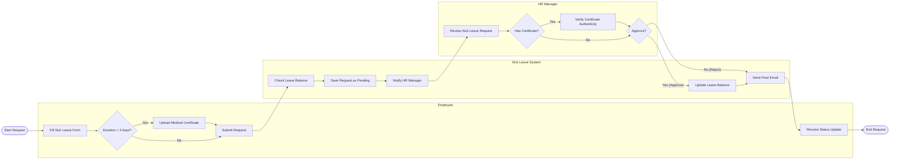

# Swimlane Diagram — Sick Leave and Medical Certificate System

## Mermaid Code

## Flow Description | Mo ta luong

| Lane | Actor | Role in Flow |
|------|-------|-------------|
| 1 | Employee | Nguoi chu dong nop don xin nghi om va cung cap giay chung nhan y te neu can. |
| 2 | Sick Leave System | He thong kiem tra so ngay phep, luu tru don, tru phep va gui email thong bao den cac ben. |
| 3 | HR Manager | Nhan su kiem tra the le, xac thuc tinh hop le cua giay kham benh va dua ra quyet dinh duyet. |
