# Action Tree — Sick Leave and Medical Certificate System

## Mermaid Code

```mermaid
%%{init: {'theme': 'default'}}%%
graph TD
    Root["Sick Leave and Medical Certificate System"]

    Root --> M1["Employee Portal"]
    Root --> M2["Leave Management"]
    Root --> M3["Certificate Verification"]
    Root --> M4["Policy Configuration"]
    Root --> M5["Reporting & Analytics"]

    M1 --> A11["Submit Sick Leave"]
    M1 --> A12["Upload Documents"]
    M1 --> A13["View Leave Balance"]
    M1 --> A14["Track Request Status"]

    M2 --> A21["Review Leave Requests"]
    M2 --> A22["Approve/Reject Leave"]
    M2 --> A23["Cancel Leave Request"]

    M3 --> A31["View Medical Certificates"]
    M3 --> A32["Mark as Verified"]
    M3 --> A33["Request Additional Info"]
    M3 --> A34["Flag Invalid Document"]

    M4 --> A41["Set Sick Leave Quotas"]
    M4 --> A42["Configure Medical Proof Rules"]
    M4 --> A43["Manage User Roles"]

    M5 --> A51["Generate Monthly Sick Leave Report"]
    M5 --> A52["Export Deductions for Payroll"]
    M5 --> A53["Analyze Absenteeism Trends"]
```

## Module Description | Mo ta Module

| # | Module | Description | Actions |
|---|--------|-------------|---------|
| 1 | Employee Portal | Cong thong tin ca nhan de nhan vien thao tac | Submit Sick Leave, Upload Documents, View Leave Balance, Track Request Status |
| 2 | Leave Management | Quan ly va phe duyet don nghi om cua HR | Review Leave Requests, Approve/Reject Leave, Cancel Leave Request |
| 3 | Certificate Verification | Kiem tra tinh xac thuc cua giay kham benh | View Medical Certificates, Mark as Verified, Request Additional Info, Flag Invalid Document |
| 4 | Policy Configuration | Thiet lap chinh sach nghi om va phan quyen | Set Sick Leave Quotas, Configure Medical Proof Rules, Manage User Roles |
| 5 | Reporting & Analytics | Bao cao thong ke va xuat du lieu tinh luong | Generate Monthly Sick Leave Report, Export Deductions for Payroll, Analyze Absenteeism Trends |
