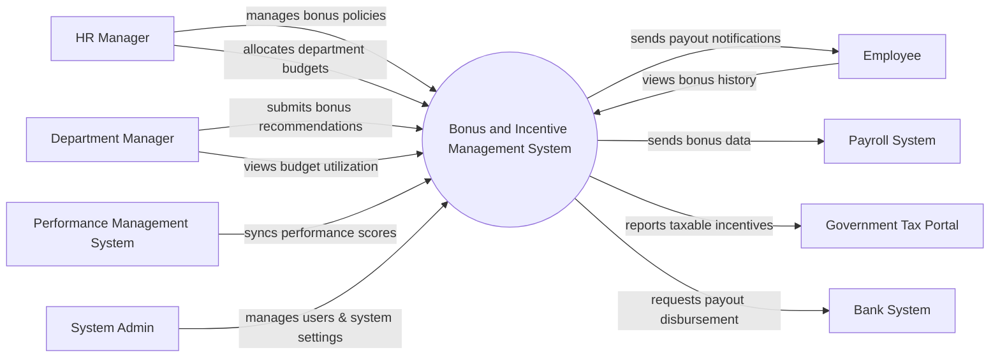

# Context Diagram — Bonus and Incentive Management System

## Mermaid Code

## Actor & Interaction Table | Bang Actor & Tuong tac

| # | Actor | Actor Type | Data Sent TO System | Data Received FROM System | Notes |
|---|-------|------------|---------------------|---------------------------|-------|
| 1 | HR Manager | Primary | Bonus policies, budget allocations, approval decisions | Budget reports, recommendation alerts | Quan tri vien nhan su phu trach thuong |
| 2 | Employee | Primary | View requests | Notifications, bonus history details | Nhan vien nhan thuong |
| 3 | Department Manager | Primary | Bonus recommendations | Budget utilization reports | Quan ly bo phan de xuat thuong |
| 4 | Performance Management System | Supporting | Employee performance scores, KPI results | Sync confirmation | He thong danh gia hieu suat |
| 5 | Payroll System | Supporting | Payout confirmation status | Bonus and incentive amounts | He thong tinh luong |
| 6 | Government Tax Portal | Regulatory | Tax compliance updates | Taxable incentive reports | Cong thue chinh phu |
| 7 | Bank System | Supporting | Transaction statuses | Payout disbursement requests | He thong ngan hang |
| 8 | System Admin | Primary | System configurations, user roles | System logs, audit reports | Quan tri he thong |

## System Boundary Description | Mo ta Pham vi He thong

The Bonus and Incentive Management System is responsible for automating the calculation, recommendation, and approval of employee bonuses and incentives based on performance metrics and company policies. It serves as the central hub for HR Managers and Department Managers to manage budgets and propose rewards. The system does not directly process the financial payout; instead, it integrates with external Payroll Systems and Bank Systems for disbursement. Additionally, employee performance metrics are imported from an external Performance Management System to drive incentive calculations.
