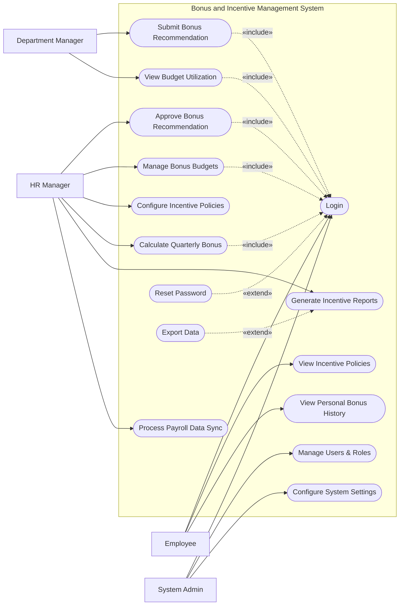

# Use Case Diagram — Bonus and Incentive Management System

## Mermaid Code

## Actor Table | Bang Actor

| # | Actor | Actor Type | Role Description | Related Use Cases |
|---|-------|------------|------------------|-------------------|
| 1 | Employee | Primary | Nhan vien thong thuong nhan thuong | UC01, UC02, UC03 |
| 2 | Department Manager | Primary | Nguoi quan ly de xuat thuong cho nhan vien | UC04, UC05 |
| 3 | HR Manager | Primary | Nhan su chuyen trach quan ly chinh sach va ngan sach | UC06, UC07, UC08, UC09, UC10, UC11 |
| 4 | System Admin | Primary | Quan tri vien he thong, phan quyen va cai dat | UC01, UC12, UC13 |

## Use Case Table | Bang Use Case

| # | UC ID | Use Case Name | Primary Actor | Secondary Actor | Description | Priority |
|---|-------|---------------|---------------|-----------------|-------------|----------|
| 1 | UC01 | Login | Employee | | Authenticate user access | High |
| 2 | UC02 | View Incentive Policies | Employee | | Read company bonus policies | Low |
| 3 | UC03 | View Personal Bonus History | Employee | | Check past received bonuses | Medium |
| 4 | UC04 | Submit Bonus Recommendation | Department Manager | | Propose bonus for an employee | High |
| 5 | UC05 | View Budget Utilization | Department Manager | | Monitor department bonus budget | Medium |
| 6 | UC06 | Approve Bonus Recommendation | HR Manager | | Review and approve proposed bonuses | High |
| 7 | UC07 | Manage Bonus Budgets | HR Manager | | Allocate budgets to departments | High |
| 8 | UC08 | Configure Incentive Policies | HR Manager | | Set up rules for incentive calculation | High |
| 9 | UC09 | Calculate Quarterly Bonus | HR Manager | Perf System | Automate bonus math based on KPIs | High |
| 10| UC10 | Generate Incentive Reports | HR Manager | | Create statistical reward reports | Medium |
| 11| UC11 | Process Payroll Data Sync | HR Manager | Payroll System | Send approved bonuses to payroll | High |
| 12| UC12 | Manage Users & Roles | System Admin | | Create, update, or deactivate user accounts | High |
| 13| UC13 | Configure System Settings | System Admin | | Update system-wide preferences | Medium |
| 14| UC14 | Reset Password | Employee | | Recover account access | High |
| 15| UC15 | Export Data | HR Manager | | Download reports as files | Low |

## Use Case Specification | Dac ta Use Case

---

### UC01 — Login

| Field | Detail |
|-------|--------|
| **UC ID** | UC01 |
| **Use Case Name** | Login |
| **Actor(s)** | Primary: Employee, HR Manager, Department Manager, System Admin |
| **Description** | Cho phep nguoi dung xac thuc de dang nhap vao he thong. |
| **Precondition** | 1. Nguoi dung phai co tai khoan hop le tren he thong.  2. He thong dang hoat dong binh thuong. |
| **Main Flow** | 1. Actor mo trang dang nhap.  2. System hien thi form dang nhap.  3. Actor nhap username va password.  4. Actor nhan nut Submit.  5. System xac thuc thong tin.  6. System chuyen huong den trang chu tuong ung quyen han. |
| **Alternative Flow** | **AF1** — Quen mat khau: Neu Actor chon "Forgot Password", System kich hoat UC14 Reset Password. |
| **Exception Flow** | **EX1** — Sai thong tin: Neu xac thuc that bai, System hien thi thong bao loi va yeu cau nhap lai.  **EX2** — Tai khoan bi khoa: Neu nhap sai qua 5 lan, System khoa tai khoan va thong bao lien he Admin. |
| **Postcondition** | Nguoi dung duoc dang nhap va phien lam viec duoc khoi tao. |
| **Business Rule** | **BR1**: Mat khau phai duoc ma hoa.  **BR2**: Phien dang nhap tu dong het han sau 30 phut khong hoat dong. |

---

### UC04 — Submit Bonus Recommendation

| Field | Detail |
|-------|--------|
| **UC ID** | UC04 |
| **Use Case Name** | Submit Bonus Recommendation |
| **Actor(s)** | Primary: Department Manager |
| **Description** | Cho phep quan ly de xuat thuong cho nhan vien trong phong ban cua ho. |
| **Precondition** | 1. Manager da dang nhap (Include UC01).  2. Phong ban con ngan sach (budget) du cho khoan thuong. |
| **Main Flow** | 1. Actor chon chuc nang "Recommend Bonus".  2. System hien thi danh sach nhan vien thuoc phong ban va ngan sach con lai.  3. Actor chon nhan vien, nhap so tien de xuat, va ly do.  4. Actor nhan Submit.  5. System kiem tra ngan sach va muc gioi han theo chinh sach.  6. System luu de xuat va gui thong bao den HR Manager. |
| **Alternative Flow** | **AF1** — Huy de xuat: Neu truoc buoc 4, Actor chon "Cancel", System quay lai trang truoc do. |
| **Exception Flow** | **EX1** — Vuot ngan sach: Neu so tien vuot qua ngan sach con lai, System bao loi va chan Submit.  **EX2** — Vuot han muc ca nhan: Neu so tien vuot quy dinh cong ty, System canh bao va yeu cau nhap giai trinh. |
| **Postcondition** | De xuat thuong luu o trang thai "Pending Approval" va thong bao duoc gui di. |
| **Business Rule** | **BR1**: Tong cac de xuat khong duoc vuot qua ngan sach cap cho phong ban.  **BR2**: Manager chi co the de xuat cho nhan vien thuoc quyen quan ly. |

---

### UC06 — Approve Bonus Recommendation

| Field | Detail |
|-------|--------|
| **UC ID** | UC06 |
| **Use Case Name** | Approve Bonus Recommendation |
| **Actor(s)** | Primary: HR Manager |
| **Description** | HR Manager xem xet va phe duyet/tu choi de xuat thuong tu cac phong ban. |
| **Precondition** | 1. HR Manager da dang nhap (Include UC01).  2. Co it nhat 1 de xuat thuong dang cho duyet (Pending Approval). |
| **Main Flow** | 1. Actor vao man hinh "Bonus Approvals".  2. System hien thi danh sach cac de xuat dang cho.  3. Actor chon xem chi tiet mot de xuat.  4. System hien thi chi tiet so tien, ly do, va tinh hinh ngan sach.  5. Actor nhan "Approve" (Dong y).  6. System cap nhat trang thai va tru tien khoi ngan sach hien dung. |
| **Alternative Flow** | **AF1** — Tu choi: O buoc 5, Actor chon "Reject" va nhap ly do. System cap nhat trang thai "Rejected" va hoan lai ngan sach du kien. |
| **Exception Flow** | **EX1** — De xuat da bi huy: Neu de xuat da bi nguoi tao huy, System hien thi loi "Request no longer available". |
| **Postcondition** | Trang thai de xuat chuyen thanh "Approved" hoac "Rejected". |
| **Business Rule** | **BR1**: Khi de xuat duoc duyet, tien thuong se tu dong duoc dua vao danh sach cho dong bo luong (UC11). |

---

### UC09 — Calculate Quarterly Bonus

| Field | Detail |
|-------|--------|
| **UC ID** | UC09 |
| **Use Case Name** | Calculate Quarterly Bonus |
| **Actor(s)** | Primary: HR Manager / Secondary: Performance Management System |
| **Description** | He thong tu dong tinh toan tien thuong quy dua tren diem KPI lay tu he thong khac. |
| **Precondition** | 1. HR Manager da dang nhap.  2. Diem KPI da duoc dong bo tu Performance Management System. |
| **Main Flow** | 1. Actor chon "Run Quarterly Calculation".  2. System yeu cau chon quy va nam can tinh.  3. Actor xac nhan chay.  4. System ket noi voi Performance Management System de lay diem so cuoi cung.  5. System ap dung cong thuc tinh thuong tu Incentive Policies.  6. System tao ra danh sach du kien tien thuong cho toan bo nhan vien. |
| **Alternative Flow** | **AF1** — Tinh toan lai: Actor the chay lai quy trinh neu thay doi he so thuong. |
| **Exception Flow** | **EX1** — Thieu du lieu KPI: Neu chua co du lieu diem so, System dung qua trinh va canh bao "Missing Performance Data". |
| **Postcondition** | Danh sach thuong quy duoc tao va hien thi o trang thai "Draft". |
| **Business Rule** | **BR1**: Tinh toan dua tren muc luong co ban va ti le KPI tuong ung.  **BR2**: Danh sach Draft phai duoc HR Manager duyet moi chuyen sang Payout. |
