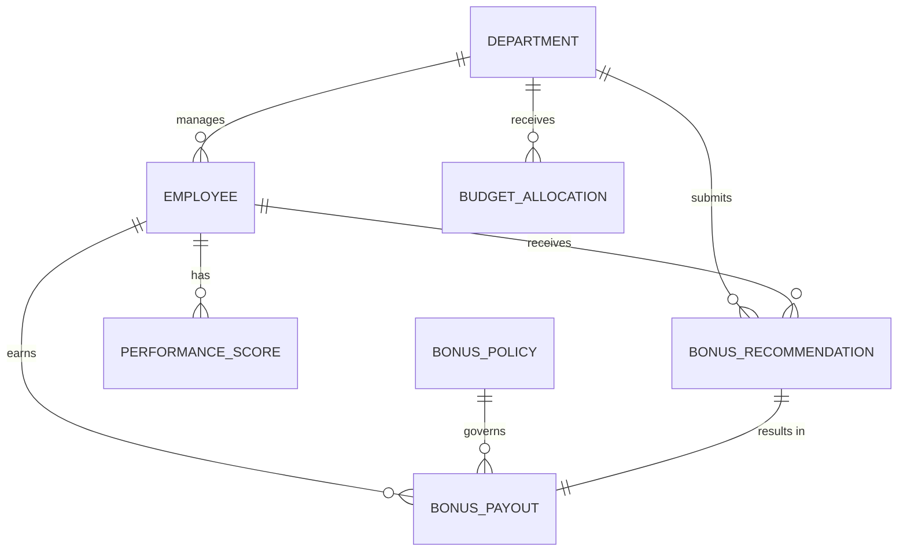

# Conceptual ERD — Bonus and Incentive Management System

## Mermaid Code

## Entity Description Table | Bang mo ta Entity

| # | Entity Name | Vietnamese Name | Description | Key Attributes | Main Relationships |
|---|-------------|-----------------|-------------|----------------|-------------------|
| 1 | DEPARTMENT | Phong ban | Thong tin cac phong ban trong cong ty | department_id, name | manages EMPLOYEE, receives BUDGET_ALLOCATION |
| 2 | EMPLOYEE | Nhan vien | Ho so ca nhan cua nhan vien nhan thuong | employee_id, name, level | belongs to DEPARTMENT, earns BONUS_PAYOUT |
| 3 | BUDGET_ALLOCATION | Ngan sach duoc cap | Ngan sach thuong tung ky cho phong ban | budget_id, amount, period | belongs to DEPARTMENT |
| 4 | BONUS_RECOMMENDATION | De xuat thuong | Yeu cau khen thuong tu quan ly bo phan | recommendation_id, amount, reason | submits by DEPARTMENT, receives by EMPLOYEE |
| 5 | BONUS_PAYOUT | Ban ghi thuong | Thong tin khoan thuong thuc te duoc duyet | payout_id, final_amount, date | earns by EMPLOYEE, governed by BONUS_POLICY |
| 6 | PERFORMANCE_SCORE | Diem hieu suat | Ket qua KPI dong bo tu he thong khac | score_id, kpi_value, period | belongs to EMPLOYEE |
| 7 | BONUS_POLICY | Chinh sach thuong | Quy tac, he so tinh thuong theo nang luc | policy_id, condition, multiplier| governs BONUS_PAYOUT |

## Relationship Description | Mo ta Quan he

| # | From Entity | Cardinality | To Entity | Relationship Label | Business Explanation |
|---|-------------|-------------|-----------|-------------------|----------------------|
| 1 | DEPARTMENT | one-to-many | EMPLOYEE | manages | Mot phong ban quan ly nhieu nhan vien. |
| 2 | DEPARTMENT | one-to-many | BUDGET_ALLOCATION | receives | Mot phong ban nhan nhieu khoan ngan sach khac nhau qua cac ky. |
| 3 | DEPARTMENT | one-to-many | BONUS_RECOMMENDATION | submits | Quan ly phong ban nop nhieu de xuat thuong. |
| 4 | EMPLOYEE | one-to-many | BONUS_RECOMMENDATION | receives | Mot nhan vien co the duoc de xuat thuong nhieu lan. |
| 5 | EMPLOYEE | one-to-many | BONUS_PAYOUT | earns | Mot nhan vien nhan nhieu khoan thuong khac nhau. |
| 6 | EMPLOYEE | one-to-many | PERFORMANCE_SCORE | has | Mot nhan vien co nhieu ban ghi diem hieu suat theo ky. |
| 7 | BONUS_POLICY | one-to-many | BONUS_PAYOUT | governs | Mot chinh sach co the ap dung cho nhieu khoan thuong. |
| 8 | BONUS_RECOMMENDATION| one-to-one | BONUS_PAYOUT | results in | Mot de xuat sau khi duyet se tro thanh mot khoan thuong. |
