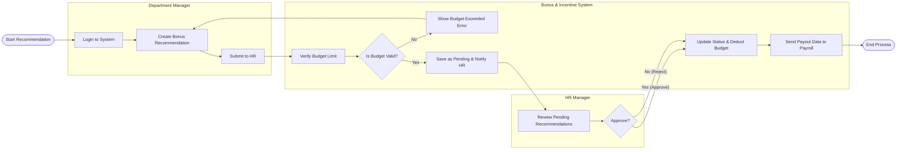

# Swimlane Diagram — Bonus and Incentive Management System

## Mermaid Code

## Flow Description | Mo ta luong

| Lane | Actor | Role in Flow |
|------|-------|-------------|
| 1 | Department Manager | Nguoi chu dong de xuat cac khoan thuong cho nhan vien trong ngan sach cho phep. |
| 2 | Bonus & Incentive System | He thong kiem tra tinh hop le cua ngan sach, luu tru, chuyen trang thai, va dong bo du lieu cho tinh luong. |
| 3 | HR Manager | Nguoi quan ly nhan su kiem tra va ra quyet dinh phe duyet cuoi cung. |
