# Action Tree — Bonus and Incentive Management System

## Mermaid Code

```mermaid
%%{init: {'theme': 'default'}}%%
graph TD
    Root["Bonus and Incentive Management System"]

    Root --> M1["Policy Management"]
    Root --> M2["Budget Management"]
    Root --> M3["Recommendation Module"]
    Root --> M4["Calculation Module"]
    Root --> M5["Reporting Module"]

    M1 --> A11["Create Incentive Rules"]
    M1 --> A12["Update Bonus Multipliers"]
    M1 --> A13["View Active Policies"]

    M2 --> A21["Allocate Department Budgets"]
    M2 --> A22["Monitor Budget Utilization"]
    M2 --> A23["Adjust Remaining Balances"]

    M3 --> A31["Submit New Recommendation"]
    M3 --> A32["Review Pending Approvals"]
    M3 --> A33["Approve/Reject Requests"]

    M4 --> A41["Sync Performance Scores"]
    M4 --> A42["Run Automatic Calculation"]
    M4 --> A43["Push to Payroll System"]

    M5 --> A51["View Payout History"]
    M5 --> A52["Generate Expense Reports"]
    M5 --> A53["Export Taxable Incentives"]
```

## Module Description | Mo ta Module

| # | Module | Description | Actions |
|---|--------|-------------|---------|
| 1 | Policy Management | Quan ly cac quy dinh, quy tac va he so thuong | Create Incentive Rules, Update Bonus Multipliers, View Active Policies |
| 2 | Budget Management | Phan bo va giam sat ngan sach khen thuong cac phong ban | Allocate Department Budgets, Monitor Budget Utilization, Adjust Remaining Balances |
| 3 | Recommendation Module | Quy trinh nop don de xuat va phe duyet khen thuong | Submit New Recommendation, Review Pending Approvals, Approve/Reject Requests |
| 4 | Calculation Module | Xu ly tinh toan thuong va dong bo voi he thong ben ngoai | Sync Performance Scores, Run Automatic Calculation, Push to Payroll System |
| 5 | Reporting Module | Thong ke lich su va xuat bao cao tai chinh lien quan | View Payout History, Generate Expense Reports, Export Taxable Incentives |
