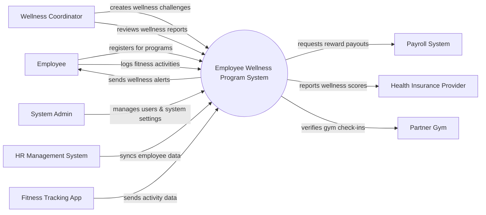

# Context Diagram — Employee Wellness Program System

## Mermaid Code

## Actor & Interaction Table | Bang Actor & Tuong tac

| # | Actor | Actor Type | Data Sent TO System | Data Received FROM System | Notes |
|---|-------|------------|---------------------|---------------------------|-------|
| 1 | Employee | Primary | Activity logs, challenge registrations | Wellness alerts, point balance | Nhan vien tham gia |
| 2 | Wellness Coordinator | Primary | Challenge configurations, wellness content | Participation reports | Dieu phoi vien chuong trinh |
| 3 | System Admin | Primary | System configurations, user roles | System logs, audit reports | Quan tri he thong |
| 4 | HR Management System | Supporting | Employee profile data, department info | Sync status | He thong quan ly nhan su |
| 5 | Payroll System | Supporting | Payout confirmation | Reward deduction/payout requests | He thong tinh luong |
| 6 | Fitness Tracking App | Supporting | Steps, heart rate, burned calories | API connection status | Ung dung theo doi suc khoe |
| 7 | Health Insurance Provider | Regulatory | Premium discount policies | Aggregated wellness scores | Nha cung cap bao hiem |
| 8 | Partner Gym | Supporting | Member check-in data | Membership verification | Phong gym doi tac |

## System Boundary Description | Mo ta Pham vi He thong

The Employee Wellness Program System manages health and fitness initiatives for employees, allowing them to participate in challenges, track physical activities, and redeem rewards. It provides tools for Wellness Coordinators to create and monitor wellness campaigns. The system does not directly manage core employee HR records or process financial rewards; it integrates with the HR Management System for employee data and the Payroll System for reward fulfillment. External fitness apps and partner gyms feed activity data into the system.
