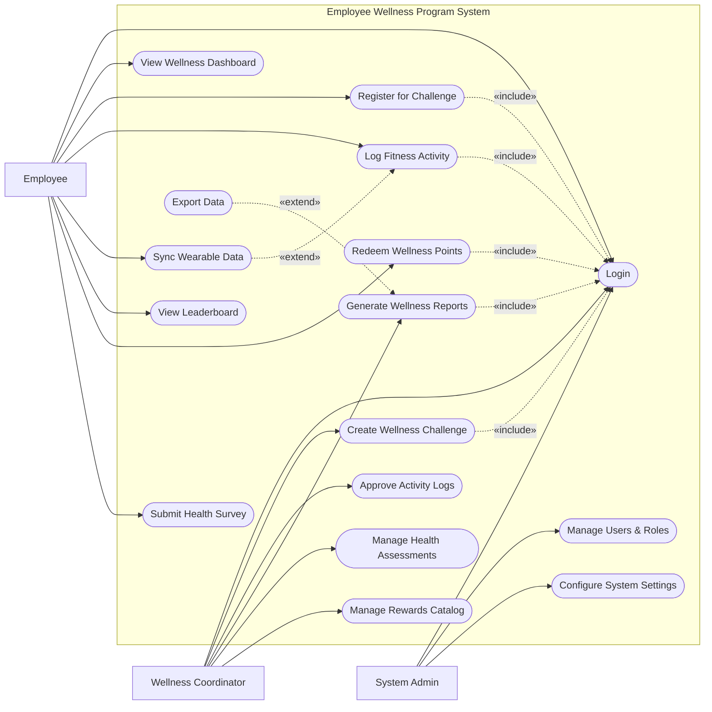

# Use Case Diagram — Employee Wellness Program System

## Mermaid Code

## Actor Table | Bang Actor

| # | Actor | Actor Type | Role Description | Related Use Cases |
|---|-------|------------|------------------|-------------------|
| 1 | Employee | Primary | Nhan vien tham gia cac chuong trinh suc khoe | UC01, UC02, UC03, UC04, UC05, UC06, UC07, UC12 |
| 2 | Wellness Coordinator | Primary | Nguoi quan ly cac chien dich va phan thuong suc khoe | UC01, UC08, UC09, UC10, UC11, UC15 |
| 3 | System Admin | Primary | Quan tri vien he thong, phan quyen va cai dat | UC01, UC13, UC14 |

## Use Case Table | Bang Use Case

| # | UC ID | Use Case Name | Primary Actor | Secondary Actor | Description | Priority |
|---|-------|---------------|---------------|-----------------|-------------|----------|
| 1 | UC01 | Login | Employee | | Authenticate user access | High |
| 2 | UC02 | View Wellness Dashboard | Employee | | View summary of health points and active challenges | Medium |
| 3 | UC03 | Register for Challenge | Employee | | Join an upcoming wellness challenge | High |
| 4 | UC04 | Log Fitness Activity | Employee | | Manually enter completed exercises or activities | High |
| 5 | UC05 | Sync Wearable Data | Employee | Fitness Tracking App | Automatically import data from devices | Medium |
| 6 | UC06 | View Leaderboard | Employee | | Check rankings against other colleagues | Low |
| 7 | UC07 | Redeem Wellness Points | Employee | | Exchange accumulated points for rewards | High |
| 8 | UC08 | Create Wellness Challenge | Wellness Coordinator | | Setup new challenges with specific goals and duration | High |
| 9 | UC09 | Approve Activity Logs | Wellness Coordinator | | Review and validate manual activity submissions | Medium |
| 10| UC10 | Generate Wellness Reports | Wellness Coordinator | | Create reports on company-wide health participation | Medium |
| 11| UC11 | Manage Health Assessments | Wellness Coordinator | | Create and distribute health check surveys | Medium |
| 12| UC12 | Submit Health Survey | Employee | | Complete periodic health self-assessments | Medium |
| 13| UC13 | Manage Users & Roles | System Admin | | Administer user access and permissions | High |
| 14| UC14 | Configure System Settings | System Admin | | Adjust global system preferences | Medium |
| 15| UC15 | Manage Rewards Catalog | Wellness Coordinator | | Add or update available items for redemption | High |
| 16| UC16 | Export Data | Wellness Coordinator | | Download participation statistics | Low |

## Use Case Specification | Dac ta Use Case

---

### UC01 — Login

| Field | Detail |
|-------|--------|
| **UC ID** | UC01 |
| **Use Case Name** | Login |
| **Actor(s)** | Primary: Employee, Wellness Coordinator, System Admin |
| **Description** | Cho phep nguoi dung xac thuc de dang nhap vao he thong. |
| **Precondition** | 1. Nguoi dung phai co tai khoan hop le tren he thong.  2. He thong dang hoat dong binh thuong. |
| **Main Flow** | 1. Actor mo trang dang nhap.  2. System hien thi form dang nhap.  3. Actor nhap username va password.  4. Actor nhan nut Submit.  5. System xac thuc thong tin.  6. System chuyen huong den trang chu tuong ung quyen han. |
| **Alternative Flow** | **AF1** — Quen mat khau: Neu Actor chon "Forgot Password", System hien thi quy trinh dat lai mat khau. |
| **Exception Flow** | **EX1** — Sai thong tin: Neu xac thuc that bai, System hien thi thong bao loi va yeu cau nhap lai.  **EX2** — Tai khoan bi khoa: Neu nhap sai qua 5 lan, System khoa tai khoan va thong bao lien he Admin. |
| **Postcondition** | Nguoi dung duoc dang nhap va phien lam viec duoc khoi tao. |
| **Business Rule** | **BR1**: Mat khau phai duoc ma hoa.  **BR2**: Phien dang nhap tu dong het han sau 30 phut khong hoat dong. |

---

### UC03 — Register for Challenge

| Field | Detail |
|-------|--------|
| **UC ID** | UC03 |
| **Use Case Name** | Register for Challenge |
| **Actor(s)** | Primary: Employee |
| **Description** | Nhan vien dang ky tham gia mot thu thach suc khoe do cong ty to chuc. |
| **Precondition** | 1. Nhan vien da dang nhap (Include UC01).  2. Co it nhat 1 thu thach dang o trang thai "Open for Registration". |
| **Main Flow** | 1. Actor chon "Challenges" tu menu chinh.  2. System hien thi danh sach cac thu thach hien co.  3. Actor chon xem chi tiet mot thu thach.  4. System hien thi muc tieu, phan thuong va the le.  5. Actor nhan "Join Challenge".  6. System them nhan vien vao danh sach nguoi tham gia va hien thi thong bao thanh cong. |
| **Alternative Flow** | **AF1** — Roi khoi thu thach: Neu Actor dang o trong thu thach nhung chua bat dau, Actor co the chon "Leave Challenge" de huy dang ky. |
| **Exception Flow** | **EX1** — Vuot qua so luong: Neu thu thach da du so luong nguoi tham gia, System an nut Join va hien thi thong bao "Challenge Full". |
| **Postcondition** | Nhan vien duoc ghi nhan tham gia vao thu thach tuong ung. |
| **Business Rule** | **BR1**: Nhan vien chi co the dang ky thu thach trong thoi gian cho phep.  **BR2**: Mot so thu thach co the gioi han theo phong ban. |

---

### UC04 — Log Fitness Activity

| Field | Detail |
|-------|--------|
| **UC ID** | UC04 |
| **Use Case Name** | Log Fitness Activity |
| **Actor(s)** | Primary: Employee |
| **Description** | Nhan vien ghi nhan hoat dong the chat thu cong de tich luy diem thuong. |
| **Precondition** | 1. Nhan vien da dang nhap (Include UC01).  2. Nhan vien dang tham gia it nhat mot thu thach hoac chuong trinh tich diem. |
| **Main Flow** | 1. Actor chon "Log Activity".  2. System hien thi form nhap hoat dong.  3. Actor chon loai hoat dong (chay bo, dap xe, yoga...), nhap thoi gian va khoang cach.  4. Actor nhan Submit.  5. System kiem tra tinh hop le cua du lieu.  6. System luu hoat dong, tinh toan diem thuong, va cap nhat diem cho nhan vien. |
| **Alternative Flow** | **AF1** — Dong bo du lieu: (Extend UC05) Actor chon "Sync from Device", System tu dong lay du lieu thay vi nhap thu cong. |
| **Exception Flow** | **EX1** — Du lieu bat thuong: Neu thoi gian hoac khoang cach vuot qua nguong cho phep (VD: chay 100km trong 1 gio), System danh dau hoat dong la "Pending Review" de Coordinator duyet. |
| **Postcondition** | Hoat dong duoc luu lai va diem cua nhan vien duoc cap nhat (neu du lieu hop le). |
| **Business Rule** | **BR1**: Hoat dong thu cong co the bi gioi han so luong/ngay theo tung loai thu thach.  **BR2**: Diem thuong duoc tinh theo cong thuc quy dinh truoc cua he thong. |

---

### UC07 — Redeem Wellness Points

| Field | Detail |
|-------|--------|
| **UC ID** | UC07 |
| **Use Case Name** | Redeem Wellness Points |
| **Actor(s)** | Primary: Employee |
| **Description** | Nhan vien doi diem thuong tich luy duoc lay cac qua tang hoac phuc loi. |
| **Precondition** | 1. Nhan vien da dang nhap (Include UC01).  2. Nhan vien co du so diem lon hon hoac bang muc toi thieu de doi qua. |
| **Main Flow** | 1. Actor truy cap vao trang "Rewards Catalog".  2. System hien thi so diem hien tai va danh sach cac phan thuong kha dung.  3. Actor chon mot phan thuong va nhan "Redeem".  4. System yeu cau xac nhan doi qua.  5. Actor nhan "Confirm".  6. System tru diem tuong ung, luu lich su doi qua va gui email xac nhan. |
| **Alternative Flow** | **AF1** — Qua tang het hang: Neu phan thuong da het ton kho, System hien thi "Out of Stock" va vo hieu hoa nut Redeem. |
| **Exception Flow** | **EX1** — Khong du diem: Neu so diem hien tai thap hon gia tri qua tang, System hien thi thong bao "Insufficient Points" va khong cho phep Confirm. |
| **Postcondition** | Diem cua nhan vien bi tru, giao dich doi qua duoc ghi nhan vao he thong. |
| **Business Rule** | **BR1**: Diem thuong co the co thoi han su dung (vi du: het han vao cuoi nam).  **BR2**: Mot so qua tang dac biet can co su xet duyet cua HR. |

---

### UC08 — Create Wellness Challenge

| Field | Detail |
|-------|--------|
| **UC ID** | UC08 |
| **Use Case Name** | Create Wellness Challenge |
| **Actor(s)** | Primary: Wellness Coordinator |
| **Description** | Dieu phoi vien tao mot thu thach suc khoe moi cho nhan vien tham gia. |
| **Precondition** | 1. Coordinator da dang nhap voi quyen han hop le (Include UC01). |
| **Main Flow** | 1. Actor vao man hinh "Challenge Management" va chon "Create New".  2. System hien thi form tao thu thach.  3. Actor nhap ten, mo ta, thoi gian bat dau/ket thuc, loai hoat dong, va muc tieu diem thuong.  4. Actor nhan "Save & Publish".  5. System luu thong tin vao co so du lieu.  6. System gui thong bao (email/app) den cac nhan vien hop le ve thu thach moi. |
| **Alternative Flow** | **AF1** — Luu nhap: O buoc 4, Actor co the chon "Save as Draft", System chi luu lai ma khong gui thong bao. |
| **Exception Flow** | **EX1** — Ngay thang loi: Neu ngay ket thuc xay ra truoc ngay bat dau, System canh bao va khong cho luu. |
| **Postcondition** | Thu thach duoc tao moi tren he thong va nguoi dung co the bat dau dang ky. |
| **Business Rule** | **BR1**: Thu thach moi tao phai duoc chi dinh ro nhom doi tuong duoc phep tham gia (toan cong ty hoac theo phong ban). |
