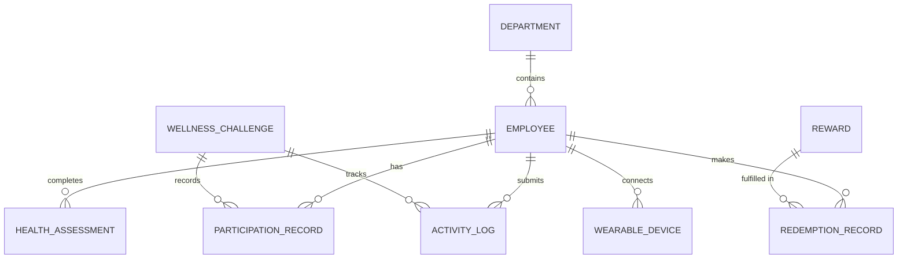

# Conceptual ERD — Employee Wellness Program System

## Mermaid Code

## Entity Description Table | Bang mo ta Entity

| # | Entity Name | Vietnamese Name | Description | Key Attributes | Main Relationships |
|---|-------------|-----------------|-------------|----------------|-------------------|
| 1 | DEPARTMENT | Phong ban | Thong tin cac phong ban trong cong ty | department_id, name | contains EMPLOYEE |
| 2 | EMPLOYEE | Nhan vien | Ho so ca nhan va diem tich luy cua nhan vien | employee_id, name, total_points | belongs to DEPARTMENT |
| 3 | HEALTH_ASSESSMENT | Kiem tra suc khoe | Bai khao sat suc khoe dinh ky | assessment_id, score, date | belongs to EMPLOYEE |
| 4 | WELLNESS_CHALLENGE| Thu thach suc khoe | Cac chien dich/thu thach suc khoe do cong ty to chuc | challenge_id, name, start_date, end_date | records PARTICIPATION_RECORD |
| 5 | PARTICIPATION_RECORD | Lich su tham gia | Ghi nhan viec nhan vien dang ky tham gia thu thach | participation_id, status, joined_date | belongs to EMPLOYEE, WELLNESS_CHALLENGE |
| 6 | ACTIVITY_LOG | Nhat ky hoat dong | Ban ghi chi tiet cac bai tap the duc hoac van dong | log_id, activity_type, duration, points_earned | belongs to EMPLOYEE, WELLNESS_CHALLENGE |
| 7 | REWARD | Phan thuong | Danh muc cac phan thuong co the doi diem | reward_id, item_name, point_cost, stock | fulfilled in REDEMPTION_RECORD |
| 8 | REDEMPTION_RECORD | Lich su doi thuong | Ghi nhan viec nhan vien doi diem lay qua | redemption_id, redeemed_date, status | belongs to EMPLOYEE, REWARD |
| 9 | WEARABLE_DEVICE | Thiet bi deo | Thong tin thiet bi suc khoe duoc dong bo cua nhan vien | device_id, device_type, sync_token | belongs to EMPLOYEE |

## Relationship Description | Mo ta Quan he

| # | From Entity | Cardinality | To Entity | Relationship Label | Business Explanation |
|---|-------------|-------------|-----------|-------------------|----------------------|
| 1 | DEPARTMENT | one-to-many | EMPLOYEE | contains | Mot phong ban bao gom nhieu nhan vien. |
| 2 | EMPLOYEE | one-to-many | HEALTH_ASSESSMENT | completes | Mot nhan vien co the thuc hien nhieu bai khao sat suc khoe. |
| 3 | EMPLOYEE | one-to-many | PARTICIPATION_RECORD | has | Mot nhan vien co the tham gia nhieu thu thach khac nhau. |
| 4 | WELLNESS_CHALLENGE | one-to-many | PARTICIPATION_RECORD | records | Mot thu thach co the co nhieu nhan vien tham gia. |
| 5 | EMPLOYEE | one-to-many | ACTIVITY_LOG | submits | Mot nhan vien co the gui nhieu hoat dong the duc. |
| 6 | WELLNESS_CHALLENGE | one-to-many | ACTIVITY_LOG | tracks | Mot thu thach ghi nhan nhieu hoat dong tu nguoi dung tham gia. |
| 7 | EMPLOYEE | one-to-many | REDEMPTION_RECORD | makes | Mot nhan vien co the thuc hien nhieu giao dich doi qua. |
| 8 | REWARD | one-to-many | REDEMPTION_RECORD | fulfilled in | Mot phan thuong co the duoc doi nhieu lan boi cac nhan vien. |
| 9 | EMPLOYEE | one-to-many | WEARABLE_DEVICE | connects | Mot nhan vien co the ket noi nhieu thiet bi suc khoe ca nhan. |
