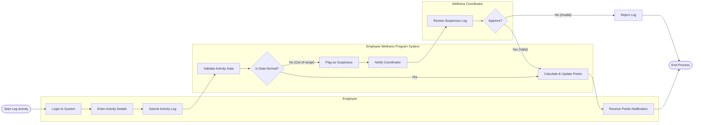

# Swimlane Diagram — Employee Wellness Program System

## Mermaid Code

## Flow Description | Mo ta luong

| Lane | Actor | Role in Flow |
|------|-------|-------------|
| 1 | Employee | Nguoi chu dong nhap thong tin hoat dong the chat va nhan thong bao khi diem duoc cap nhat. |
| 2 | Employee Wellness Program System | He thong tu dong kiem tra su bat thuong cua du lieu, tinh toan diem thuong va danh dau cac ban ghi nghi ngo. |
| 3 | Wellness Coordinator | Nguoi quan ly nhan duoc thong bao, vao he thong de xem xet thu cong va ra quyet dinh phe duyet cac hoat dong bi nghi ngo. |
