# Action Tree — Employee Wellness Program System

## Mermaid Code

```mermaid
%%{init: {'theme': 'default'}}%%
graph TD
    Root["Employee Wellness Program System"]

    Root --> M1["Wellness Profile"]
    Root --> M2["Challenge Management"]
    Root --> M3["Activity Tracking"]
    Root --> M4["Rewards & Redemption"]
    Root --> M5["Analytics & Administration"]

    M1 --> A11["View Health Dashboard"]
    M1 --> A12["Complete Health Survey"]
    M1 --> A13["Manage Wearable Devices"]

    M2 --> A21["Browse Challenges"]
    M2 --> A22["Join Challenge"]
    M2 --> A23["Create New Challenge"]
    M2 --> A24["View Leaderboard"]

    M3 --> A31["Log Manual Activity"]
    M3 --> A32["Sync Device Data"]
    M3 --> A33["Approve Suspicious Logs"]

    M4 --> A41["View Rewards Catalog"]
    M4 --> A42["Redeem Points"]
    M4 --> A43["Manage Reward Inventory"]

    M5 --> A51["Generate Wellness Reports"]
    M5 --> A52["Manage Users Roles"]
    M5 --> A53["Configure Point Settings"]
```

## Module Description | Mo ta Module

| # | Module | Description | Actions |
|---|--------|-------------|---------|
| 1 | Wellness Profile | Quan ly ho so suc khoe ca nhan cua nhan vien | View Health Dashboard, Complete Health Survey, Manage Wearable Devices |
| 2 | Challenge Management | Quan ly cac thu thach, muc tieu va bang xep hang | Browse Challenges, Join Challenge, Create New Challenge, View Leaderboard |
| 3 | Activity Tracking | Ghi nhan va xac minh du lieu van dong cua nhan vien | Log Manual Activity, Sync Device Data, Approve Suspicious Logs |
| 4 | Rewards & Redemption | Quan ly he thong diem thuong va danh muc qua tang | View Rewards Catalog, Redeem Points, Manage Reward Inventory |
| 5 | Analytics & Administration| Bao cao thong ke va quan tri he thong | Generate Wellness Reports, Manage Users Roles, Configure Point Settings |
