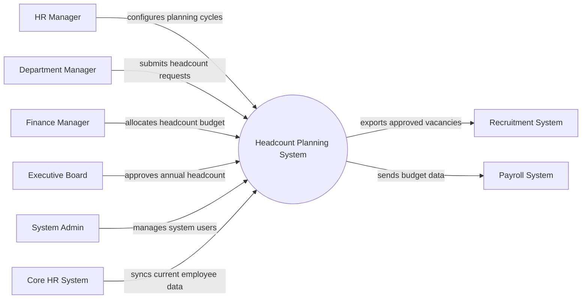

# Context Diagram — Headcount Planning System

## Mermaid Code

## Actor & Interaction Table | Bang Actor & Tuong tac

| # | Actor | Actor Type | Data Sent TO System | Data Received FROM System | Notes |
|---|-------|------------|---------------------|---------------------------|-------|
| 1 | HR Manager | Primary | Planning cycle settings, HR rules | Headcount reports, alerts | Quan tri vien nhan su |
| 2 | Department Manager | Primary | Headcount requests, justifications | Request status, department reports | Quan ly bo phan |
| 3 | Finance Manager | Primary | Budget allocations, cost constraints | Financial impact reports | Quan ly tai chinh |
| 4 | Executive Board | Primary | Final approval decisions | High-level summary reports | Ban giam doc |
| 5 | System Admin | Primary | System configurations, user roles | System logs, audit reports | Quan tri he thong |
| 6 | Recruitment System | Supporting | Recruitment status | Approved vacancies | He thong tuyen dung |
| 7 | Payroll System | Supporting | Actual payroll costs | Headcount budget data | He thong tinh luong |
| 8 | Core HR System | Supporting | Current employee master data | Sync confirmation | He thong nhan su loi |

## System Boundary Description | Mo ta Pham vi He thong

The Headcount Planning System is responsible for managing the entire lifecycle of headcount planning, including cycle creation, request submission, budget allocation, and final approval. It serves as a centralized platform for HR, Finance, and Department Managers to collaborate on workforce planning. The system does not directly execute recruitment or calculate payroll; instead, it integrates with external Recruitment Systems and Payroll Systems to exchange approved vacancies and budget data.
