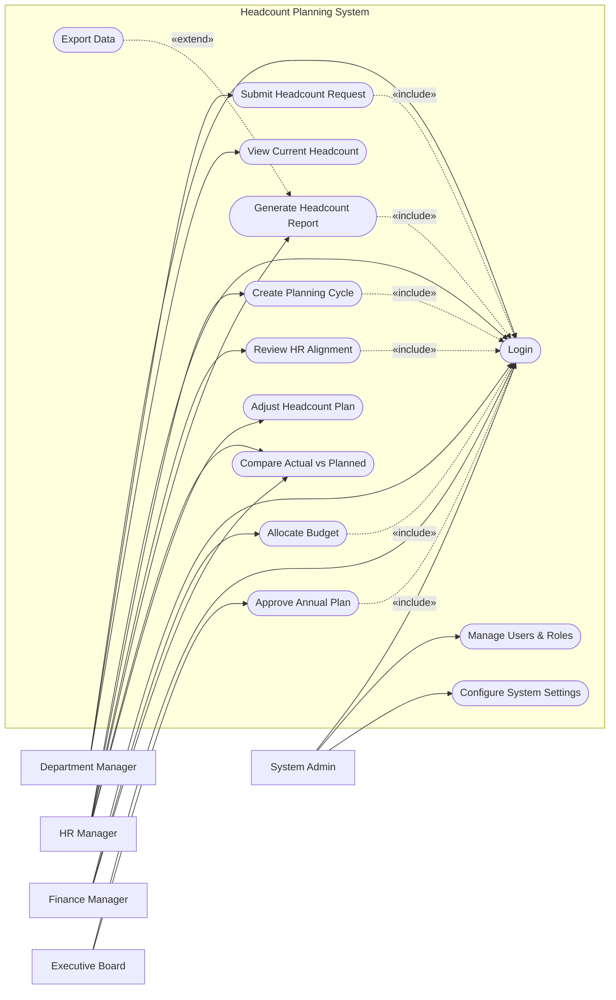

# Use Case Diagram — Headcount Planning System

## Mermaid Code

## Actor Table | Bang Actor

| # | Actor | Actor Type | Role Description | Related Use Cases |
|---|-------|------------|------------------|-------------------|
| 1 | Department Manager | Primary | Nguoi quan ly phong ban de xuat nhan su | UC01, UC03, UC07 |
| 2 | HR Manager | Primary | Nhan su quan ly quy trinh va du lieu chung | UC01, UC02, UC04, UC08, UC12, UC13 |
| 3 | Finance Manager | Primary | Quan ly ngan sach cho ke hoach nhan su | UC01, UC05, UC12 |
| 4 | Executive Board | Primary | Ban giam doc phe duyet ke hoach cuoi cung | UC01, UC06 |
| 5 | System Admin | Primary | Quan tri vien he thong | UC01, UC10, UC11 |

## Use Case Table | Bang Use Case

| # | UC ID | Use Case Name | Primary Actor | Secondary Actor | Description | Priority |
|---|-------|---------------|---------------|-----------------|-------------|----------|
| 1 | UC01 | Login | Department Manager | | Authenticate user access | High |
| 2 | UC02 | Create Planning Cycle | HR Manager | | Initiate a new headcount planning cycle | High |
| 3 | UC03 | Submit Headcount Request | Department Manager | | Request new headcount for a department | High |
| 4 | UC04 | Review HR Alignment | HR Manager | | Review requests for HR policy compliance | High |
| 5 | UC05 | Allocate Budget | Finance Manager | | Allocate and approve budget for requests | High |
| 6 | UC06 | Approve Annual Plan | Executive Board | | Final approval of the entire headcount plan | High |
| 7 | UC07 | View Current Headcount | Department Manager | | View existing team headcount data | Medium |
| 8 | UC08 | Generate Headcount Report | HR Manager | | Create statistical headcount reports | Medium |
| 9 | UC09 | Export Data | HR Manager | | Download reports as files | Low |
| 10| UC10 | Manage Users & Roles | System Admin | | Manage user access and permissions | High |
| 11| UC11 | Configure System Settings | System Admin | | Update system-wide preferences | Medium |
| 12| UC12 | Compare Actual vs Planned | HR Manager | Finance Manager | Track variations against plan | Medium |
| 13| UC13 | Adjust Headcount Plan | HR Manager | | Modify approved plans during the year | Low |

## Use Case Specification | Dac ta Use Case

---

### UC01 — Login

| Field | Detail |
|-------|--------|
| **UC ID** | UC01 |
| **Use Case Name** | Login |
| **Actor(s)** | Primary: Department Manager, HR Manager, Finance Manager, Executive Board, System Admin |
| **Description** | Cho phep nguoi dung xac thuc de dang nhap vao he thong. |
| **Precondition** | 1. Nguoi dung phai co tai khoan hop le.  2. He thong dang hoat dong binh thuong. |
| **Main Flow** | 1. Actor mo trang dang nhap.  2. System hien thi form dang nhap.  3. Actor nhap username va password.  4. Actor nhan nut Submit.  5. System xac thuc thong tin.  6. System chuyen huong den trang chu. |
| **Alternative Flow** | **AF1** — Quen mat khau: Neu Actor chon "Forgot Password", System kich hoat chuc nang khoi phuc mat khau. |
| **Exception Flow** | **EX1** — Sai thong tin: Neu xac thuc that bai, System hien thi thong bao loi.  **EX2** — Tai khoan bi khoa: Neu nhap sai 5 lan, System khoa tai khoan. |
| **Postcondition** | Nguoi dung dang nhap thanh cong. |
| **Business Rule** | **BR1**: Mat khau phai duoc ma hoa.  **BR2**: Phien dang nhap tu dong het han sau 30 phut. |

---

### UC02 — Create Planning Cycle

| Field | Detail |
|-------|--------|
| **UC ID** | UC02 |
| **Use Case Name** | Create Planning Cycle |
| **Actor(s)** | Primary: HR Manager |
| **Description** | Khoi tao mot ky ke hoach nhan su moi cho nam hoac quy tiep theo. |
| **Precondition** | 1. HR Manager da dang nhap (Include UC01).  2. Khong co ky ke hoach nao dang mo trung thoi gian. |
| **Main Flow** | 1. Actor chon "Create Planning Cycle".  2. System hien thi form tao ky ke hoach.  3. Actor nhap ten, thoi gian bat dau/ket thuc va han chot nop don.  4. Actor nhan Submit.  5. System kiem tra tinh hop le.  6. System luu va kich hoat ky ke hoach, gui thong bao den cac Manager. |
| **Alternative Flow** | **AF1** — Huy tao: Actor chon Cancel de thoat ma khong luu. |
| **Exception Flow** | **EX1** — Trung thoi gian: System thong bao loi neu thoi gian bi chong cheo voi ky truoc. |
| **Postcondition** | Mot ky ke hoach moi duoc tao voi trang thai "Active". |
| **Business Rule** | **BR1**: Moi thoi diem chi co toi da mot ky ke hoach Active cho cung mot don vi. |

---

### UC03 — Submit Headcount Request

| Field | Detail |
|-------|--------|
| **UC ID** | UC03 |
| **Use Case Name** | Submit Headcount Request |
| **Actor(s)** | Primary: Department Manager |
| **Description** | Cho phep Department Manager nop don yeu cau bo sung nhan su. |
| **Precondition** | 1. Dept Manager da dang nhap (Include UC01).  2. Co mot ky ke hoach dang "Active". |
| **Main Flow** | 1. Actor chon "New Headcount Request".  2. System hien thi form yeu cau.  3. Actor chon vi tri, so luong, muc luong du kien va ly do.  4. Actor nhan Submit.  5. System xac nhan du lieu.  6. System luu yeu cau voi trang thai "Pending HR" va thong bao HR. |
| **Alternative Flow** | **AF1** — Luu nhap: Actor chon "Save Draft" de luu tam thoi. |
| **Exception Flow** | **EX1** — Qua han: Neu da qua han chot cua ky ke hoach, System chan Submit va thong bao loi. |
| **Postcondition** | Yeu cau nhan su duoc luu vao he thong voi trang thai cho duyet. |
| **Business Rule** | **BR1**: Tat ca yeu cau phai nam trong ky ke hoach hop le. |

---

### UC04 — Review HR Alignment

| Field | Detail |
|-------|--------|
| **UC ID** | UC04 |
| **Use Case Name** | Review HR Alignment |
| **Actor(s)** | Primary: HR Manager |
| **Description** | HR Manager kiem tra xem yeu cau nhan su co phu hop voi chinh sach HR hay khong. |
| **Precondition** | 1. HR Manager da dang nhap (Include UC01).  2. Co yeu cau o trang thai "Pending HR". |
| **Main Flow** | 1. Actor chon xem danh sach yeu cau cho duyet.  2. System hien thi danh sach "Pending HR".  3. Actor chon mot yeu cau de xem chi tiet.  4. Actor nhan "Approve" de dong y khao sat HR.  5. System cap nhat trang thai thanh "Pending Finance" va thong bao Finance Manager. |
| **Alternative Flow** | **AF1** — Tu choi: Actor chon "Reject" va nhap ly do. System cap nhat trang thai thanh "Rejected by HR". |
| **Exception Flow** | **EX1** — Don da xu ly: Neu don da bi huy, System thong bao "Request unavailable". |
| **Postcondition** | Yeu cau chuyen sang trang thai cho Tai chinh hoac bi tu choi. |
| **Business Rule** | **BR1**: HR phai duyet truoc khi chuyen sang cho Finance. |

---

### UC05 — Allocate Budget

| Field | Detail |
|-------|--------|
| **UC ID** | UC05 |
| **Use Case Name** | Allocate Budget |
| **Actor(s)** | Primary: Finance Manager |
| **Description** | Finance Manager phan bo va phe duyet ngan sach cho yeu cau nhan su. |
| **Precondition** | 1. Finance Manager da dang nhap (Include UC01).  2. Co yeu cau o trang thai "Pending Finance". |
| **Main Flow** | 1. Actor vao man hinh "Budget Approval".  2. System hien thi cac yeu cau "Pending Finance".  3. Actor xem chi tiet chi phi uoc tinh.  4. Actor nhan "Approve Budget".  5. System cap nhat trang thai "Approved by Finance" va thong bao cac ben. |
| **Alternative Flow** | **AF1** — Yeu cau dieu chinh: Actor chon "Request Revision", System chuyen don ve trang thai "Draft" kem ghi chu. |
| **Exception Flow** | **EX1** — Vuot ngan sach: Neu vuot qua ngan sach tong, System canh bao nhung van cho phep neu duoc vuot quyen (override). |
| **Postcondition** | Yeu cau duoc phe duyet ngan sach va cho Executive Board tong duyet. |
| **Business Rule** | **BR1**: Yeu cau chi chinh thuc hoan tat khi ca HR va Finance deu thong qua. |
