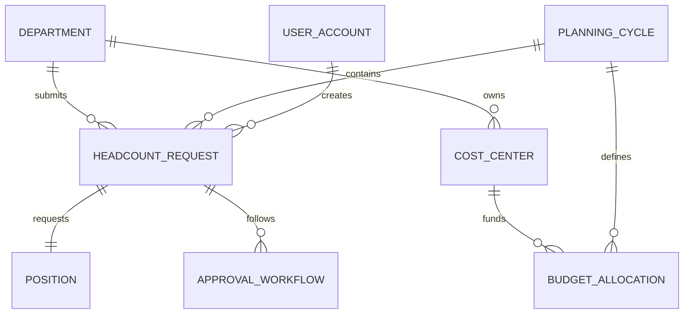

# Conceptual ERD — Headcount Planning System

## Mermaid Code

## Entity Description Table | Bang mo ta Entity

| # | Entity Name | Vietnamese Name | Description | Key Attributes | Main Relationships |
|---|-------------|-----------------|-------------|----------------|-------------------|
| 1 | DEPARTMENT | Phong ban | Thong tin cac phong ban trong cong ty | dept_id, name, head_id | submits HEADCOUNT_REQUEST |
| 2 | PLANNING_CYCLE | Ky ke hoach | Thoi gian thuc hien ke hoach nhan su | cycle_id, year, start_date | contains HEADCOUNT_REQUEST |
| 3 | HEADCOUNT_REQUEST | Don xin nhan su | Yeu cau bo sung nhan su tu cac phong ban | request_id, quantity, status | requests POSITION |
| 4 | BUDGET_ALLOCATION | Phan bo ngan sach | Ngan sach duoc cap cho ke hoach nhan su | allocation_id, amount, currency | funds COST_CENTER |
| 5 | POSITION | Vi tri cong viec | Thong tin chuc danh can tuyen | position_id, title, level | belongs to HEADCOUNT_REQUEST |
| 6 | COST_CENTER | Trung tam chi phi | Don vi chiu phi cho nhan su | cost_id, code, description | owns BUDGET_ALLOCATION |
| 7 | APPROVAL_WORKFLOW | Luong phe duyet | Lich su phe duyet cua yeu cau | workflow_id, step, action_date | belongs to HEADCOUNT_REQUEST |
| 8 | USER_ACCOUNT | Tai khoan | Thong tin dang nhap cua nguoi dung | user_id, username, role | creates HEADCOUNT_REQUEST |

## Relationship Description | Mo ta Quan he

| # | From Entity | Cardinality | To Entity | Relationship Label | Business Explanation |
|---|-------------|-------------|-----------|-------------------|----------------------|
| 1 | DEPARTMENT | one-to-many | HEADCOUNT_REQUEST | submits | Mot phong ban co the nop nhieu don yeu cau nhan su. |
| 2 | PLANNING_CYCLE | one-to-many | HEADCOUNT_REQUEST | contains | Mot ky ke hoach bao gom nhieu don yeu cau. |
| 3 | COST_CENTER | one-to-many | BUDGET_ALLOCATION | funds | Mot trung tam chi phi cung cap ngan sach cho nhieu phan bo. |
| 4 | PLANNING_CYCLE | one-to-many | BUDGET_ALLOCATION | defines | Mot ky ke hoach xac dinh nhieu khoan phan bo ngan sach. |
| 5 | HEADCOUNT_REQUEST | one-to-one | POSITION | requests | Moi don yeu cau nhan su ung voi mot vi tri cong viec cu special. |
| 6 | DEPARTMENT | one-to-many | COST_CENTER | owns | Mot phong ban so huu mot hoac nhieu trung tam chi phi. |
| 7 | HEADCOUNT_REQUEST | one-to-many | APPROVAL_WORKFLOW | follows | Mot don yeu cau co mot luong gom nhieu buoc phe duyet. |
| 8 | USER_ACCOUNT | one-to-many | HEADCOUNT_REQUEST | creates | Mot tai khoan co the tao nhieu don yeu cau nhan su. |
