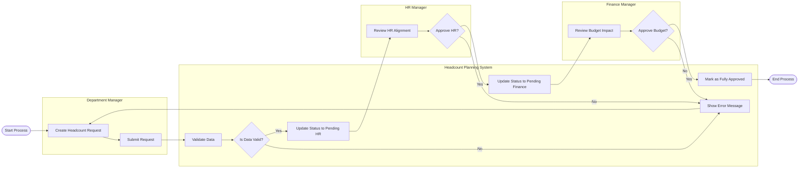

# Swimlane Diagram — Headcount Planning System

## Mermaid Code

## Flow Description | Mo ta luong

| Lane | Actor | Role in Flow |
|------|-------|-------------|
| 1 | Department Manager | Nguoi chu dong tao va nop yeu cau bo sung nhan su cho phong ban minh. |
| 2 | Headcount Planning System | He thong kiem tra tinh hop le cua don, cap nhat trang thai tung buoc va chuyen tiep cho cac ben lien quan. |
| 3 | HR Manager | Kiem tra yeu cau co phu hop voi chinh sach nhan su hay khong truoc khi den buoc tai chinh. |
| 4 | Finance Manager | Nguoi xet duyet cuoi cung ve mat ngan sach va chi phi cho yeu cau nhan su. |
