# Action Tree — Headcount Planning System

## Mermaid Code

```mermaid
%%{init: {'theme': 'default'}}%%
graph TD
    Root["Headcount Planning System"]

    Root --> M1["Planning Cycle Management"]
    Root --> M2["Request Management"]
    Root --> M3["Budget Management"]
    Root --> M4["Reporting & Analytics"]
    Root --> M5["System Administration"]

    M1 --> A11["Create New Cycle"]
    M1 --> A12["Modify Active Cycle"]
    M1 --> A13["Close Planning Cycle"]
    
    M2 --> A21["Submit Headcount Request"]
    M2 --> A22["Review HR Alignment"]
    M2 --> A23["Track Request Status"]
    M2 --> A24["Cancel Request"]

    M3 --> A31["Allocate Budget"]
    M3 --> A32["Approve Budget Cost"]
    M3 --> A33["Compare Budget vs Actual"]

    M4 --> A41["Generate Headcount Report"]
    M4 --> A42["Export Data to Excel"]
    M4 --> A43["View Dashboard Summary"]

    M5 --> A51["Manage Users & Roles"]
    M5 --> A52["Configure Approval Workflows"]
    M5 --> A53["Update System Settings"]
```

## Module Description | Mo ta Module

| # | Module | Description | Actions |
|---|--------|-------------|---------|
| 1 | Planning Cycle Management | Quan ly cac ky ke hoach nhan su hang nam hoac quy | Create New Cycle, Modify Active Cycle, Close Planning Cycle |
| 2 | Request Management | Quan ly qua trinh tao va xu ly don yeu cau nhan su | Submit Headcount Request, Review HR Alignment, Track Request Status, Cancel Request |
| 3 | Budget Management | Quan ly phan bo va phe duyet ngan sach cho nhan su | Allocate Budget, Approve Budget Cost, Compare Budget vs Actual |
| 4 | Reporting & Analytics | Bao cao va thong ke lien quan den so luong nhan su | Generate Headcount Report, Export Data to Excel, View Dashboard Summary |
| 5 | System Administration | Quan tri he thong, nguoi dung va cau hinh chung | Manage Users & Roles, Configure Approval Workflows, Update System Settings |
