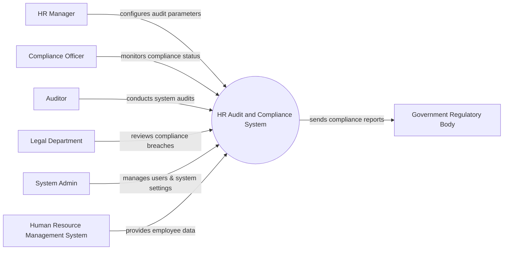

# Context Diagram — HR Audit and Compliance System

## Mermaid Code

## Actor & Interaction Table | Bang Actor & Tuong tac

| # | Actor | Actor Type | Data Sent TO System | Data Received FROM System | Notes |
|---|-------|------------|---------------------|---------------------------|-------|
| 1 | HR Manager | Primary | Audit parameters, HR policies | Audit summaries | Quan ly nhan su thiet lap thong so |
| 2 | Compliance Officer | Primary | Compliance verification requests | Compliance dashboards, alerts | Chuyen vien tuan thu |
| 3 | Auditor | Primary | Audit execution commands, queries | Detailed audit logs, findings | Kiem toan vien (noi bo/doc lap) |
| 4 | Legal Department | Primary | Breach review feedback, legal notes | Breach notifications, evidence | Phong phap che |
| 5 | System Admin | Primary | System configurations, user roles | System logs, audit reports | Quan tri he thong |
| 6 | Human Resource Management System | Supporting | Employee records, payroll data | Data sync status | He thong quan ly nhan su |
| 7 | Government Regulatory Body | Regulatory | Regulatory updates | Standardized compliance reports | Co quan quan ly nha nuoc |

## System Boundary Description | Mo ta Pham vi He thong

The HR Audit and Compliance System is responsible for continuously monitoring, auditing, and ensuring that HR processes comply with internal policies and external regulations. It serves as a central tool for Compliance Officers, Auditors, and HR Managers to detect violations and generate reports. The system does not directly manage daily HR tasks like payroll or leave; rather, it connects to external systems like the HRMS to fetch data for analysis. Finally, it provides automated reporting to Government Regulatory Bodies when required.
