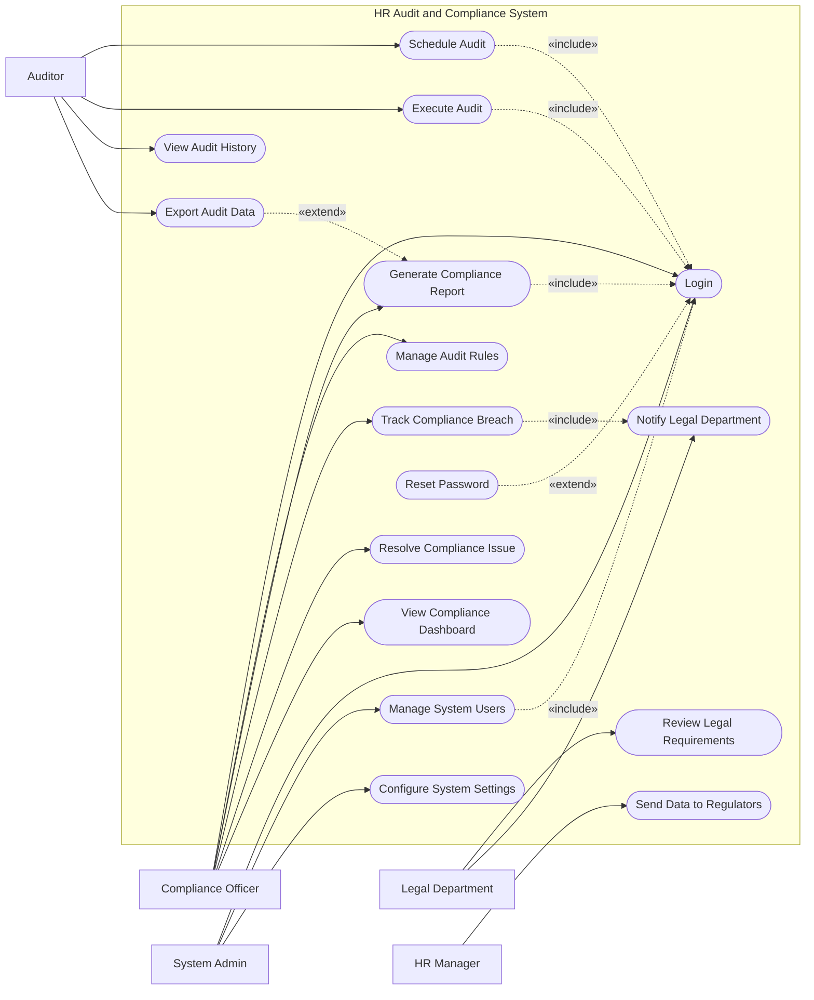

# Use Case Diagram — HR Audit and Compliance System

## Mermaid Code

## Actor Table | Bang Actor

| # | Actor | Actor Type | Role Description | Related Use Cases |
|---|-------|------------|------------------|-------------------|
| 1 | Compliance Officer | Primary | Giam sat tuan thu, xay dung quy tac va xu ly vi pham | UC01, UC02, UC06, UC07, UC08, UC16 |
| 2 | Auditor | Primary | Thuc hien kiem toan va kiem tra lich su | UC03, UC04, UC05, UC09 |
| 3 | Legal Department | Primary | Xem xet cac van de phap ly va giai quyet vi pham | UC10, UC11 |
| 4 | HR Manager | Primary | Gui bao cao cho co quan chuc nang | UC12 |
| 5 | System Admin | Primary | Quan tri vien he thong, quan ly tai khoan | UC01, UC14, UC15 |

## Use Case Table | Bang Use Case

| # | UC ID | Use Case Name | Primary Actor | Secondary Actor | Description | Priority |
|---|-------|---------------|---------------|-----------------|-------------|----------|
| 1 | UC01 | Login | Compliance Officer | | Authenticate user access | High |
| 2 | UC02 | Manage Audit Rules | Compliance Officer | | Define and update rules for auditing | High |
| 3 | UC03 | Schedule Audit | Auditor | | Plan automated or manual audits | Medium |
| 4 | UC04 | Execute Audit | Auditor | HRMS | Run the audit process against HR data | High |
| 5 | UC05 | View Audit History | Auditor | | Check past audit logs | Low |
| 6 | UC06 | Generate Compliance Report | Compliance Officer | | Create detailed compliance reports | High |
| 7 | UC07 | Track Compliance Breach | Compliance Officer | Legal Department| Log and monitor detected violations | High |
| 8 | UC08 | Resolve Compliance Issue | Compliance Officer | | Mark compliance issues as resolved | Medium |
| 9 | UC09 | Export Audit Data | Auditor | | Download audit findings as files | Low |
| 10| UC10 | Review Legal Requirements | Legal Department | | Update legal guidelines in system | Medium |
| 11| UC11 | Notify Legal Department | System | Legal Department| Alert legal team of severe breaches | High |
| 12| UC12 | Send Data to Regulators | HR Manager | Gov Regulator | Submit compliance reports to Gov | High |
| 13| UC13 | Reset Password | Compliance Officer | | Recover account access | High |
| 14| UC14 | Manage System Users | System Admin | | Manage user roles and accounts | High |
| 15| UC15 | Configure System Settings | System Admin | | Adjust system-wide configurations | Medium |
| 16| UC16 | View Compliance Dashboard | Compliance Officer | | View real-time compliance metrics | Medium |

## Use Case Specification | Dac ta Use Case

---

### UC01 — Login

| Field | Detail |
|-------|--------|
| **UC ID** | UC01 |
| **Use Case Name** | Login |
| **Actor(s)** | Primary: Compliance Officer, Auditor, Legal Department, System Admin, HR Manager |
| **Description** | Cho phep nguoi dung xac thuc de dang nhap vao he thong. |
| **Precondition** | 1. Nguoi dung co tai khoan hop le.  2. He thong dang hoat dong. |
| **Main Flow** | 1. Actor mo trang dang nhap.  2. System hien thi form dang nhap.  3. Actor nhap username va password.  4. Actor nhan nut Submit.  5. System xac thuc thong tin.  6. System chuyen huong den Dashboard tuong ung. |
| **Alternative Flow** | **AF1** — Quen mat khau: Actor chon "Forgot Password", System kich hoat UC13 Reset Password. |
| **Exception Flow** | **EX1** — Sai thong tin: Xac thuc that bai, System hien thi thong bao loi.  **EX2** — Tai khoan bi khoa: Nhap sai qua 5 lan, System khoa tai khoan. |
| **Postcondition** | Nguoi dung dang nhap thanh cong, phien lam viec tao ra. |
| **Business Rule** | **BR1**: Mat khau phai duoc ma hoa.  **BR2**: Timeout sau 30 phut khong hoat dong. |

---

### UC04 — Execute Audit

| Field | Detail |
|-------|--------|
| **UC ID** | UC04 |
| **Use Case Name** | Execute Audit |
| **Actor(s)** | Primary: Auditor / Secondary: HRMS |
| **Description** | Kiem toan vien khoi chay qua trinh kiem tra tren du lieu nhan su. |
| **Precondition** | 1. Auditor da dang nhap (Include UC01).  2. He thong HRMS san sang cung cap du lieu. |
| **Main Flow** | 1. Actor chon "Run New Audit".  2. System hien thi danh sach quy tac (Audit Rules).  3. Actor chon quy tac va pham vi du lieu can kiem tra.  4. Actor nhan "Execute".  5. System ket noi voi HRMS de lay du lieu.  6. System phan tich du lieu va xuat ket qua (Audit Record). |
| **Alternative Flow** | **AF1** — Kiem tra tu dong: He thong tu dong chay kiem toan theo lich trinh da thiet lap. |
| **Exception Flow** | **EX1** — Loi ket noi HRMS: He thong bao loi ket noi va yeu cau thu lai sau. |
| **Postcondition** | Mot ban ghi kiem toan duoc tao ra kem theo chi tiet cac vi pham (neu co). |
| **Business Rule** | **BR1**: Ket qua kiem toan khong the bi xoa.  **BR2**: Kiem toan vien chi duoc xem du lieu trong pham vi duoc phan quyen. |

---

### UC06 — Generate Compliance Report

| Field | Detail |
|-------|--------|
| **UC ID** | UC06 |
| **Use Case Name** | Generate Compliance Report |
| **Actor(s)** | Primary: Compliance Officer |
| **Description** | Chuyen vien tuan thu tao bao cao tong hop ve trang thai tuan thu. |
| **Precondition** | 1. Da co ket qua kiem toan trong he thong. |
| **Main Flow** | 1. Actor chon "Generate Report".  2. System hien thi cac tieu chi loc (thoi gian, phong ban, loai vi pham).  3. Actor chon tieu chi va nhan "Generate".  4. System tong hop du lieu va hien thi ban xem truoc (Preview).  5. Actor xac nhan va luu bao cao. |
| **Alternative Flow** | **AF1** — Xuat file: Actor chon "Export", System kich hoat UC09 Export Audit Data. |
| **Exception Flow** | **EX1** — Khong co du lieu: He thong hien thi thong bao "No records found" va huy tao bao cao. |
| **Postcondition** | Bao cao duoc tao va luu tren he thong. |
| **Business Rule** | **BR1**: Bao cao sau khi chot (Finalized) khong duoc phep sua doi. |

---

### UC07 — Track Compliance Breach

| Field | Detail |
|-------|--------|
| **UC ID** | UC07 |
| **Use Case Name** | Track Compliance Breach |
| **Actor(s)** | Primary: Compliance Officer / Secondary: Legal Department |
| **Description** | Ghi nhan, theo doi va cap nhat tien do xu ly cac vi pham tuan thu. |
| **Precondition** | 1. He thong phat hien it nhat 1 vi pham (Breach) tu ket qua kiem toan. |
| **Main Flow** | 1. Actor chon "Breach Management".  2. System hien thi danh sach cac vi pham chua giai quyet.  3. Actor chon mot vi pham de xem chi tiet.  4. Actor cap nhat trang thai va nhap ke hoach khac phuc (Remediation Plan).  5. System luu thay doi. |
| **Alternative Flow** | **AF1** — Bao cao cho Legal: Neu muc do nghiem trong cao, System tu dong kich hoat UC11 Notify Legal Department. |
| **Exception Flow** | **EX1** — Quyen han han che: Neu vi pham mang tinh bao mat cao, chi co tai khoan Legal moi duoc xem chi tiet. |
| **Postcondition** | Vi pham duoc cap nhat trang thai, cac ben lien quan duoc thong bao. |
| **Business Rule** | **BR1**: Moi vi pham phai co thoi han giai quyet (Deadline). |

---

### UC14 — Manage System Users

| Field | Detail |
|-------|--------|
| **UC ID** | UC14 |
| **Use Case Name** | Manage System Users |
| **Actor(s)** | Primary: System Admin |
| **Description** | Quan tri vien them, xoa, sua va phan quyen cho tai khoan. |
| **Precondition** | 1. System Admin da dang nhap he thong. |
| **Main Flow** | 1. Actor chon module "User Management".  2. System hien thi danh sach nguoi dung.  3. Actor chon "Add New User".  4. Actor nhap thong tin, chon Role va nhan Save.  5. System luu vao co so du lieu va gui email kich hoat. |
| **Alternative Flow** | **AF1** — Khoa tai khoan: Actor chon 1 User hien co va nhan "Deactivate". |
| **Exception Flow** | **EX1** — Trung email: He thong thong bao "Email already exists" va chan luu. |
| **Postcondition** | Tai khoan moi duoc tao hoac tai khoan cu duoc cap nhat/khoa. |
| **Business Rule** | **BR1**: Admin khong the tu xoa tai khoan cua chinh minh. |
