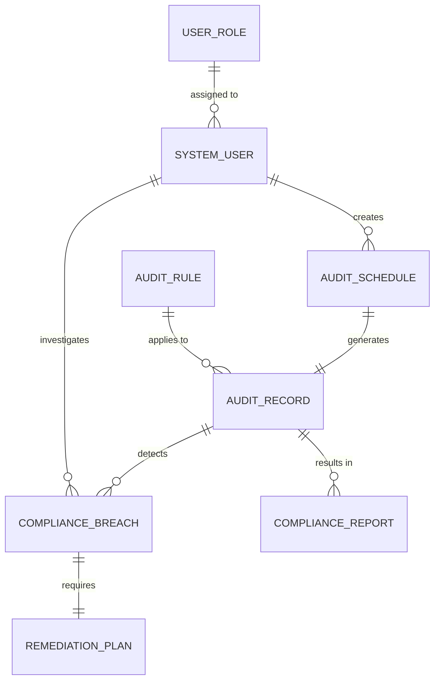

# Conceptual ERD — HR Audit and Compliance System

## Mermaid Code

## Entity Description Table | Bang mo ta Entity

| # | Entity Name | Vietnamese Name | Description | Key Attributes | Main Relationships |
|---|-------------|-----------------|-------------|----------------|-------------------|
| 1 | SYSTEM_USER | Nguoi dung he thong | Tai khoan truy cap he thong | user_id, username, email | creates AUDIT_SCHEDULE, investigates COMPLIANCE_BREACH |
| 2 | USER_ROLE | Quyen nguoi dung | Vai tro cua nguoi dung | role_id, role_name, permissions | assigned to SYSTEM_USER |
| 3 | AUDIT_RULE | Quy tac kiem toan | Cac tieu chi tuan thu can kiem tra | rule_id, rule_name, criteria | applies to AUDIT_RECORD |
| 4 | AUDIT_SCHEDULE | Lich trinh kiem toan | Ke hoach thuc hien kiem toan | schedule_id, start_date, frequency | generates AUDIT_RECORD |
| 5 | AUDIT_RECORD | Ban ghi kiem toan | Ket qua cua mot lan chay kiem toan | record_id, execution_time, status | results in COMPLIANCE_REPORT, detects COMPLIANCE_BREACH |
| 6 | COMPLIANCE_REPORT | Bao cao tuan thu | Tai lieu tong hop ve hien trang | report_id, generated_date, summary | belongs to AUDIT_RECORD |
| 7 | COMPLIANCE_BREACH | Vi pham tuan thu | Loi hoac vi pham duoc phat hien | breach_id, severity, description | requires REMEDIATION_PLAN |
| 8 | REMEDIATION_PLAN | Ke hoach khac phuc | Giai phap xu ly vi pham | plan_id, deadline, action_steps | belongs to COMPLIANCE_BREACH |

## Relationship Description | Mo ta Quan he

| # | From Entity | Cardinality | To Entity | Relationship Label | Business Explanation |
|---|-------------|-------------|-----------|-------------------|----------------------|
| 1 | SYSTEM_USER | one-to-many | AUDIT_SCHEDULE | creates | Mot nguoi dung co the tao nhieu lich trinh kiem toan. |
| 2 | SYSTEM_USER | one-to-many | COMPLIANCE_BREACH | investigates | Mot nguoi dung co the theo doi/dieu tra nhieu vi pham. |
| 3 | USER_ROLE | one-to-many | SYSTEM_USER | assigned to | Mot vai tro duoc gan cho nhieu nguoi dung. |
| 4 | AUDIT_RULE | one-to-many | AUDIT_RECORD | applies to | Mot quy tac co the duoc ap dung vao nhieu lan kiem toan. |
| 5 | AUDIT_SCHEDULE | one-to-one | AUDIT_RECORD | generates | Moi lich trinh khi den han se tao ra mot ban ghi kiem toan. |
| 6 | AUDIT_RECORD | one-to-many | COMPLIANCE_REPORT | results in | Mot ban ghi kiem toan co the duoc trich xuat thanh nhieu bao cao. |
| 7 | AUDIT_RECORD | one-to-many | COMPLIANCE_BREACH | detects | Mot lan kiem toan co the phat hien nhieu vi pham tuan thu. |
| 8 | COMPLIANCE_BREACH | one-to-one | REMEDIATION_PLAN | requires | Moi vi pham can co mot ke hoach khac phuc tuong ung. |
