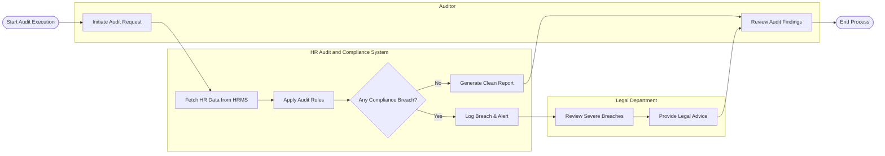

# Swimlane Diagram — HR Audit and Compliance System

## Mermaid Code

## Flow Description | Mo ta luong

| Lane | Actor | Role in Flow |
|------|-------|-------------|
| 1 | Auditor | Nguoi chu dong khoi chay qua trinh kiem toan va xem xet ket qua cuoi cung. |
| 2 | HR Audit and Compliance System | He thong lay du lieu, ap dung quy tac, xac dinh vi pham va tu dong phan luong canh bao. |
| 3 | Legal Department | Phong ban tiep nhan thong bao ve cac vi pham tuan thu nghiem trong de dua ra tu van phap ly. |
