# Action Tree — HR Audit and Compliance System

## Mermaid Code

```mermaid
%%{init: {'theme': 'default'}}%%
graph TD
    Root["HR Audit and Compliance System"]

    Root --> M1["Audit Management"]
    Root --> M2["Compliance Rules"]
    Root --> M3["Breach Management"]
    Root --> M4["Reporting & Analytics"]
    Root --> M5["System Administration"]

    M1 --> A11["Schedule Automatic Audits"]
    M1 --> A12["Execute Manual Audit"]
    M1 --> A13["View Audit Logs"]
    M1 --> A14["Export Audit Findings"]

    M2 --> A21["Create Audit Rule"]
    M2 --> A22["Update Compliance Criteria"]
    M2 --> A23["Deactivate Rule"]

    M3 --> A31["Review Breach Details"]
    M3 --> A32["Create Remediation Plan"]
    M3 --> A33["Notify Legal Department"]
    M3 --> A34["Mark Issue as Resolved"]

    M4 --> A41["Generate Compliance Dashboard"]
    M4 --> A42["Export Regulatory Report"]
    M4 --> A43["Track Trend Metrics"]

    M5 --> A51["Manage User Accounts"]
    M5 --> A52["Assign Roles & Permissions"]
    M5 --> A53["Configure Data Syncing"]
    M5 --> A54["Maintain System Security"]
```

## Module Description | Mo ta Module

| # | Module | Description | Actions |
|---|--------|-------------|---------|
| 1 | Audit Management | Quan ly qua trinh va lich trinh kiem toan | Schedule Automatic Audits, Execute Manual Audit, View Audit Logs, Export Audit Findings |
| 2 | Compliance Rules | Thiet lap cac quy tac tuan thu phap ly | Create Audit Rule, Update Compliance Criteria, Deactivate Rule |
| 3 | Breach Management | Ghi nhan va xu ly cac vi pham phat hien duoc | Review Breach Details, Create Remediation Plan, Notify Legal Department, Mark Issue as Resolved |
| 4 | Reporting & Analytics | Tong hop du lieu va xuat bao cao tuan thu | Generate Compliance Dashboard, Export Regulatory Report, Track Trend Metrics |
| 5 | System Administration | Quan tri nguoi dung va cau hinh he thong | Manage User Accounts, Assign Roles & Permissions, Configure Data Syncing, Maintain System Security |
