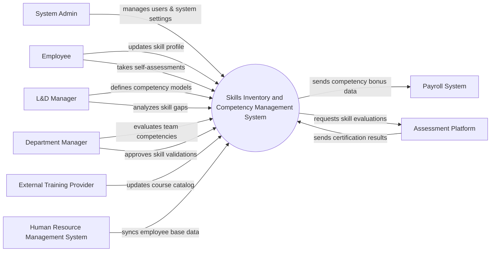

# Context Diagram — Skills Inventory and Competency Management System

## Mermaid Code

## Actor & Interaction Table | Bang Actor & Tuong tac

| # | Actor | Actor Type | Data Sent TO System | Data Received FROM System | Notes |
|---|-------|------------|---------------------|---------------------------|-------|
| 1 | System Admin | Primary | System configurations, user roles | System logs, audit reports | Quan tri he thong |
| 2 | Employee | Primary | Self-assessment scores, skill updates | Skill gap reports, training recommendations | Nhan vien trong to chuc |
| 3 | L&D Manager | Primary | Competency models, skill frameworks | Organization skill gap analysis, training needs | Quan ly dao tao va phat trien |
| 4 | Department Manager | Primary | Skill validations, employee evaluations | Team competency reports | Quan ly phong ban |
| 5 | External Training Provider | Supporting | Course catalog updates, training availability | Training enrollment requests | Doi tac cung cap khoa hoc |
| 6 | Human Resource Management System | Supporting | Employee base data, job roles | Competency level updates | He thong nhan su cot loi |
| 7 | Payroll System | Supporting | Payroll confirmation status | Skill-based bonus and allowance data | He thong tinh luong |
| 8 | Assessment Platform | Supporting | Certification results, test scores | Assessment requests, candidate info | Nen tang danh gia ky nang |

## System Boundary Description | Mo ta Pham vi He thong

The Skills Inventory and Competency Management System is responsible for tracking employee skills, defining competency models for various job roles, and analyzing skill gaps across the organization. It allows employees to self-assess and managers to validate competencies, ultimately recommending targeted training. The system does not handle general HR functions or payroll processing directly; instead, it integrates with the Human Resource Management System for employee data and the Payroll System for skill-based compensation. External training and certification assessments are managed by third-party platforms that feed results back into the system.
