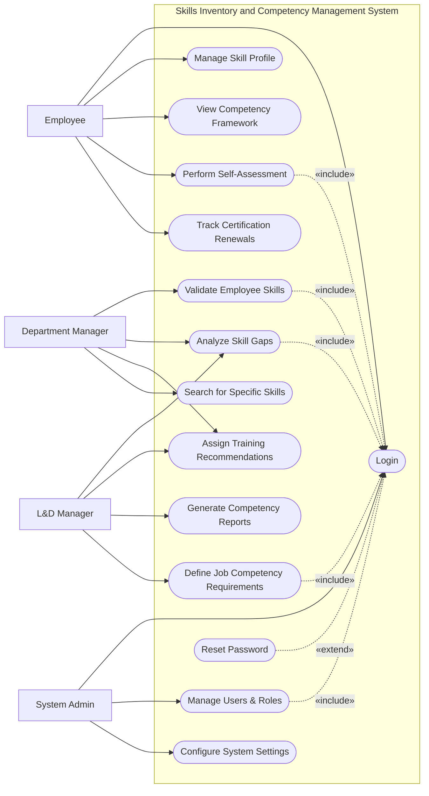

# Use Case Diagram — Skills Inventory and Competency Management System

## Mermaid Code

## Actor Table | Bang Actor

| # | Actor | Actor Type | Role Description | Related Use Cases |
|---|-------|------------|------------------|-------------------|
| 1 | Employee | Primary | Nhan vien quan ly ho so ky nang va tu danh gia nang luc | UC01, UC02, UC03, UC04, UC08 |
| 2 | Department Manager | Primary | Nguoi quan ly truc tiep, danh gia va xac nhan ky nang cua nhan vien | UC05, UC06, UC07, UC11 |
| 3 | L&D Manager | Primary | Quan ly dao tao, thiet lap khung nang luc va phan tich khoang trong ky nang | UC06, UC07, UC09, UC10 |
| 4 | System Admin | Primary | Quan tri vien he thong, phan quyen va thiet lap he thong | UC01, UC12, UC13 |

## Use Case Table | Bang Use Case

| # | UC ID | Use Case Name | Primary Actor | Secondary Actor | Description | Priority |
|---|-------|---------------|---------------|-----------------|-------------|----------|
| 1 | UC01 | Login | Employee | | Authenticate user access | High |
| 2 | UC02 | Manage Skill Profile | Employee | | Update and maintain personal skill inventory | Medium |
| 3 | UC03 | View Competency Framework | Employee | | View required skills for current or target roles | Low |
| 4 | UC04 | Perform Self-Assessment | Employee | | Rate own proficiency on required skills | High |
| 5 | UC05 | Validate Employee Skills | Department Manager | | Review and approve employee skill ratings | High |
| 6 | UC06 | Analyze Skill Gaps | L&D Manager | Department Manager | Identify missing skills against job requirements | High |
| 7 | UC07 | Assign Training Recommendations | L&D Manager | Department Manager | Suggest courses to bridge skill gaps | Medium |
| 8 | UC08 | Track Certification Renewals | Employee | | Monitor expiration dates of professional certificates | Medium |
| 9 | UC09 | Generate Competency Reports | L&D Manager | | Create statistical reports on organization skills | Medium |
| 10| UC10 | Define Job Competency Requirements | L&D Manager | | Set skill standards for different job roles | High |
| 11| UC11 | Search for Specific Skills | Department Manager| | Find employees with specific competencies | Medium |
| 12| UC12 | Manage Users & Roles | System Admin | | Create, update, or deactivate user accounts | High |
| 13| UC13 | Configure System Settings | System Admin | | Update system-wide preferences and parameters | Medium |
| 14| UC14 | Reset Password | Employee | | Recover account access | High |

## Use Case Specification | Dac ta Use Case

---

### UC01 — Login

| Field | Detail |
|-------|--------|
| **UC ID** | UC01 |
| **Use Case Name** | Login |
| **Actor(s)** | Primary: Employee, L&D Manager, Department Manager, System Admin |
| **Description** | Cho phep nguoi dung xac thuc de dang nhap vao he thong. |
| **Precondition** | 1. Nguoi dung phai co tai khoan hop le tren he thong.  2. He thong dang hoat dong binh thuong. |
| **Main Flow** | 1. Actor mo trang dang nhap.  2. System hien thi form dang nhap.  3. Actor nhap username va password.  4. Actor nhan nut Submit.  5. System xac thuc thong tin.  6. System chuyen huong den trang chu tuong ung quyen han. |
| **Alternative Flow** | **AF1** — Quen mat khau: Neu Actor chon "Forgot Password", System kich hoat UC14 Reset Password. |
| **Exception Flow** | **EX1** — Sai thong tin: Neu xac thuc that bai, System hien thi thong bao loi va yeu cau nhap lai.  **EX2** — Tai khoan bi khoa: Neu nhap sai qua 5 lan, System khoa tai khoan va thong bao lien he Admin. |
| **Postcondition** | Nguoi dung duoc dang nhap va phien lam viec duoc khoi tao. |
| **Business Rule** | **BR1**: Mat khau phai duoc ma hoa.  **BR2**: Phien dang nhap tu dong het han sau 30 phut khong hoat dong. |

---

### UC04 — Perform Self-Assessment

| Field | Detail |
|-------|--------|
| **UC ID** | UC04 |
| **Use Case Name** | Perform Self-Assessment |
| **Actor(s)** | Primary: Employee |
| **Description** | Cho phep nhan vien tu danh gia muc do thanh thao cac ky nang yeu cau cho vi tri hien tai. |
| **Precondition** | 1. Nhan vien da dang nhap (Include UC01).  2. Vi tri cua nhan vien da duoc gan khung nang luc (Competency Framework). |
| **Main Flow** | 1. Actor chon chuc nang "Self-Assessment".  2. System hien thi danh sach cac ky nang can danh gia kem theo tieu chi cham diem.  3. Actor chon muc do thanh thao cho tung ky nang va them minh chung (neu co).  4. Actor nhan Submit.  5. System kiem tra viec dien day du cac truong bat buoc.  6. System luu ket qua, danh dau trang thai la "Pending Manager Review" va thong bao cho Manager. |
| **Alternative Flow** | **AF1** — Luu nhap: Tai buoc 4, Actor chon "Save as Draft", System luu trang thai ban nhap ma khong gui thong bao. |
| **Exception Flow** | **EX1** — Thieu thong tin: Neu cac ky nang bat buoc chua duoc danh gia, System canh bao va chan viec Submit. |
| **Postcondition** | Phieu tu danh gia cua nhan vien duoc luu va chuyen sang buoc cho xac nhan tu quan ly. |
| **Business Rule** | **BR1**: Nhan vien chi co the lam tu danh gia trong khoang thoi gian mo ky danh gia theo quy dinh cua cong ty. |

---

### UC05 — Validate Employee Skills

| Field | Detail |
|-------|--------|
| **UC ID** | UC05 |
| **Use Case Name** | Validate Employee Skills |
| **Actor(s)** | Primary: Department Manager |
| **Description** | Quan ly phong ban xem xet va phe duyet muc do thanh thao ky nang ma nhan vien da tu danh gia. |
| **Precondition** | 1. Manager da dang nhap (Include UC01).  2. Nhan vien da nop phieu tu danh gia (Trang thai "Pending Manager Review"). |
| **Main Flow** | 1. Actor vao man hinh "Team Assessments".  2. System hien thi danh sach phieu tu danh gia dang cho duyet.  3. Actor chon mot phieu de xem chi tiet.  4. System hien thi muc do nhan vien tu danh gia va minh chung kem theo.  5. Actor nhap muc do danh gia cua quan ly va nhan "Approve" (Xac nhan).  6. System cap nhat Ho so ky nang (Skill Profile) cua nhan vien va gui thong bao hoan tat. |
| **Alternative Flow** | **AF1** — Yeu cau lam lai: O buoc 5, Actor chon "Request Re-evaluation", System chuyen trang thai phieu ve "Draft" va yeu cau nhan vien danh gia lai. |
| **Exception Flow** | **EX1** — Ky nang chua hoan thien: Neu quan ly quen khong cham diem mot vai ky nang, System hien thi loi "Please rate all skills" truoc khi cho xac nhan. |
| **Postcondition** | Ky nang cua nhan vien duoc cap nhat chinh thuc vao he thong sau khi duoc xac nhan. |
| **Business Rule** | **BR1**: Diem cua quan ly danh gia la diem so cuoi cung duoc ghi nhan trong he thong. |

---

### UC06 — Analyze Skill Gaps

| Field | Detail |
|-------|--------|
| **UC ID** | UC06 |
| **Use Case Name** | Analyze Skill Gaps |
| **Actor(s)** | Primary: L&D Manager, Department Manager |
| **Description** | Phan tich khoang cach giua ky nang thuc te cua nhan vien hoac phong ban so voi yeu cau cua khung nang luc. |
| **Precondition** | 1. Actor da dang nhap (Include UC01).  2. He thong da co du lieu xac nhan ky nang cua nhan vien (Tu UC05). |
| **Main Flow** | 1. Actor vao chuc nang "Skill Gap Analysis".  2. System hien thi form loc (theo nhan vien, phong ban, hoac vi tri).  3. Actor chon tieu chi can phan tich va nhan "Analyze".  4. System tinh toan su chenh lech giua diem thuc te va diem yeu cau.  5. System hien thi bao cao Skill Gap duoi dang bieu do va danh sach chi tiet. |
| **Alternative Flow** | **AF1** — Xuat bao cao: Actor nhan chon "Export Report", System tao va tai ve bao cao dang PDF/Excel. |
| **Exception Flow** | **EX1** — Khong du du lieu: Neu phong ban duoc chon chua co du lieu danh gia, System thong bao "Insufficient data for analysis". |
| **Postcondition** | Nguoi dung nhan duoc bao cao chi tiet ve khoang trong ky nang lam co so xay dung ke hoach dao tao. |
| **Business Rule** | **BR1**: Khoang trong ky nang (Gap) = Yeu cau (Required Level) - Thuc te (Actual Level). Neu ket qua < 0, ghi nhan la 0 (Khong co gap). |

---

### UC10 — Define Job Competency Requirements

| Field | Detail |
|-------|--------|
| **UC ID** | UC10 |
| **Use Case Name** | Define Job Competency Requirements |
| **Actor(s)** | Primary: L&D Manager |
| **Description** | Thiet lap khung nang luc (Competency Model) cho tung vi tri cong viec trong cong ty. |
| **Precondition** | 1. L&D Manager da dang nhap (Include UC01).  2. Danh sach cac ky nang (Skills) da duoc tao tren he thong. |
| **Main Flow** | 1. Actor vao module "Competency Framework".  2. System hien thi danh sach cac vi tri cong viec hien co.  3. Actor chon mot vi tri hoac tao them vi tri moi.  4. Actor them cac ky nang yeu cau va dat muc diem tieu chuan (Target Level) cho tung ky nang.  5. Actor nhan "Save".  6. System luu khung nang luc va ap dung cho tat ca nhan vien dang giu vi tri do. |
| **Alternative Flow** | **AF1** — Sao chep khung nang luc: O buoc 3, Actor chon "Clone from another job role" de tiet kiem thoi gian thiet lap. |
| **Exception Flow** | **EX1** — Khong co ky nang: Neu Actor co gang luu nhung chua the ky nang nao, System canh bao "At least one skill is required". |
| **Postcondition** | Khung nang luc cho vi tri cong viec duoc tao hoac cap nhat thanh cong. |
| **Business Rule** | **BR1**: Chi co L&D Manager va System Admin moi co quyen thay doi khung nang luc cua cac vi tri cong viec. |
