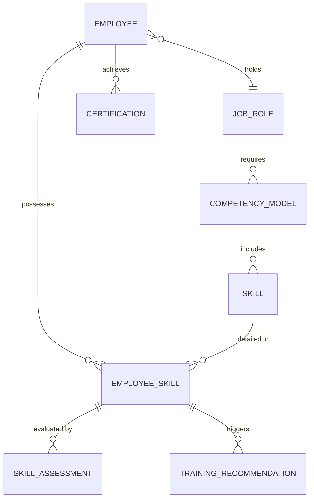

# Conceptual ERD — Skills Inventory and Competency Management System

## Mermaid Code

## Entity Description Table | Bang mo ta Entity

| # | Entity Name | Vietnamese Name | Description | Key Attributes | Main Relationships |
|---|-------------|-----------------|-------------|----------------|-------------------|
| 1 | EMPLOYEE | Nhan vien | Ho so ca nhan cua nhan vien | employee_id, name, email | holds JOB_ROLE, possesses EMPLOYEE_SKILL |
| 2 | JOB_ROLE | Vi tri cong viec | Thong tin cac chuc danh trong to chuc | role_id, title, department | requires COMPETENCY_MODEL |
| 3 | COMPETENCY_MODEL| Khung nang luc | Tap hop cac ky nang yeu cau cho vi tri | model_id, target_level | includes SKILL |
| 4 | SKILL | Ky nang | Danh muc ky nang don le trong he thong | skill_id, name, category | detailed in EMPLOYEE_SKILL |
| 5 | EMPLOYEE_SKILL | Ky nang nhan vien | Muc do thanh thao cua tung nhan vien voi ky nang | emp_skill_id, proficiency_level | possesses by EMPLOYEE |
| 6 | SKILL_ASSESSMENT| Danh gia ky nang | Lich su danh gia ky nang (tu danh gia, quan ly danh gia) | assessment_id, score, date | evaluated by EMPLOYEE_SKILL |
| 7 | CERTIFICATION | Chung chi | Bang cap hoac chung chi ben ngoai ma nhan vien dat duoc | cert_id, name, expiration_date | achieves by EMPLOYEE |
| 8 | TRAINING_RECOMMENDATION | De xuat dao tao | Khoa hoc duoc de xuat dua tren khoang trong ky nang | rec_id, course_name, status | triggers by EMPLOYEE_SKILL |

## Relationship Description | Mo ta Quan he

| # | From Entity | Cardinality | To Entity | Relationship Label | Business Explanation |
|---|-------------|-------------|-----------|-------------------|----------------------|
| 1 | EMPLOYEE | many-to-one | JOB_ROLE | holds | Nhieu nhan vien co the giu cung mot vi tri cong viec. |
| 2 | JOB_ROLE | one-to-many | COMPETENCY_MODEL | requires | Mot vi tri cong viec co the yeu cau nhieu muc trong khung nang luc. |
| 3 | COMPETENCY_MODEL| one-to-many | SKILL | includes | Mot khung nang luc bao gom nhieu ky nang khac nhau. |
| 4 | EMPLOYEE | one-to-many | EMPLOYEE_SKILL | possesses | Mot nhan vien so huu nhieu ky nang thuc te khac nhau. |
| 5 | SKILL | one-to-many | EMPLOYEE_SKILL | detailed in | Mot ky nang co the duoc phan bo chi tiet vao nhieu nhan vien khac nhau. |
| 6 | EMPLOYEE_SKILL | one-to-many | SKILL_ASSESSMENT | evaluated by | Mot ky nang cua nhan vien co the trai qua nhieu lan danh gia theo thoi gian. |
| 7 | EMPLOYEE | one-to-many | CERTIFICATION | achieves | Mot nhan vien co the dat duoc nhieu chung chi. |
| 8 | EMPLOYEE_SKILL | one-to-many | TRAINING_RECOMMENDATION| triggers | Mot ky nang bi thieu hut se tao ra nhieu de xuat dao tao. |
