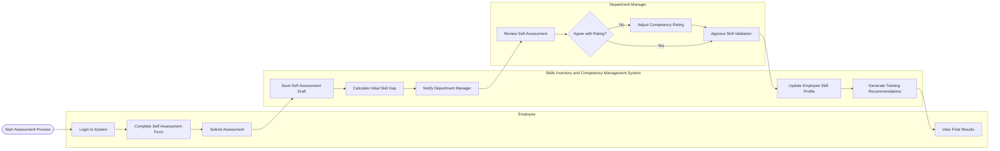

# Swimlane Diagram — Skills Inventory and Competency Management System

## Mermaid Code

## Flow Description | Mo ta luong

| Lane | Actor | Role in Flow |
|------|-------|-------------|
| 1 | Employee | Nguoi chu dong vao he thong thuc hien tu danh gia nang luc ca nhan minh so voi yeu cau cong viec. |
| 2 | Skills Inventory and Competency Management System | He thong luu tru thong tin, tinh toan khoang trong ky nang (skill gap), gui thong bao va tu dong de xuat cac khoa dao tao. |
| 3 | Department Manager | Nguoi quan ly nhan thong bao, xem xet diem tu danh gia cua nhan vien, dieu chinh neu can va xac nhan ket qua cuoi cung. |
