# Action Tree — Skills Inventory and Competency Management System

## Mermaid Code

```mermaid
%%{init: {'theme': 'default'}}%%
graph TD
    Root["Skills Inventory and Competency Management System"]

    Root --> M1["Skill Framework Management"]
    Root --> M2["Employee Skill Inventory"]
    Root --> M3["Competency Assessment"]
    Root --> M4["Gap Analysis & Training"]
    Root --> M5["System Administration"]

    M1 --> A11["Define Global Skills Dictionary"]
    M1 --> A12["Define Job Competency Models"]
    M1 --> A13["Map Skills to Job Roles"]

    M2 --> A21["Update Personal Skill Profiles"]
    M2 --> A22["Track Employee Certifications"]
    M2 --> A23["Search Organization Skills"]

    M3 --> A31["Perform Self-Assessment"]
    M3 --> A32["Conduct Manager Evaluation"]
    M3 --> A33["Validate External Certifications"]
    M3 --> A34["Review Assessment History"]

    M4 --> A41["Analyze Individual Skill Gaps"]
    M4 --> A42["Analyze Department Skill Gaps"]
    M4 --> A43["Assign Training Recommendations"]
    M4 --> A44["Track Training Progress"]

    M5 --> A51["Manage User Accounts & Roles"]
    M5 --> A52["Configure System Parameters"]
    M5 --> A53["View System Audit Logs"]
```

## Module Description | Mo ta Module

| # | Module | Description | Actions |
|---|--------|-------------|---------|
| 1 | Skill Framework Management | Thiet lap tu dien ky nang va khung nang luc chuan cho to chuc. | Define Global Skills Dictionary, Define Job Competency Models, Map Skills to Job Roles |
| 2 | Employee Skill Inventory | Quan ly danh muc ky nang va chung chi cua tung nhan vien. | Update Personal Skill Profiles, Track Employee Certifications, Search Organization Skills |
| 3 | Competency Assessment | Thuc hien cac danh gia nang luc dinh ky giua nhan vien va quan ly. | Perform Self-Assessment, Conduct Manager Evaluation, Validate External Certifications, Review Assessment History |
| 4 | Gap Analysis & Training | Phan tich thieu hut ky nang va dua ra de xuat dao tao phu hop. | Analyze Individual Skill Gaps, Analyze Department Skill Gaps, Assign Training Recommendations, Track Training Progress |
| 5 | System Administration | Quan tri nguoi dung, phan quyen va thiet lap cac thong so he thong. | Manage User Accounts & Roles, Configure System Parameters, View System Audit Logs |
