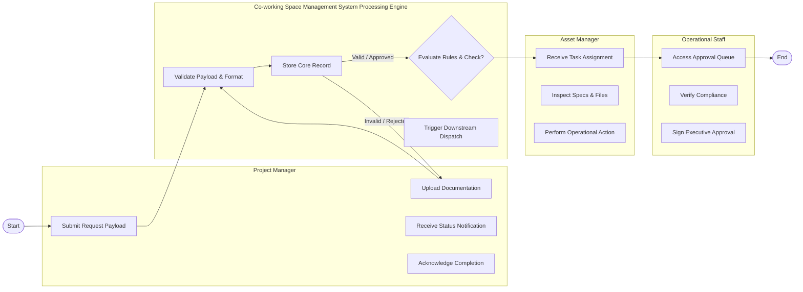

# Swimlane Diagram — Co-working Space Management System

## Mermaid Code

## Flow Description | Mô tả luồng

| Lane | Actor | Role in Flow |
|------|-------|-------------|
| 1 | Project Manager | Initiates operation, uploads inputs, monitors status, receives results. |
| 2 | Co-working Space Management System Processing Engine | Validates inputs, executes core logic, checks compliance, updates state. |
| 3 | Asset Manager | Reviews request, inspects details, executes operational processing. |
| 4 | Operational Staff | Inspects high-level compliance and signs final approval. |

