# Action Tree — Parking Lot Management System

## Mermaid Code

```mermaid
graph TD
    Root["Parking Lot Management System"]

    Root --> M1["Core Request & Data Input Module"]
    Root --> M2["Operational Workflow Engine"]
    Root --> M3["Financial & Settlement Module"]
    Root --> M4["Notification & Communication Module"]
    Root --> M5["Compliance & Audit Trail Module"]
    Root --> M6["System Administration & Analytics Module"]

    M1 --> A1_1["Submit New Request"]
    M1 --> A1_2["Save Form Draft"]
    M1 --> A1_3["Validate Input Schema"]
    M1 --> A1_4["Upload File Attachments"]
    M1 --> A1_5["View Submission History"]
    M2 --> A2_1["Assign Processing Task"]
    M2 --> A2_2["Update Status Code"]
    M2 --> A2_3["Set Processing Deadline"]
    M2 --> A2_4["Route to Escalation"]
    M2 --> A2_5["View State History"]
    M3 --> A3_1["Calculate Fee Structure"]
    M3 --> A3_2["Process Payment Gateway"]
    M3 --> A3_3["Generate VAT Invoice"]
    M3 --> A3_4["Execute Refund Payout"]
    M3 --> A3_5["Export Financial Ledger"]
    M4 --> A4_1["Send SMS Alert"]
    M4 --> A4_2["Dispatch Email Receipt"]
    M4 --> A4_3["Push Mobile Notification"]
    M4 --> A4_4["Configure Alert Template"]
    M4 --> A4_5["View Delivery Status"]
    M5 --> A5_1["Log Security Audit"]
    M5 --> A5_2["Query Regulatory Portal"]
    M5 --> A5_3["Export Compliance Report"]
    M5 --> A5_4["Inspect User Activity"]
    M5 --> A5_5["Archive Legal Proof"]
    M6 --> A6_1["Configure Business Rules"]
    M6 --> A6_2["Manage User Roles"]
    M6 --> A6_3["Render System Dashboard"]
    M6 --> A6_4["Backup System Database"]
    M6 --> A6_5["View Performance Metrics"]
```

## Module Description | Mô tả Module

| # | Module | Description | Actions |
|---|--------|-------------|---------|
| 1 | Core Request & Data Input Module | Handles data entry, form validation, and record submission. | Submit New Request, Save Form Draft, Validate Input Schema, Upload File Attachments, View Submission History |
| 2 | Operational Workflow Engine | Manages state transitions, queues, and task dispatching. | Assign Processing Task, Update Status Code, Set Processing Deadline, Route to Escalation, View State History |
| 3 | Financial & Settlement Module | Handles billing, payment gateway integration, and invoicing. | Calculate Fee Structure, Process Payment Gateway, Generate VAT Invoice, Execute Refund Payout, Export Financial Ledger |
| 4 | Notification & Communication Module | Dispatches SMS, email, and in-app alerts. | Send SMS Alert, Dispatch Email Receipt, Push Mobile Notification, Configure Alert Template, View Delivery Status |
| 5 | Compliance & Audit Trail Module | Maintains security logs, government verification, and audit reports. | Log Security Audit, Query Regulatory Portal, Export Compliance Report, Inspect User Activity, Archive Legal Proof |
| 6 | System Administration & Analytics Module | Manages user access, configuration parameters, and business intelligence. | Configure Business Rules, Manage User Roles, Render System Dashboard, Backup System Database, View Performance Metrics |

