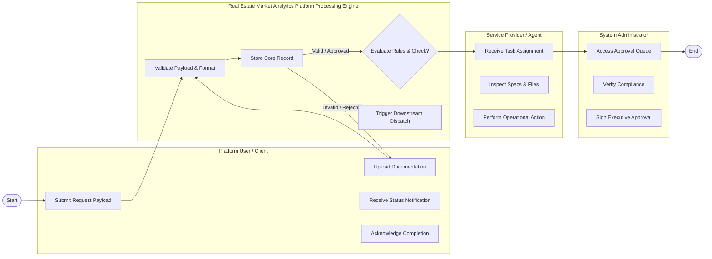

# Swimlane Diagram — Real Estate Market Analytics Platform

## Mermaid Code

## Flow Description | Mô tả luồng

| Lane | Actor | Role in Flow |
|------|-------|-------------|
| 1 | Platform User / Client | Initiates operation, uploads inputs, monitors status, receives results. |
| 2 | Real Estate Market Analytics Platform Processing Engine | Validates inputs, executes core logic, checks compliance, updates state. |
| 3 | Service Provider / Agent | Reviews request, inspects details, executes operational processing. |
| 4 | System Administrator | Inspects high-level compliance and signs final approval. |

