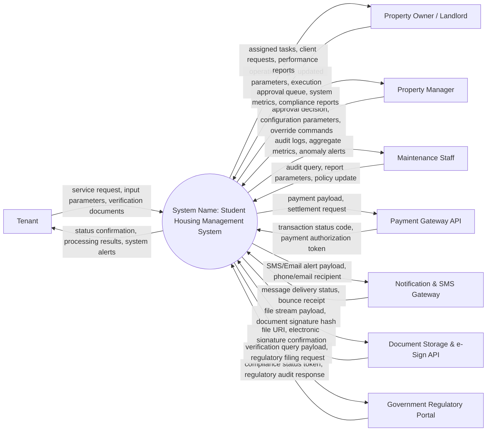

# Context Diagram — Student Housing Management System

## Mermaid Code

## Actor & Interaction Table | Bảng Actor & Tương tác

| # | Actor | Actor Type | Data Sent TO System | Data Received FROM System | Notes |
|---|-------|------------|---------------------|---------------------------|-------|
| 1 | Tenant | Primary | service request, input parameters, verification documents | status confirmation, processing results, system alerts | Primary end user interacting with core workflows. |
| 2 | Property Owner / Landlord | Primary | operation logs, updated parameters, execution status | assigned tasks, client requests, performance reports | Operational role managing tasks and service requests. |
| 3 | Property Manager | Primary | approval decision, configuration parameters, override commands | approval queue, system metrics, compliance reports | Administrative user overseeing compliance and settings. |
| 4 | Maintenance Staff | Primary | audit query, report parameters, policy update | audit logs, aggregate metrics, anomaly alerts | Supervisory role checking quality control. |
| 5 | Payment Gateway API | Supporting System | transaction status code, payment authorization token | payment payload, settlement request | External billing and settlement API. |
| 6 | Notification & SMS Gateway | Supporting System | message delivery status, bounce receipt | SMS/Email alert payload, phone/email recipient | External communication engine. |
| 7 | Document Storage & e-Sign API | Supporting System | file URI, electronic signature confirmation | file stream payload, document signature hash | Cloud file storage and digital signature engine. |
| 8 | Government Regulatory Portal | Regulatory System | compliance status token, regulatory audit response | verification query payload, regulatory filing request | Government legal registry or compliance system. |

## System Boundary Description | Mô tả Phạm vi Hệ thống

Hệ thống **Student Housing Management System** (Hệ thống Quản lý Nhà ở Sinh viên) được thiết kế nhằm tự động hóa và quản lý tập trung toàn bộ nghiệp vụ cốt lõi trong phân khúc bất động sản tương ứng. Ranh giới hệ thống bao gồm cơ sở dữ liệu tích hợp, bộ vi xử lý logic nghiệp vụ trung tâm, cổng xác thực an toàn và cơ chế điều phối luồng làm việc. Hệ thống giao tiếp với các nhân tố bên ngoài (Primary Actors, Supporting Systems, Regulatory Bodies) thông qua các giao diện lập trình ứng dụng (API) chuẩn hóa và mã hóa thông tin. Các thành phần bên ngoài như thiết bị cá nhân người dùng, dịch vụ viễn thông công cộng, hạ tầng thanh toán bên thứ ba nằm ngoài phạm vi xử lý nội bộ của hệ thống nhưng được kết nối an toàn để đảm bảo tính toàn vẹn dữ liệu.
