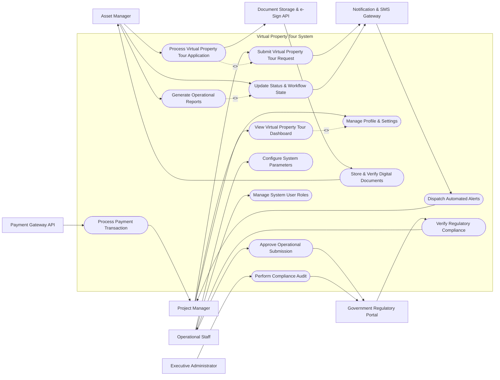

# Use Case Diagram — Virtual Property Tour System

## Mermaid Code

## Actor Table | Bảng Actor

| # | Actor | Actor Type | Role Description | Related Use Cases |
|---|-------|------------|------------------|-------------------|
| 1 | Project Manager | Primary | Main user initiating virtual property tour system operations. | UC01, UC02, UC03, UC11, UC12 |
| 2 | Asset Manager | Primary | Handles operational workflows in virtual property tour system. | UC04, UC05, UC06, UC13 |
| 3 | Operational Staff | Primary | Manages system configurations and governance. | UC07, UC08, UC10, UC14 |
| 4 | Executive Administrator | Primary | Monitors platform integrity and audit compliance. | UC09 |
| 5 | Payment Gateway API | Supporting System | Processes electronic payments and payouts. | UC11 |
| 6 | Notification & SMS Gateway | Supporting System | Sends real-time alerts and notifications. | UC01, UC05, UC12 |
| 7 | Document Storage & e-Sign API | Supporting System | Stores documents securely and handles e-signatures. | UC04, UC13 |
| 8 | Government Regulatory Portal | Regulatory System | Validates legal compliance and official registry data. | UC07, UC09, UC14 |

## Use Case Table | Bảng Use Case

| # | UC ID | Use Case Name | Primary Actor | Secondary Actor | Description | Priority |
|---|-------|---------------|---------------|-----------------|-------------|----------|
| 1 | UC01 | Submit Virtual Property Tour Request | Project Manager | Notification & SMS Gateway | Initiate a new request or operation within Virtual Property Tour System. | High |
| 2 | UC02 | View Virtual Property Tour Dashboard | Project Manager | None | Display overview summary metrics, pending actions, and status updates. | High |
| 3 | UC03 | Manage Profile & Settings | Project Manager | None | Update account information, notification settings, and preferences. | Medium |
| 4 | UC04 | Process Virtual Property Tour Application | Asset Manager | Document Storage & e-Sign API | Evaluate submitted data, verify documents, and perform operational tasks. | High |
| 5 | UC05 | Update Status & Workflow State | Asset Manager | Notification & SMS Gateway | Advance record through lifecycle states (Pending, Active, Closed). | High |
| 6 | UC06 | Generate Operational Reports | Asset Manager | None | Extract detailed summary statistics, operational metrics, and logs. | Medium |
| 7 | UC07 | Approve Operational Submission | Operational Staff | Government Regulatory Portal | Review and approve/reject high-level operational or legal requests. | High |
| 8 | UC08 | Configure System Parameters | Operational Staff | None | Set business rules, approval thresholds, and automated triggers. | High |
| 9 | UC09 | Perform Compliance Audit | Executive Administrator | Government Regulatory Portal | Inspect audit trails and ensure regulatory compliance. | Medium |
| 10 | UC10 | Manage System User Roles | Operational Staff | None | Assign access permissions, roles, and security policies. | High |
| 11 | UC11 | Process Payment Transaction | Payment Gateway API | Project Manager | Execute billing charges, fee calculations, and electronic payouts. | High |
| 12 | UC12 | Dispatch Automated Alerts | Notification & SMS Gateway | Project Manager | Trigger automated SMS, push notifications, and email notices. | Medium |
| 13 | UC13 | Store & Verify Digital Documents | Document Storage & e-Sign API | Asset Manager | Archive PDF contracts, proof documents, and compute hash verification. | High |
| 14 | UC14 | Verify Regulatory Compliance | Government Regulatory Portal | Operational Staff | Query government databases for license checks and regulatory approvals. | Medium |

## Use Case Specification | Đặc tả Use Case

---

### UC01 — Submit Virtual Property Tour Request

| Field | Detail |
|-------|--------|
| **UC ID** | UC01 |
| **Use Case Name** | Submit Virtual Property Tour Request |
| **Actor(s)** | Primary: Project Manager / Secondary: Notification & SMS Gateway |
| **Description** | Allows Project Manager to submit a formal request or transaction within Virtual Property Tour System with validated inputs. |
| **Precondition** | 1. User is authenticated and logged into the system. 2. System services are active and accessible. |
| **Main Flow** | 1. User accesses the request submission page. 2. System presents input form tailored for Virtual Property Tour System. 3. User enters required details, uploads supporting files. 4. System validates inputs against business rules and data schemas. 5. User reviews summary and confirms submission. 6. System stores record with status 'PENDING_REVIEW'. 7. System triggers Notification & SMS Gateway to send confirmation notice to User. |
| **Alternative Flow** | AF1 — Draft Save: User selects 'Save Draft'. System saves current form payload with state 'DRAFT' for later submission. |
| **Exception Flow** | EX1 — Validation Error: Mandatory fields are missing or improperly formatted. System displays inline error messages and blocks submission. EX2 — File Storage Failure: Document Storage API is unreachable. System retains form inputs in local session cache and alerts user to retry. |
| **Postcondition** | Request record created in database with 'PENDING_REVIEW' state and tracking ID generated. |
| **Business Rule** | BR1: Requests submitted after business hours must be queued for next-day processing. BR2: Attached documentation must conform to approved file formats (PDF, JPG, PNG under 15MB). |

---

### UC04 — Process Virtual Property Tour Application

| Field | Detail |
|-------|--------|
| **UC ID** | UC04 |
| **Use Case Name** | Process Virtual Property Tour Application |
| **Actor(s)** | Primary: Asset Manager / Secondary: Document Storage & e-Sign API |
| **Description** | Allows Asset Manager to review, inspect, and process user requests. |
| **Precondition** | 1. A request exists in 'PENDING_REVIEW' status. 2. User has administrative processing permissions. |
| **Main Flow** | 1. Processor opens processing task queue. 2. System displays request payload, uploaded documents, and history. 3. Processor evaluates data correctness and inspects documents via Document Storage API. 4. Processor enters evaluation notes and selects outcome ('VERIFIED' or 'REJECTED'). 5. System updates record state in database. 6. System generates processing log entry with timestamp and processor ID. |
| **Alternative Flow** | AF1 — Request Clarification: Processor marks item 'NEEDS_INFO'. System sends alert to submitter specifying required corrections. |
| **Exception Flow** | EX1 — Document Signature Mismatch: e-Signature verification fails. System flags item with 'SECURITY_ALERT' and locks record. EX2 — Record Lock Conflict: Another processor opens same item. System presents read-only view with warning notice. |
| **Postcondition** | Record transitions to 'VERIFIED' or 'REJECTED' with audit history logged. |
| **Business Rule** | BR1: Applications must be processed within 48 business hours. BR2: Rejection decisions must include explicit rationale notes. |

---

### UC07 — Approve Operational Submission

| Field | Detail |
|-------|--------|
| **UC ID** | UC07 |
| **Use Case Name** | Approve Operational Submission |
| **Actor(s)** | Primary: Operational Staff / Secondary: Government Regulatory Portal |
| **Description** | Enables Operational Staff to issue final executive approval or authorization for high-priority items. |
| **Precondition** | 1. Record status is in 'VERIFIED' state. 2. Approver possesses executive sign-off authority. |
| **Main Flow** | 1. Approver accesses approval dashboard. 2. System renders executive summary, risk analysis, and audit log. 3. Approver verifies compliance status via Government Regulatory Portal. 4. Approver authorizes approval using digital signature key. 5. System transitions record state to 'APPROVED_AND_ACTIVE'. 6. System dispatches authorization notifications to stakeholders. |
| **Alternative Flow** | AF1 — Conditional Approval: Approver sets status 'APPROVED_WITH_CONDITIONS' with required follow-up deliverables. |
| **Exception Flow** | EX1 — Regulatory Check Failure: Portal returns 'NON_COMPLIANT'. System halts approval workflow and alerts Legal team. EX2 — Expired Signature Key: Approver digital key is expired. System prompts mandatory key re-authentication. |
| **Postcondition** | Record marked 'APPROVED_AND_ACTIVE', financial and operational triggers activated. |
| **Business Rule** | BR1: Transactions exceeding threshold values require dual executive sign-off. BR2: Approval audit trail cannot be modified or purged. |

---

### UC11 — Process Payment Transaction

| Field | Detail |
|-------|--------|
| **UC ID** | UC11 |
| **Use Case Name** | Process Payment Transaction |
| **Actor(s)** | Primary: Payment Gateway API / Secondary: Project Manager |
| **Description** | Executes financial settlement, invoicing, and payment confirmation for system transactions. |
| **Precondition** | 1. Payment amount is calculated and verified. 2. Payment Gateway service is online. |
| **Main Flow** | 1. System initiates payment request payload to Payment Gateway API. 2. Gateway prompts user for payment credential authorization. 3. Gateway processes charge against card/bank/wallet. 4. Gateway transmits response payload containing transaction token and status code. 5. System verifies cryptographic response signature. 6. System records invoice and updates record status to 'PAID'. |
| **Alternative Flow** | AF1 — Auto-recurring Charge: System executes subscription billing charge using stored tokenized payment profile. |
| **Exception Flow** | EX1 — Insufficient Funds: Gateway returns error 'DECLINED_INSUFFICIENT_FUNDS'. System prompts user to update payment method. EX2 — Gateway Timeout: Payment API fails to respond within 10 seconds. System queries transaction status via polling before retrying. |
| **Postcondition** | Payment record created, digital receipt issued, and transaction state updated to PAID. |
| **Business Rule** | BR1: All payment transactions must be encrypted via TLS 1.3. BR2: PCI-DSS compliance standards must be strictly enforced for credit card tokenization. |

