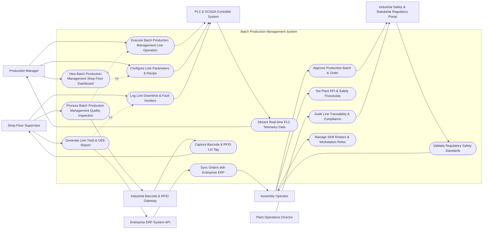

# Use Case Diagram — Batch Production Management System

## Mermaid Code

## Actor Table | Bảng Actor

| # | Actor | Actor Type | Role Description | Related Use Cases |
|---|-------|------------|------------------|-------------------|
| 1 | Production Manager | Primary | Main user initiating batch production management system operations. | UC01, UC02, UC03, UC11 |
| 2 | Shop Floor Supervisor | Primary | Manages line execution in batch production management system. | UC04, UC05, UC06, UC13 |
| 3 | Assembly Operator | Primary | Manages factory line parameters and executive reporting. | UC07, UC08, UC10, UC12, UC14 |
| 4 | Plant Operations Director | Primary | Monitors regulatory adherence and quality standards. | UC09 |
| 5 | PLC & SCADA Controller System | Supporting System | Interfaces directly with machinery PLC/SCADA units. | UC01, UC03, UC05, UC11 |
| 6 | Enterprise ERP System API | Supporting System | Exchanges order, inventory, and cost ledger data. | UC06, UC12 |
| 7 | Industrial Barcode & RFID Gateway | Supporting System | Reads barcodes, QR codes, and RFID tags on the shop floor. | UC04, UC13 |
| 8 | Industrial Safety & Standards Regulatory Portal | Regulatory System | Validates industrial safety and environmental compliance. | UC07, UC09, UC14 |

## Use Case Table | Bảng Use Case

| # | UC ID | Use Case Name | Primary Actor | Secondary Actor | Description | Priority |
|---|-------|---------------|---------------|-----------------|-------------|----------|
| 1 | UC01 | Execute Batch Production Management Line Operation | Production Manager | PLC & SCADA Controller System | Initiate line operations and data capture in Batch Production Management System. | High |
| 2 | UC02 | View Batch Production Management Shop Floor Dashboard | Production Manager | None | Display real-time line metrics, machine statuses, and production output. | High |
| 3 | UC03 | Configure Line Parameters & Recipe | Production Manager | PLC & SCADA Controller System | Set machine speed, temperature, pressure setpoints, and job parameters. | Medium |
| 4 | UC04 | Process Batch Production Management Quality Inspection | Shop Floor Supervisor | Industrial Barcode & RFID Gateway | Perform dimensional, visual, or laboratory quality inspection tasks. | High |
| 5 | UC05 | Log Line Downtime & Fault Incident | Shop Floor Supervisor | PLC & SCADA Controller System | Record machine breakdown reasons, duration, and corrective actions. | High |
| 6 | UC06 | Generate Line Yield & OEE Report | Shop Floor Supervisor | Enterprise ERP System API | Compile Overall Equipment Effectiveness (OEE), scrap rates, and output logs. | Medium |
| 7 | UC07 | Approve Production Batch & Order | Assembly Operator | Industrial Safety & Standards Regulatory Portal | Review batch records and authorize final release to warehouse/shipping. | High |
| 8 | UC08 | Set Plant KPI & Safety Thresholds | Assembly Operator | None | Define tolerance limits, SPC control boundaries, and alert escalation rules. | High |
| 9 | UC09 | Audit Line Traceability & Compliance | Plant Operations Director | Industrial Safety & Standards Regulatory Portal | Perform forward/backward batch traceability and compliance checks. | Medium |
| 10 | UC10 | Manage Shift Rosters & Workstation Roles | Assembly Operator | None | Assign operators to workstation lines and grant machine clearance. | High |
| 11 | UC11 | Stream Real-time PLC Telemetry Data | PLC & SCADA Controller System | Production Manager | Continuous ingestion of temperature, vibration, and cycle data from equipment. | High |
| 12 | UC12 | Sync Orders with Enterprise ERP | Enterprise ERP System API | Assembly Operator | Synchronize raw material issues, finished goods counts, and BOM changes. | Medium |
| 13 | UC13 | Capture Barcode & RFID Lot Tag | Industrial Barcode & RFID Gateway | Shop Floor Supervisor | Scan component serial numbers and associate them with production lot. | High |
| 14 | UC14 | Validate Regulatory Safety Standards | Industrial Safety & Standards Regulatory Portal | Assembly Operator | Submit environmental, worker safety, and ISO compliance metrics. | Medium |

## Use Case Specification | Đặc tả Use Case

---

### UC01 — Execute Batch Production Management Line Operation

| Field | Detail |
|-------|--------|
| **UC ID** | UC01 |
| **Use Case Name** | Execute Batch Production Management Line Operation |
| **Actor(s)** | Primary: Production Manager / Secondary: PLC & SCADA Controller System |
| **Description** | Allows Production Manager to start, monitor, and execute line operations for a scheduled work order. |
| **Precondition** | 1. Work order is released in 'READY_FOR_PRODUCTION' state. 2. Equipment is verified clean and calibrated. |
| **Main Flow** | 1. Operator scans work order barcode at line workstation. 2. System validates work order state and loads active recipe parameters. 3. Operator initiates line start sequence on HMI/terminal. 4. System sends run command payload to PLC & SCADA Controller System. 5. Equipment commences operation while streaming cycle metrics. 6. System updates work order state to 'IN_PROGRESS' and displays live counter. |
| **Alternative Flow** | AF1 — Pause Operation: Operator presses 'Line Pause'. System records pause timestamp, prompts reason selection (Material Shortage / Minor Jam), and holds machine state. |
| **Exception Flow** | EX1 — Emergency E-Stop Activated: SCADA system triggers safety interlock. System instantly flags record with 'EMERGENCY_STOP', logs alarm code, and alerts Shift Supervisor. EX2 — Recipe Parameter Mismatch: PLC reports parameter out of tolerance. System halts start sequence and requires Engineer override code. |
| **Postcondition** | Line operation is active, telemetry data logging continuously to timeseries database. |
| **Business Rule** | BR1: Production lines cannot start without valid operator authentication and safety check sign-off. BR2: Telemetry sample rate must be logged at minimum 1-second intervals for critical parameters. |

---

### UC04 — Process Batch Production Management Quality Inspection

| Field | Detail |
|-------|--------|
| **UC ID** | UC04 |
| **Use Case Name** | Process Batch Production Management Quality Inspection |
| **Actor(s)** | Primary: Shop Floor Supervisor / Secondary: Industrial Barcode & RFID Gateway |
| **Description** | Allows Shop Floor Supervisor to record quality inspection results, measurements, and defect classifications for produced units. |
| **Precondition** | 1. Inspection lot or sample unit is selected from active production line. 2. Measurement tools/gauges are calibrated. |
| **Main Flow** | 1. Inspector scans unit/lot RFID tag using Industrial Barcode & RFID Gateway. 2. System displays quality inspection checklist and SPC tolerance limits. 3. Inspector inputs measured dimensions, visual flaw counts, or test values. 4. System evaluates measured values against upper/lower control limits (UCL/LCL). 5. System assigns pass/fail status to the lot. 6. If failed, system prompts defect categorization and quarantine routing. |
| **Alternative Flow** | AF1 — Auto Visual Inspection: Automated Vision System scans unit surface and passes defect coordinates directly to system without manual entry. |
| **Exception Flow** | EX1 — Gauge Out of Calibration: System detects tool calibration date is expired. System locks measurement field and prompts tool replacement. EX2 — Out-of-Control Rule Triggered: SPC algorithm detects 7 consecutive points on one side of mean. System triggers 'SPC_WARNING' alert to Quality Manager. |
| **Postcondition** | Inspection record logged, unit marked 'PASSED' or 'QUARANTINED', SPC charts updated. |
| **Business Rule** | BR1: Quarantined lots must be physically isolated in designated quarantine zone within 15 minutes. BR2: Quality inspection records must be retained for a minimum of 10 years per ISO 9001. |

---

### UC07 — Approve Production Batch & Order

| Field | Detail |
|-------|--------|
| **UC ID** | UC07 |
| **Use Case Name** | Approve Production Batch & Order |
| **Actor(s)** | Primary: Assembly Operator / Secondary: Industrial Safety & Standards Regulatory Portal |
| **Description** | Enables Assembly Operator to review full batch genealogy, quality records, and authorize final product release. |
| **Precondition** | 1. All line operations and quality inspections for the batch are completed. 2. Batch record status is 'PENDING_RELEASE'. |
| **Main Flow** | 1. Manager accesses Batch Release Dashboard. 2. System displays batch execution timeline, yield percentage, defect summary, and sign-offs. 3. Manager verifies environmental compliance via Regulatory Portal if applicable. 4. Manager enters digital signature key to confirm release. 5. System transitions batch state to 'RELEASED_TO_WAREHOUSE'. 6. System dispatches finished goods receipt payload to Enterprise ERP System API. |
| **Alternative Flow** | AF1 — Conditional Release: Manager releases batch with deviation note for non-critical cosmetic hold. |
| **Exception Flow** | EX1 — Unresolved Quality Hold: Batch has open non-conformance report (NCR). System blocks release button and highlights pending NCR ID. EX2 — Regulatory Compliance Gap: Regulatory portal flags emission variance. System restricts export documentation generation. |
| **Postcondition** | Batch status changed to RELEASED, finished goods inventory credited in ERP system. |
| **Business Rule** | BR1: Batch release requires electronic signature conforming to 21 CFR Part 11 / Annex 11 standards. BR2: Dual sign-off (Quality + Operations) mandatory for medical/pharma/aerospace lines. |

---

### UC11 — Stream Real-time PLC Telemetry Data

| Field | Detail |
|-------|--------|
| **UC ID** | UC11 |
| **Use Case Name** | Stream Real-time PLC Telemetry Data |
| **Actor(s)** | Primary: PLC & SCADA Controller System / Secondary: Production Manager |
| **Description** | Handles continuous ingestion, filtering, and event detection for real-time equipment sensors. |
| **Precondition** | 1. Industrial IoT gateway is connected to machine PLC network. 2. Data ingestion pipeline is active. |
| **Main Flow** | 1. PLC & SCADA Controller System publishes telemetry topic (vibration, temp, pressure, RPM). 2. System ingestion pipeline receives sensor payload. 3. System filters noise and validates reading against physical sensor bounds. 4. System writes raw telemetry to timeseries database. 5. System evaluates rules engine for anomaly detection or threshold breaches. 6. System updates live HMI dashboard widgets for line operators. |
| **Alternative Flow** | AF1 — Edge Buffer Mode: Network connection drops. Edge gateway buffers telemetry locally on flash storage and backfills upon reconnection. |
| **Exception Flow** | EX1 — Sensor Failure (Open Circuit): Sensor returns null/NaN reading. System raises 'SENSOR_FAULT' alert on dashboard. EX2 — High Temperature Critical Breach: Sensor exceeds 95C safety limit. System sends instant shutoff signal to SCADA controller. |
| **Postcondition** | Telemetry data recorded, real-time dashboards refreshed, alerts dispatched if thresholds breached. |
| **Business Rule** | BR1: Ingestion latency must remain under 100 milliseconds for safety-critical interlocks. BR2: High-frequency telemetry must be downsampled and archived after 90 days of storage. |

