# Action Tree — Carbon Footprint Tracking System

## Mermaid Code

```mermaid
graph TD
    Root["Carbon Footprint Tracking System"]

    Root --> M1["Shop Floor Order Execution Module"]
    Root --> M2["Equipment & SCADA Integration Module"]
    Root --> M3["Quality Assurance & SPC Module"]
    Root --> M4["Maintenance & Downtime Tracking Module"]
    Root --> M5["Traceability & Genealogy Module"]
    Root --> M6["Plant Intelligence & ERP Sync Module"]

    M1 --> A1_1["Release Work Order"]
    M1 --> A1_2["Start Line Operation"]
    M1 --> A1_3["Pause / Resume Line"]
    M1 --> A1_4["Scan Component Barcode"]
    M1 --> A1_5["Log Scrap Quantity"]
    M2 --> A2_1["Stream PLC Telemetry"]
    M2 --> A2_2["Download Machine Recipe"]
    M2 --> A2_3["Monitor Machine State"]
    M2 --> A2_4["Trigger E-Stop Interlock"]
    M2 --> A2_5["Calculate OEE Score"]
    M3 --> A3_1["Record Inspection Sample"]
    M3 --> A3_2["Render SPC Control Chart"]
    M3 --> A3_3["Flag Quality Hold"]
    M3 --> A3_4["Create Non-Conformance Report"]
    M3 --> A3_5["Quarantine Defective Lot"]
    M4 --> A4_1["Log Unplanned Downtime"]
    M4 --> A4_2["Dispatch Maintenance Tech"]
    M4 --> A4_3["Track Failure Reason Code"]
    M4 --> A4_4["Record Spare Parts Used"]
    M4 --> A4_5["Schedule PM Inspection"]
    M5 --> A5_1["Search Lot Genealogy"]
    M5 --> A5_2["Trace Component Supplier"]
    M5 --> A5_3["Generate Recall Tree"]
    M5 --> A5_4["Export Traceability Report"]
    M5 --> A5_5["Verify Digital Signature"]
    M6 --> A6_1["Sync ERP Work Orders"]
    M6 --> A6_2["Post Finished Goods Receipt"]
    M6 --> A6_3["Render Executive Dashboard"]
    M6 --> A6_4["Export Shift Summary"]
    M6 --> A6_5["Configure Plant KPI Rules"]
```

## Module Description | Mô tả Module

| # | Module | Description | Actions |
|---|--------|-------------|---------|
| 1 | Shop Floor Order Execution Module | Work order dispatching, HMI line control, and real-time execution tracking. | Release Work Order, Start Line Operation, Pause / Resume Line, Scan Component Barcode, Log Scrap Quantity |
| 2 | Equipment & SCADA Integration Module | PLC telemetry ingestion, recipe management, and machine interface. | Stream PLC Telemetry, Download Machine Recipe, Monitor Machine State, Trigger E-Stop Interlock, Calculate OEE Score |
| 3 | Quality Assurance & SPC Module | Inspection checklists, SPC control charts, and defect categorization. | Record Inspection Sample, Render SPC Control Chart, Flag Quality Hold, Create Non-Conformance Report, Quarantine Defective Lot |
| 4 | Maintenance & Downtime Tracking Module | Downtime logging, maintenance dispatching, and failure code analysis. | Log Unplanned Downtime, Dispatch Maintenance Tech, Track Failure Reason Code, Record Spare Parts Used, Schedule PM Inspection |
| 5 | Traceability & Genealogy Module | Forward/backward batch tracking, component serial mapping, and audit logs. | Search Lot Genealogy, Trace Component Supplier, Generate Recall Tree, Export Traceability Report, Verify Digital Signature |
| 6 | Plant Intelligence & ERP Sync Module | ERP integration, production dashboards, and executive reporting. | Sync ERP Work Orders, Post Finished Goods Receipt, Render Executive Dashboard, Export Shift Summary, Configure Plant KPI Rules |

