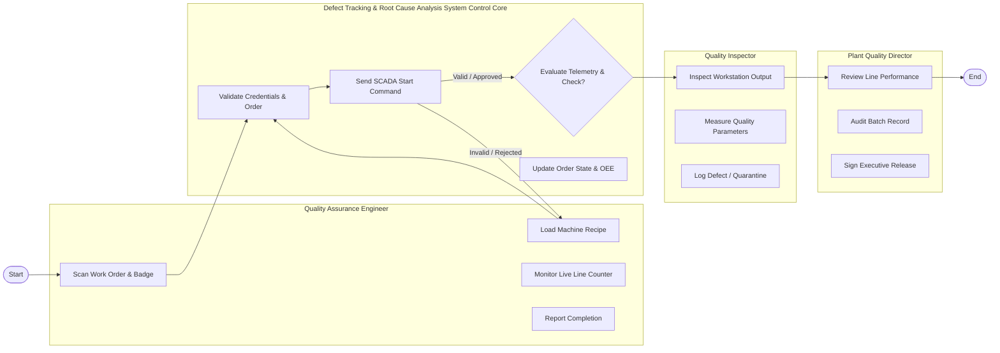

# Swimlane Diagram — Defect Tracking & Root Cause Analysis System

## Mermaid Code

## Flow Description | Mô tả luồng

| Lane | Actor | Role in Flow |
|------|-------|-------------|
| 1 | Quality Assurance Engineer | Initiates production run, monitors workstation, reports status. |
| 2 | Defect Tracking & Root Cause Analysis System Control Core | Validates inputs, controls machinery interfaces, computes OEE, records state. |
| 3 | Quality Inspector | Performs line inspection, logs defects, routes quarantined units. |
| 4 | Plant Quality Director | Reviews operational metrics, audits compliance, approves release. |

