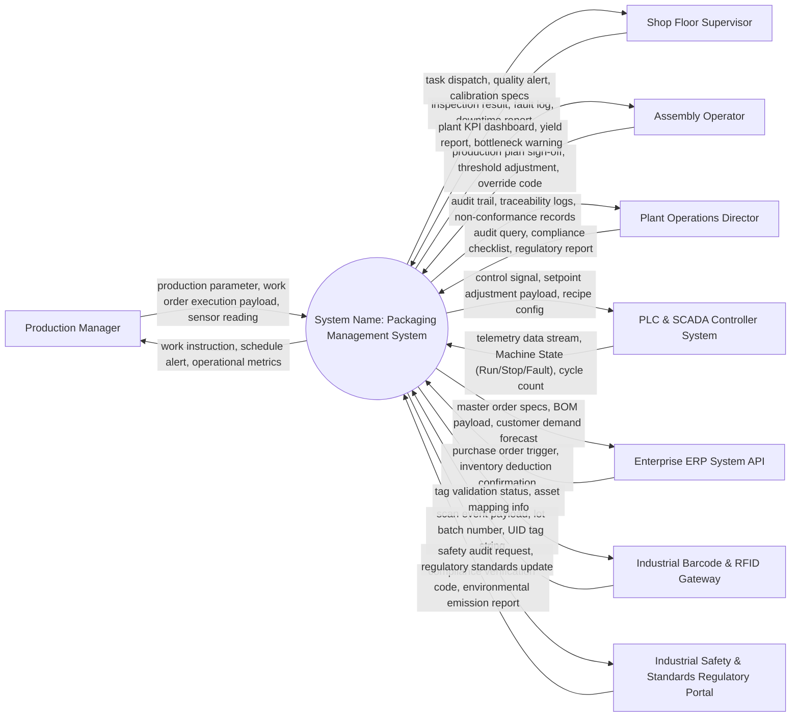

# Context Diagram — Packaging Management System

## Mermaid Code

## Actor & Interaction Table | Bảng Actor & Tương tác

| # | Actor | Actor Type | Data Sent TO System | Data Received FROM System | Notes |
|---|-------|------------|---------------------|---------------------------|-------|
| 1 | Production Manager | Primary | production parameter, work order execution payload, sensor reading | work instruction, schedule alert, operational metrics | Primary user executing plant line workflows. |
| 2 | Shop Floor Supervisor | Primary | inspection result, fault log, downtime report | task dispatch, quality alert, calibration specs | Operational supervisor managing line execution. |
| 3 | Assembly Operator | Primary | production plan sign-off, threshold adjustment, override code | plant KPI dashboard, yield report, bottleneck warning | Plant manager responsible for throughput and compliance. |
| 4 | Plant Operations Director | Primary | audit query, compliance checklist, regulatory report | audit trail, traceability logs, non-conformance records | Auditing role checking ISO/FDA/OSHA compliance. |
| 5 | PLC & SCADA Controller System | Supporting System | telemetry data stream, Machine State (Run/Stop/Fault), cycle count | control signal, setpoint adjustment payload, recipe config | Industrial hardware control layer. |
| 6 | Enterprise ERP System API | Supporting System | purchase order trigger, inventory deduction confirmation | master order specs, BOM payload, customer demand forecast | Corporate enterprise resource planning backend. |
| 7 | Industrial Barcode & RFID Gateway | Supporting System | scan event payload, lot batch number, UID tag string | tag validation status, asset mapping info | Hardware scanning and auto-ID system. |
| 8 | Industrial Safety & Standards Regulatory Portal | Regulatory System | compliance verification code, environmental emission report | safety audit request, regulatory standards update | Government industrial regulatory body portal. |

## System Boundary Description | Mô tả Phạm vi Hệ thống

Hệ thống **Packaging Management System** (Hệ Thống Quản Lý Đóng Gói) được thiết kế nhằm tự động hóa và quản lý tập trung toàn bộ nghiệp vụ cốt lõi trong phân khúc bất động sản tương ứng. Ranh giới hệ thống bao gồm cơ sở dữ liệu tích hợp, bộ vi xử lý logic nghiệp vụ trung tâm, cổng xác thực an toàn và cơ chế điều phối luồng làm việc. Hệ thống giao tiếp với các nhân tố bên ngoài (Primary Actors, Supporting Systems, Regulatory Bodies) thông qua các giao diện lập trình ứng dụng (API) chuẩn hóa và mã hóa thông tin. Các thành phần bên ngoài như thiết bị cá nhân người dùng, dịch vụ viễn thông công cộng, hạ tầng thanh toán bên thứ ba nằm ngoài phạm vi xử lý nội bộ của hệ thống nhưng được kết nối an toàn để đảm bảo tính toàn vẹn dữ liệu.
