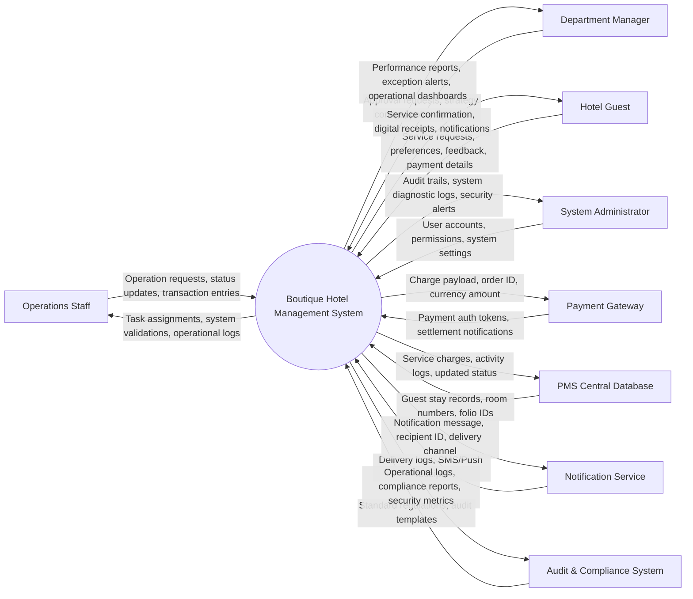

# Context Diagram — Boutique Hotel Management System

## Mermaid Code

## Actor & Interaction Table | Bảng Actor & Tương tác

| # | Actor | Actor Type | Data Sent TO System | Data Received FROM System | Ghi chú / Notes |
|---|-------|------------|---------------------|---------------------------|-----------------|
| 1 | Operations Staff | Primary | Operation requests, status updates, transaction entries | Task assignments, system validations, operational logs | Nhân viên vận hành chính của Boutique Hotel Management System |
| 2 | Department Manager | Primary | Approval requests, strategy configs, policy updates | Performance reports, exception alerts, operational dashboards | Quản lý cấp cao giám sát hoạt động của Boutique Hotel Management System |
| 3 | Hotel Guest | Primary | Service requests, preferences, feedback, payment details | Service confirmation, digital receipts, notifications | Khách hàng tương tác với dịch vụ hệ thống |
| 4 | System Administrator | Primary | User accounts, permissions, system settings | Audit trails, system diagnostic logs, security alerts | Quản trị viên cấu hình hệ thống |
| 5 | Payment Gateway | Supporting | Payment auth tokens, settlement notifications | Charge payload, order ID, currency amount | Cổng thanh toán điện tử xử lý giao dịch |
| 6 | PMS Central Database | Supporting | Guest stay records, room numbers, folio IDs | Service charges, activity logs, updated status | Hệ thống quản lý khách sạn trung tâm |
| 7 | Notification Service | Supporting | Delivery logs, SMS/Push receipts | Notification message, recipient ID, delivery channel | Dịch vụ gửi thông báo qua SMS/Email/App |
| 8 | Audit & Compliance System | Regulatory | Standard regulations, audit templates | Operational logs, compliance reports, security metrics | Hệ thống kiểm soát tuân thủ và kiểm toán |

## System Boundary Description | Mô tả Phạm vi Hệ thống

Hệ thống Boutique Hotel Management System chịu trách nhiệm xử lý toàn bộ quy trình nghiệp vụ chuyên sâu thuộc lĩnh vực Boutique. Hệ thống quản lý dữ liệu đầu vào từ Operations Staff và Hotel Guest, đồng bộ hóa tài khoản và giao dịch với PMS Central Database, đồng thời ủy quyền xử lý thanh toán tài chính cho Payment Gateway và gửi thông báo qua Notification Service.
