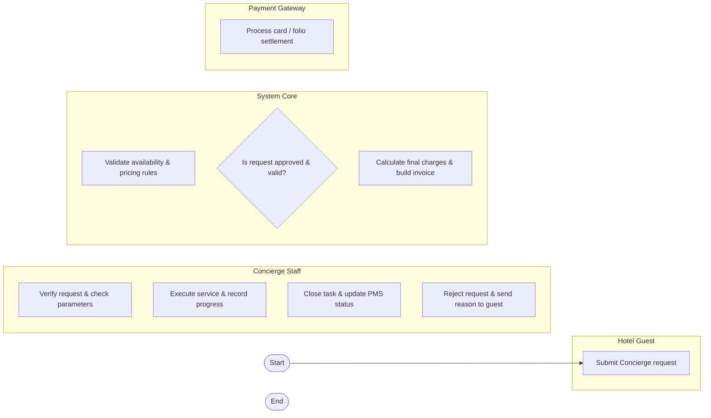

# Swimlane Diagram — Concierge & Guest Service System

## Mermaid Code

## Flow Description | Mô tả luồng

| Lane | Actor | Role in Flow |
|------|-------|-------------|
| 1 | Hotel Guest | Khởi tạo yêu cầu và thanh toán dịch vụ |
| 2 | Concierge Staff | Tiếp nhận, thực hiện công việc và cập nhật kết quả |
| 3 | System Core | Xử lý dữ liệu, kiểm tra quy tắc và tính tiền |
| 4 | Payment Gateway | Xác thực và thanh toán giao dịch |
