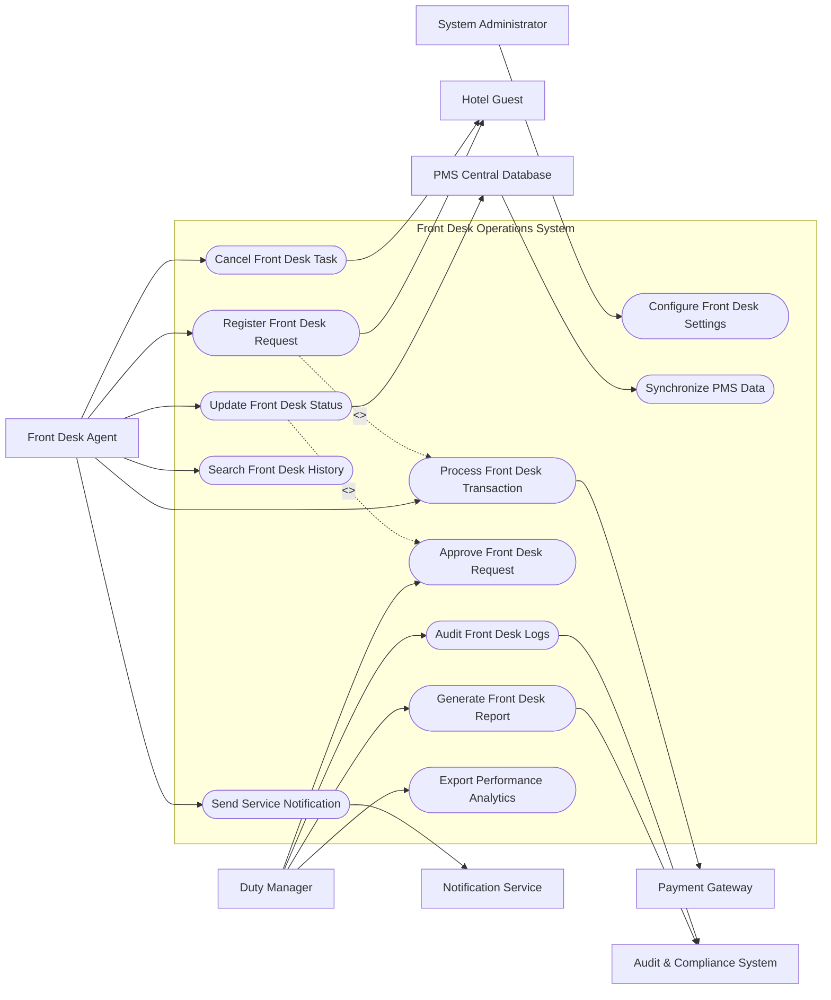

# Use Case Diagram — Front Desk Operations System

## Mermaid Code

## Actor Table | Bảng Actor

| # | Actor | Actor Type | Role Description | Related Use Cases |
|---|-------|------------|------------------|-------------------|
| 1 | Front Desk Agent | Primary | Phụ trách các tác vụ liên quan đến Front Desk Agent trong hệ thống | UC01, UC02, UC03, UC07, UC08, UC10 |
| 2 | Hotel Guest | Primary | Phụ trách các tác vụ liên quan đến Hotel Guest trong hệ thống | UC01, UC10 |
| 3 | Payment Gateway | Supporting | Phụ trách các tác vụ liên quan đến Payment Gateway trong hệ thống | UC02 |
| 4 | PMS Central Database | Supporting | Phụ trách các tác vụ liên quan đến PMS Central Database trong hệ thống | UC03, UC09 |
| 5 | Duty Manager | Primary | Phụ trách các tác vụ liên quan đến Duty Manager trong hệ thống | UC04, UC05, UC11, UC12 |
| 6 | Audit & Compliance System | Regulatory | Phụ trách các tác vụ liên quan đến Audit & Compliance System trong hệ thống | UC05, UC11 |
| 7 | System Administrator | Primary | Phụ trách các tác vụ liên quan đến System Administrator trong hệ thống | UC06 |
| 8 | Notification Service | Supporting | Phụ trách các tác vụ liên quan đến Notification Service trong hệ thống | UC07 |

## Use Case Table | Bảng Use Case

| # | UC ID | Use Case Name | Primary Actor | Secondary Actor | Description | Priority |
|---|-------|---------------|---------------|-----------------|-------------|----------|
| 1 | UC01 | Register Front Desk Request | Front Desk Agent | Hotel Guest | Create new operational request in Front Desk Operations System. | High |
| 2 | UC02 | Process Front Desk Transaction | Front Desk Agent | Payment Gateway | Execute payment or billing charge for Front Desk Operations System. | High |
| 3 | UC03 | Update Front Desk Status | Front Desk Agent | PMS Central Database | Modify operational status and update PMS database. | High |
| 4 | UC04 | Approve Front Desk Request | Duty Manager | None | Review and approve high-value or special requests. | High |
| 5 | UC05 | Generate Front Desk Report | Duty Manager | Audit & Compliance System | Compile performance metrics and operational summaries. | High |
| 6 | UC06 | Configure Front Desk Settings | System Administrator | None | Maintain system master data, roles, and rules. | Medium |
| 7 | UC07 | Send Service Notification | Front Desk Agent | Notification Service | Dispatch automated alerts to guests or staff. | Medium |
| 8 | UC08 | Search Front Desk History | Front Desk Agent | None | Query historical logs and previous records. | Medium |
| 9 | UC09 | Synchronize PMS Data | PMS Central Database | None | Sync real-time guest and room data with central PMS. | High |
| 10 | UC10 | Cancel Front Desk Task | Front Desk Agent | Hotel Guest | Cancel active request upon guest cancellation. | Low |
| 11 | UC11 | Audit Front Desk Logs | Duty Manager | Audit & Compliance System | Review user audit trails and security compliance. | Medium |
| 12 | UC12 | Export Performance Analytics | Duty Manager | None | Export operational data to Excel or PDF format. | Low |

## Use Case Specification | Đặc tả Use Case

---

### UC01 — Register Front Desk Request

| Field | Detail |
|-------|--------|
| **UC ID** | UC01 |
| **Use Case Name** | Register Front Desk Request |
| **Actor(s)** | Primary: Front Desk Agent / Secondary: Hotel Guest |
| **Description** | Thực hiện tiếp nhận và tạo mới yêu cầu nghiệp vụ trong hệ thống Front Desk Operations System. |
| **Precondition** | 1. Người dùng đã đăng nhập hệ thống với quyền hạn hợp lệ. 2. Danh mục dịch vụ và khách hàng đã sẵn sàng. |
| **Main Flow** | 1. Front Desk Agent truy cập màn hình tạo yêu cầu dịch vụ mới. 2. System hiển thị biểu mẫu nhập liệu chuẩn hóa. 3. Front Desk Agent chọn thông tin Hotel Guest và chi tiết dịch vụ yêu cầu. 4. System kiểm tra tính hợp lệ của thông tin và tình trạng khả dụng. 5. Front Desk Agent nhấn Xác nhận khởi tạo yêu cầu. 6. System tạo mới hồ sơ, lưu vào CSDL và gửi thông báo xác nhận. |
| **Alternative Flow** | AF1 — Tạo yêu cầu nhanh từ ứng dụng di động: Guest tự tạo yêu cầu qua mobile app, System tự đồng bộ. AF2 — Đơn yêu cầu theo gói dịch vụ: System tự động điền các hạng mục theo gói hợp đồng. |
| **Exception Flow** | EX1 — Khách hàng chưa đăng ký thông tin lưu trú: System báo lỗi và yêu cầu xác minh phòng trước. EX2 — Dịch vụ tạm ngưng phục vụ: System cảnh báo không khả dụng và gợi ý dịch vụ thay thế. |
| **Postcondition** | Hồ sơ yêu cầu được tạo ở trạng thái Pending/Active, mã định danh duy nhất được khởi tạo. |
| **Business Rule** | BR1: Mọi yêu cầu khởi tạo phải gắn liền với mã khách hàng hoặc phòng cụ thể. |

---

### UC02 — Process Front Desk Transaction

| Field | Detail |
|-------|--------|
| **UC ID** | UC02 |
| **Use Case Name** | Process Front Desk Transaction |
| **Actor(s)** | Primary: Front Desk Agent / Secondary: Payment Gateway |
| **Description** | Xử lý thanh toán hoặc ghi nợ tài khoản dịch vụ cho Front Desk Operations System. |
| **Precondition** | 1. Yêu cầu dịch vụ đã hoàn thành hoặc ở trạng thái chờ thanh toán. 2. Cổng thanh toán hoặc Folio PMS đang kết nối. |
| **Main Flow** | 1. Front Desk Agent mở yêu cầu cần thanh toán và kiểm tra bảng chi tiết chi phí. 2. System tổng hợp giá dịch vụ, thuế VAT và phí phục vụ. 3. Front Desk Agent chọn phương thức thanh toán (Ghi nợ phòng Folio / Tiền mặt / Thẻ ngân hàng). 4. System gửi lệnh tính phí sang Folio PMS hoặc Payment Gateway. 5. Payment Gateway trả về kết quả giao dịch thành công. 6. System cập nhật trạng thái đơn dịch vụ thành Paid và in hóa đơn thanh toán. |
| **Alternative Flow** | AF1 — Ghi nợ về tài khoản công ty: Front Desk Agent chọn nợ công ty, kiểm tra hạn mức nợ hợp lệ. AF2 — Thanh toán bằng voucher: System trừ giá trị voucher trước khi tính số tiền còn lại. |
| **Exception Flow** | EX1 — Thẻ ngân hàng từ chối: System báo giao dịch thất bại, yêu cầu quẹt thẻ khác. EX2 — Folio bị khóa không cho ghi nợ: System yêu cầu liên hệ Lễ tân mở khóa Folio. |
| **Postcondition** | Giao dịch được hạch toán, hóa đơn được xuất, trạng thái hoàn tất thanh toán. |
| **Business Rule** | BR1: Mọi giao dịch tài chính phải có mã giao dịch duy nhất từ cổng thanh toán hoặc PMS. |

---

### UC03 — Update Front Desk Status

| Field | Detail |
|-------|--------|
| **UC ID** | UC03 |
| **Use Case Name** | Update Front Desk Status |
| **Actor(s)** | Primary: Front Desk Agent / Secondary: PMS Central Database |
| **Description** | Cập nhật trạng thái tiến độ thực hiện của nghiệp vụ. |
| **Precondition** | 1. Hồ sơ nghiệp vụ đang ở trạng thái hoạt động. 2. Nhân viên có quyền cập nhật tiến độ. |
| **Main Flow** | 1. Front Desk Agent mở danh sách công việc được phân công. 2. System hiển thị các yêu cầu đang thực hiện. 3. Front Desk Agent chọn yêu cầu và thay đổi trạng thái sang In-Progress hoặc Completed. 4. System ghi nhận thời điểm cập nhật và nhân viên thực hiện. 5. System đồng bộ trạng thái mới sang PMS Central Database. 6. System gửi thông báo trạng thái mới tới khách hàng. |
| **Alternative Flow** | AF1 — Tạm dừng thực hiện: Nhân viên chọn trạng thái On-Hold và nhập lý do chờ phụ tùng/vật tư. |
| **Exception Flow** | EX1 — Mất kết nối PMS: System lưu trạng thái tạm thời và thử đồng bộ lại sau. |
| **Postcondition** | Trạng thái nghiệp vụ được cập nhật chính xác trên toàn hệ thống. |
| **Business Rule** | BR1: Chỉ nhân viên được phân công mới có quyền chuyển trạng thái Completed. |

---

### UC04 — Approve Front Desk Request

| Field | Detail |
|-------|--------|
| **UC ID** | UC04 |
| **Use Case Name** | Approve Front Desk Request |
| **Actor(s)** | Primary: Duty Manager / Secondary: None |
| **Description** | Quản lý xem xét và phê duyệt các yêu cầu dịch vụ đặc biệt hoặc có giá trị cao. |
| **Precondition** | 1. Có yêu cầu ở trạng thái Pending Approval. 2. Quản lý có thẩm quyền duyệt. |
| **Main Flow** | 1. Duty Manager truy cập danh sách yêu cầu chờ duyệt. 2. System hiển thị chi tiết nội dung, chi phí và lý do yêu cầu. 3. Duty Manager kiểm tra tính hợp lệ và hạn mức cho phép. 4. Duty Manager nhấn Phê duyệt (Approve). 5. System chuyển trạng thái yêu cầu sang Approved và chuyển tiếp cho nhân viên xử lý. 6. System lưu lại lịch sử phê duyệt của quản lý. |
| **Alternative Flow** | AF1 — Từ chối phê duyệt (Reject): Quản lý nhập lý do từ chối, System gửi thông báo hủy tới người tạo yêu cầu. |
| **Exception Flow** | EX1 — Quá hạn thời gian phê duyệt: System gửi cảnh báo nhắc nhở tới Quản lý trực ca. |
| **Postcondition** | Yêu cầu được chuyển sang bước thực thi tiếp theo. |
| **Business Rule** | BR1: Các giao dịch có giá trị vượt hạn mức chuẩn bắt buộc phải qua bước phê duyệt. |

---

### UC05 — Generate Front Desk Report

| Field | Detail |
|-------|--------|
| **UC ID** | UC05 |
| **Use Case Name** | Generate Front Desk Report |
| **Actor(s)** | Primary: Duty Manager / Secondary: Audit & Compliance System |
| **Description** | Tổng hợp và xuất báo cáo hiệu suất hoạt động nghiệp vụ. |
| **Precondition** | 1. Dữ liệu vận hành trong khoảng thời gian báo cáo đã được lưu trữ đầy đủ. |
| **Main Flow** | 1. Duty Manager chọn phân hệ Báo cáo và chọn khoảng thời gian (Ngày/Tuần/Tháng). 2. System truy vấn dữ liệu vận hành từ CSDL trung tâm. 3. System tính toán các chỉ số KPI, tổng doanh thu và biểu đồ xu hướng. 4. System xuất màn hình báo cáo tổng quan trực quan. 5. Duty Manager chọn Tải báo cáo dạng PDF/Excel. 6. System gửi bản sao báo cáo tới Audit & Compliance System. |
| **Alternative Flow** | AF1 — Đặt lịch gửi báo cáo tự động: Quản lý thiết lập gửi báo cáo định kỳ qua email hàng sáng. |
| **Exception Flow** | EX1 — Không có dữ liệu trong khoảng thời gian chọn: System hiển thị thông báo "Không tìm thấy dữ liệu phù hợp". |
| **Postcondition** | Báo cáo được khởi tạo và lưu vết trong hệ thống. |
| **Business Rule** | BR1: Báo cáo tài chính nghiệp vụ phải đối soát khớp 100% với dữ liệu hạch toán. |

