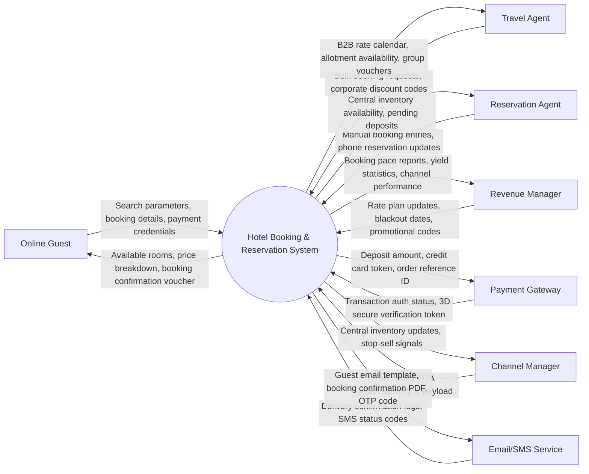

# Context Diagram — Hotel Booking & Reservation System

## Mermaid Code

## Actor & Interaction Table | Bảng Actor & Tương tác

| # | Actor | Actor Type | Data Sent TO System | Data Received FROM System | Ghi chú / Notes |
|---|-------|------------|---------------------|---------------------------|-----------------|
| 1 | Online Guest | Primary | Search parameters, booking details, payment credentials | Available rooms, price breakdown, booking confirmation voucher | Khách hàng đặt phòng trực tuyến qua trang web / app |
| 2 | Travel Agent | Primary | Bulk booking requests, corporate discount codes | B2B rate calendar, allotment availability, group vouchers | Đại lý du lịch đặt phòng theo hợp đồng |
| 3 | Reservation Agent | Primary | Manual booking entries, phone reservation updates | Central inventory availability, pending deposits | Nhân viên đặt phòng nội bộ khách sạn |
| 4 | Revenue Manager | Primary | Rate plan updates, blackout dates, promotional codes | Booking pace reports, yield statistics, channel performance | Quản lý doanh thu kiểm soát chính sách bán phòng |
| 5 | Payment Gateway | Supporting | Transaction auth status, 3D secure verification token | Deposit amount, credit card token, order reference ID | Cổng thanh toán trực tuyến (VNPAY, Stripe, Momo) |
| 6 | Channel Manager | Supporting | Third-party OTA reservation sync payload | Central inventory updates, stop-sell signals | Tích hợp kênh bán phòng OTAs |
| 7 | Email/SMS Service | Supporting | Delivery confirmation logs, SMS status codes | Guest email template, booking confirmation PDF, OTP code | Hệ thống gửi thư và tin nhắn xác nhận |

## System Boundary Description | Mô tả Phạm vi Hệ thống

Hệ thống Hotel Booking & Reservation System chịu trách nhiệm xử lý công cụ tìm kiếm phòng trực tuyến, tính toán bảng giá linh hoạt, tiếp nhận thông tin đặt phòng, thu tiền đặt cọc trực tuyến và phát hành voucher điện tử. Hệ thống kết nối Payment Gateway để thu nợ, Email/SMS Service để gửi thông báo và Channel Manager để cập nhật tồn kho phòng tập trung.
