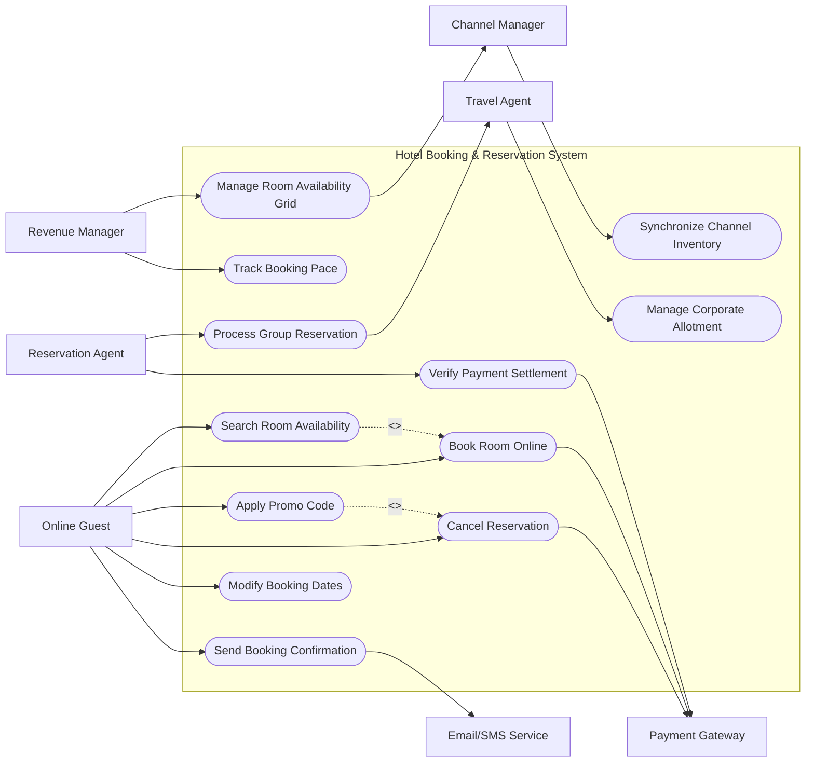

# Use Case Diagram — Hotel Booking & Reservation System

## Mermaid Code

## Actor Table | Bảng Actor

| # | Actor | Actor Type | Role Description | Related Use Cases |
|---|-------|------------|------------------|-------------------|
| 1 | Online Guest | Primary | Phụ trách các tác vụ liên quan đến Online Guest trong hệ thống | UC01, UC02, UC03, UC04, UC05, UC07 |
| 2 | Payment Gateway | Supporting | Phụ trách các tác vụ liên quan đến Payment Gateway trong hệ thống | UC02, UC04, UC11 |
| 3 | Travel Agent | Primary | Phụ trách các tác vụ liên quan đến Travel Agent trong hệ thống | UC06, UC09 |
| 4 | Email/SMS Service | Supporting | Phụ trách các tác vụ liên quan đến Email/SMS Service trong hệ thống | UC07 |
| 5 | Revenue Manager | Primary | Phụ trách các tác vụ liên quan đến Revenue Manager trong hệ thống | UC08, UC10 |
| 6 | Channel Manager | Supporting | Phụ trách các tác vụ liên quan đến Channel Manager trong hệ thống | UC08, UC12 |
| 7 | Reservation Agent | Primary | Phụ trách các tác vụ liên quan đến Reservation Agent trong hệ thống | UC09, UC11 |

## Use Case Table | Bảng Use Case

| # | UC ID | Use Case Name | Primary Actor | Secondary Actor | Description | Priority |
|---|-------|---------------|---------------|-----------------|-------------|----------|
| 1 | UC01 | Search Room Availability | Online Guest | None | Search available rooms by check-in/out dates, guests, and room type. | High |
| 2 | UC02 | Book Room Online | Online Guest | Payment Gateway | Select room, enter guest details, and complete advance deposit payment. | High |
| 3 | UC03 | Apply Promo Code | Online Guest | None | Validate voucher or discount code for special pricing. | Medium |
| 4 | UC04 | Cancel Reservation | Online Guest | Payment Gateway | Cancel booking according to policy and process refund. | High |
| 5 | UC05 | Modify Booking Dates | Online Guest | None | Change check-in/out dates subject to room availability and rate difference. | Medium |
| 6 | UC06 | Manage Corporate Allotment | Travel Agent | None | Reserve rooms against guaranteed corporate allocation contract. | Medium |
| 7 | UC07 | Send Booking Confirmation | Online Guest | Email/SMS Service | Dispatch digital confirmation voucher with QR code. | High |
| 8 | UC08 | Manage Room Availability Grid | Revenue Manager | Channel Manager | Set room counts, minimum length of stay (MLOS), and stop-sell. | High |
| 9 | UC09 | Process Group Reservation | Reservation Agent | Travel Agent | Create master reservation record for group travel tours. | Medium |
| 10 | UC10 | Track Booking Pace | Revenue Manager | None | Analyze reservation intake speed against historical data. | Low |
| 11 | UC11 | Verify Payment Settlement | Reservation Agent | Payment Gateway | Reconcile bank deposit payments with booking IDs. | High |
| 12 | UC12 | Synchronize Channel Inventory | Channel Manager | None | Update inventory levels across online booking channels. | High |

## Use Case Specification | Đặc tả Use Case

---

### UC01 — Search Room Availability

| Field | Detail |
|-------|--------|
| **UC ID** | UC01 |
| **Use Case Name** | Search Room Availability |
| **Actor(s)** | Primary: Online Guest / Secondary: None |
| **Description** | Tra cứu phòng trống và giá phòng theo thời gian lưu trú. |
| **Precondition** | 1. Khách truy cập vào giao diện web/app đặt phòng. 2. Khung giá và số lượng phòng khả dụng sẵn có trong CSDL. |
| **Main Flow** | 1. Online Guest chọn ngày đến, ngày đi, số lượng người lớn và trẻ em. 2. System kiểm tra tồn kho phòng khả dụng cho các ngày đã chọn. 3. System áp dụng các quy tắc giá (Rate Rules) và tính tổng tiền cho từng hạng phòng. 4. System hiển thị danh sách phòng trống kèm hình ảnh, tiện nghi và chính sách hủy. 5. Online Guest lọc kết quả theo loại giường, khoảng giá hoặc dịch vụ đính kèm. |
| **Alternative Flow** | AF1 — Chọn nhiều phòng cùng lúc: Guest nhập số lượng phòng > 1, System lọc các hạng phòng đủ số lượng tồn. AF2 — Không chọn được ngày cụ thể: Guest xem lịch giá linh hoạt (Flexible Price Calendar) theo tháng. |
| **Exception Flow** | EX1 — Hết phòng trong khoảng thời gian đã chọn: System thông báo hết phòng và gợi ý ngày lưu trú lân cận còn trống. EX2 — Ngày đi nhỏ hơn hoặc bằng ngày đến: System báo lỗi khoảng thời gian không hợp lệ. |
| **Postcondition** | Hiển thị danh sách kết quả tra cứu phòng chính xác theo tiêu chí. |
| **Business Rule** | BR1: Giá phòng hiển thị đã bao gồm hoặc ghi rõ thuế VAT và phí dịch vụ. |

---

### UC02 — Book Room Online

| Field | Detail |
|-------|--------|
| **UC ID** | UC02 |
| **Use Case Name** | Book Room Online |
| **Actor(s)** | Primary: Online Guest / Secondary: Payment Gateway, Email/SMS Service |
| **Description** | Đặt phòng trực tuyến và thanh toán tiền cọc đảm bảo giữ chỗ. |
| **Precondition** | 1. Guest đã chọn loại phòng và số lượng phòng khả dụng. 2. Cổng thanh toán trực tuyến hoạt động bình thường. |
| **Main Flow** | 1. Online Guest nhập thông tin liên hệ và danh sách người ở. 2. System giữ chỗ tạm thời trong 15 phút (Hold Inventory). 3. Online Guest chọn phương thức thanh toán (Thẻ tín dụng / VNPAY / Momo). 4. System chuyển hướng sang cổng Payment Gateway để thu tiền cọc. 5. Payment Gateway gửi phản hồi xác nhận giao dịch thành công. 6. System cập nhật trạng thái đặt phòng sang Confirmed, tạo voucher ID và gọi Email/SMS Service gửi email xác nhận. |
| **Alternative Flow** | AF1 — Thanh toán tại khách sạn (Pay at Hotel): Guest chọn đặt phòng không cọc (nếu chính sách áp dụng), System ghi nhận trạng thái Unconfirmed/Guaranteed by CC. AF2 — Đặt kèm phụ phí (Add-on Services): Guest chọn thêm ăn sáng hoặc đưa đón sân bay, System cộng phí vào đơn. |
| **Exception Flow** | EX1 — Thanh toán thất bại hoặc quá thời gian 15 phút: System giải phóng phòng giữ tạm và báo lỗi giao dịch. EX2 — Gián đoạn kết nối cổng thanh toán: System lưu booking ở trạng thái Pending Payment và gửi link thanh toán lại qua email. |
| **Postcondition** | Tạo mã đặt phòng Booking ID, trừ tồn kho phòng khả dụng, gửi email confirmation. |
| **Business Rule** | BR1: Đơn đặt phòng trực tuyến chỉ được xác nhận khi thanh toán cọc thành công. |

---

### UC03 — Apply Promo Code

| Field | Detail |
|-------|--------|
| **UC ID** | UC03 |
| **Use Case Name** | Apply Promo Code |
| **Actor(s)** | Primary: Online Guest / Secondary: None |
| **Description** | Kiểm tra và áp dụng mã giảm giá/voucher ưu đãi cho đơn đặt phòng. |
| **Precondition** | 1. Khách đang ở bước xem chi tiết đơn đặt phòng. 2. Mã giảm giá được cấu hình active trên hệ thống. |
| **Main Flow** | 1. Guest nhập chuỗi mã ưu đãi vào ô Promo Code. 2. System kiểm tra điều kiện mã (Thời gian hiệu lực, hạng phòng áp dụng, số lượt dùng). 3. System tính toán số tiền giảm trừ và cập nhật lại tổng chi phí đơn hàng. 4. Guest kiểm tra số tiền được giảm và tiến hành thanh toán. |
| **Alternative Flow** | AF1 — Mã tự động áp dụng (Auto-applied promotion): System tự gắn mã ưu đãi tốt nhất dựa trên thời gian đặt trước (Early Bird). |
| **Exception Flow** | EX1 — Mã hết hạn hoặc hết lượt dùng: System hiển thị thông báo "Mã ưu đãi đã hết hiệu lực". EX2 — Mã không áp dụng cho hạng phòng chọn: System báo lỗi điều kiện không thỏa mãn. |
| **Postcondition** | Chiết khấu được trừ vào tổng tiền hóa đơn đặt phòng. |
| **Business Rule** | BR1: Mỗi đơn đặt phòng chỉ được áp dụng tối đa 01 mã giảm giá. |

---

### UC04 — Cancel Reservation

| Field | Detail |
|-------|--------|
| **UC ID** | UC04 |
| **Use Case Name** | Cancel Reservation |
| **Actor(s)** | Primary: Online Guest / Secondary: Payment Gateway |
| **Description** | Hủy đơn đặt phòng trực tuyến theo chính sách hoàn hủy. |
| **Precondition** | 1. Booking ở trạng thái Confirmed. 2. Guest đăng nhập hoặc tra cứu đơn qua Booking Reference và Email. |
| **Main Flow** | 1. Online Guest truy cập màn hình tra cứu booking và chọn Hủy đặt phòng. 2. System hiển thị điều kiện hoàn hủy và số tiền hoàn lại (nếu có). 3. Online Guest xác nhận lý do hủy và gửi yêu cầu. 4. System cập nhật trạng thái booking sang Cancelled. 5. System tính phí hủy phòng và gửi lệnh hoàn tiền tới Payment Gateway (nếu thỏa chính sách). 6. System hoàn trả số lượng phòng lại vào kho phòng trống. |
| **Alternative Flow** | AF1 — Hủy phòng sát giờ (Non-refundable): System thông báo mất 100% cọc và không hoàn tiền. |
| **Exception Flow** | EX1 — Quá hạn thời gian cho phép hủy tự động: System yêu cầu liên hệ trực tiếp bộ phận đặt phòng để xử lý thủ công. |
| **Postcondition** | Trạng thái booking đổi sang Cancelled, kho phòng trống tăng lên. |
| **Business Rule** | BR1: Chính sách hoàn hủy quy định rõ mốc thời gian trước ngày nhận phòng. |

---

### UC05 — Modify Booking Dates

| Field | Detail |
|-------|--------|
| **UC ID** | UC05 |
| **Use Case Name** | Modify Booking Dates |
| **Actor(s)** | Primary: Online Guest / Secondary: None |
| **Description** | Thay đổi ngày lưu trú cho đặt phòng đã xác nhận. |
| **Precondition** | 1. Đặt phòng ở trạng thái Confirmed. 2. Khách thực hiện trước thời hạn quy định. |
| **Main Flow** | 1. Guest chọn tính năng Đổi ngày lưu trú trên cổng portal. 2. Guest chọn ngày mới cần đổi. 3. System kiểm tra phòng trống và tính chênh lệch giá (nếu có). 4. Guest xác nhận khoản phí chênh lệch và thực hiện thanh toán bổ sung. 5. System cập nhật ngày lưu trú mới và gửi lại confirmation voucher cập nhật. |
| **Alternative Flow** | AF1 — Ngày mới có giá thấp hơn: System ghi nhận số tiền thừa vào tài khoản lưu trú hoặc hoàn lại theo chính sách. |
| **Exception Flow** | EX1 — Hết phòng vào ngày mới: System thông báo không thể đổi ngày và giữ nguyên lịch cũ. |
| **Postcondition** | Lịch đặt phòng cập nhật ngày mới, thông tin kho phòng điều chỉnh. |
| **Business Rule** | BR1: Việc đổi ngày phụ thuộc vào tình trạng phòng trống tại thời điểm thay đổi. |

