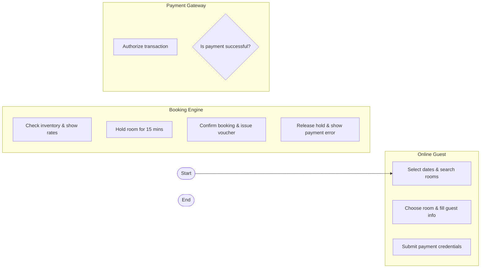

# Swimlane Diagram — Hotel Booking & Reservation System

## Mermaid Code

## Flow Description | Mô tả luồng

| Lane | Actor | Role in Flow |
|------|-------|-------------|
| 1 | Online Guest | Tìm kiếm phòng, nhập thông tin và thanh toán |
| 2 | Booking Engine | Kiểm tra tồn kho, giữ chỗ tạm thời và tạo voucher |
| 3 | Payment Gateway | Xác thực thẻ và trừ tiền cọc |
