# Action Tree — Hotel Booking & Reservation System

## Mermaid Code

```mermaid
graph TD
    Root["Hotel Booking & Reservation System"]

    Root --> M1["Search & Inventory Engine"]
    M1 --> A1_1["Search Available Rooms"]
    M1 --> A1_2["Calculate Seasonal Rates"]
    M1 --> A1_3["Check Length of Stay Rules"]
    M1 --> A1_4["Filter by Amenities"]
    Root --> M2["Booking & Checkout"]
    M2 --> A2_1["Process Online Booking"]
    M2 --> A2_2["Apply Promotional Codes"]
    M2 --> A2_3["Hold Inventory Temporarily"]
    M2 --> A2_4["Issue Digital Vouchers"]
    Root --> M3["Reservation Management"]
    M3 --> A3_1["Modify Stay Dates"]
    M3 --> A3_2["Cancel Reservation"]
    M3 --> A3_3["Process Refund Requests"]
    M3 --> A3_4["Resend Voucher Email"]
    Root --> M4["Rate & Promo Administration"]
    M4 --> A4_1["Configure Rate Rules"]
    M4 --> A4_2["Manage Promo Codes"]
    M4 --> A4_3["Set Minimum Stay Restrictions"]
    M4 --> A4_4["Trigger Early Bird Discounts"]
```

## Module Description | Mô tả Module

| # | Module | Description | Actions |
|---|--------|-------------|---------|
| 1 | Search & Inventory Engine | Tra cứu tồn kho phòng và bảng giá | Search Available Rooms, Calculate Seasonal Rates, Check Length of Stay Rules, Filter by Amenities |
| 2 | Booking & Checkout | Tiếp nhận thông tin và xử lý thanh toán | Process Online Booking, Apply Promotional Codes, Hold Inventory Temporarily, Issue Digital Vouchers |
| 3 | Reservation Management | Quản lý thay đổi và hủy đặt phòng | Modify Stay Dates, Cancel Reservation, Process Refund Requests, Resend Voucher Email |
| 4 | Rate & Promo Administration | Cấu hình giá và mã ưu đãi | Configure Rate Rules, Manage Promo Codes, Set Minimum Stay Restrictions, Trigger Early Bird Discounts |
