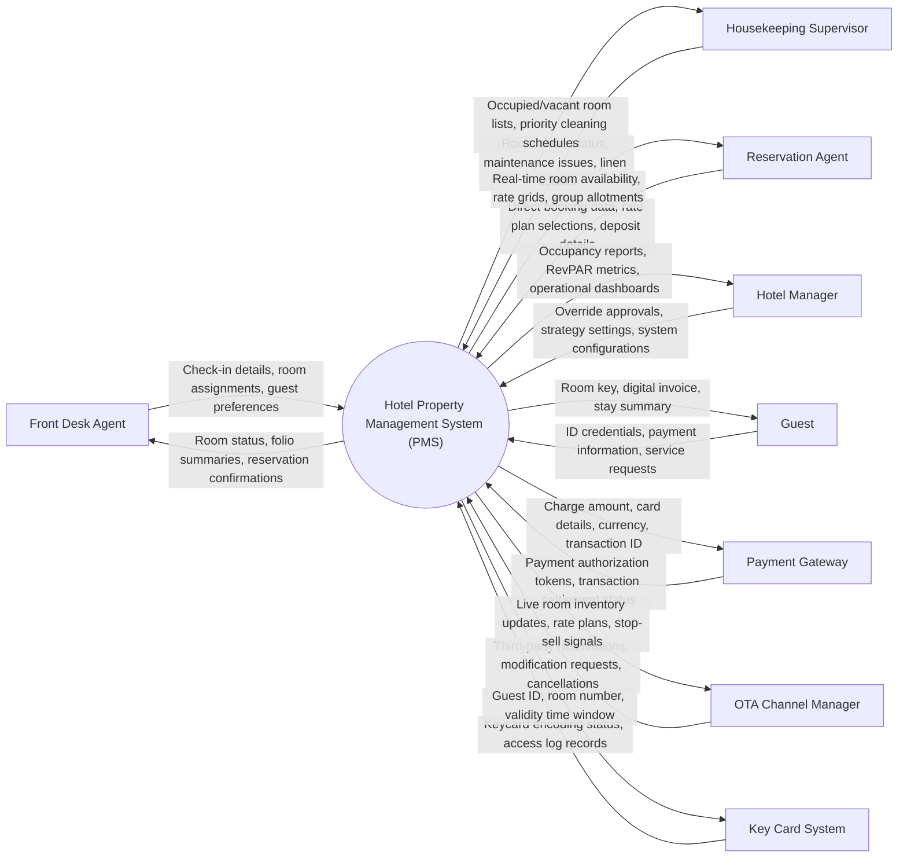

# Context Diagram — Hotel Property Management System (PMS)

## Mermaid Code

## Actor & Interaction Table | Bảng Actor & Tương tác

| # | Actor | Actor Type | Data Sent TO System | Data Received FROM System | Ghi chú / Notes |
|---|-------|------------|---------------------|---------------------------|-----------------|
| 1 | Front Desk Agent | Primary | Check-in details, room assignments, guest preferences | Room status, folio summaries, reservation confirmations | Nhân viên lễ tân thực hiện các thao tác hàng ngày |
| 2 | Housekeeping Supervisor | Primary | Room clean status, maintenance issues, linen counts | Occupied/vacant room lists, priority cleaning schedules | Giám sát buồng phòng cập nhật trạng thái phòng |
| 3 | Reservation Agent | Primary | Direct booking data, rate plan selections, deposit details | Real-time room availability, rate grids, group allotments | Nhân viên đặt phòng quản lý booking trực tiếp |
| 4 | Hotel Manager | Primary | Override approvals, strategy settings, system configurations | Occupancy reports, RevPAR metrics, operational dashboards | Quản lý khách sạn theo dõi hiệu suất chung |
| 5 | Guest | Primary | ID credentials, payment information, service requests | Room key, digital invoice, stay summary | Khách lưu trú tại khách sạn |
| 6 | Payment Gateway | Supporting | Payment authorization tokens, transaction settlement status | Charge amount, card details, currency, transaction ID | Cổng thanh toán điện tử xử lý thẻ credit/debit |
| 7 | OTA Channel Manager | Supporting | Third-party reservations, modification requests, cancellations | Live room inventory updates, rate plans, stop-sell signals | Kênh tích hợp bán phòng trực tuyến |
| 8 | Key Card System | Supporting | Keycard encoding status, access log records | Guest ID, room number, validity time window | Hệ thống tạo thẻ từ ra vào phòng |

## System Boundary Description | Mô tả Phạm vi Hệ thống

Hệ thống Hotel Property Management System (PMS) quản lý toàn bộ hoạt động vận hành cốt lõi của khách sạn bao gồm lưu trữ hồ sơ phòng, quản lý đặt phòng, check-in/check-out, theo dõi trạng thái buồng phòng, và thanh toán hóa đơn lưu trú. Hệ thống tích hợp với Key Card System, Payment Gateway và OTA Channel Manager.
