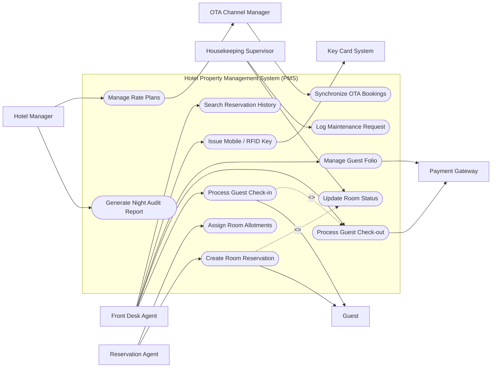

# Use Case Diagram — Hotel Property Management System (PMS)

## Mermaid Code

## Actor Table | Bảng Actor

| # | Actor | Actor Type | Role Description | Related Use Cases |
|---|-------|------------|------------------|-------------------|
| 1 | Front Desk Agent | Primary | Phụ trách các tác vụ liên quan đến Front Desk Agent trong hệ thống | UC01, UC02, UC05, UC09, UC10 |
| 2 | Guest | Primary | Phụ trách các tác vụ liên quan đến Guest trong hệ thống | UC01, UC03 |
| 3 | Payment Gateway | Supporting | Phụ trách các tác vụ liên quan đến Payment Gateway trong hệ thống | UC02, UC05 |
| 4 | Reservation Agent | Primary | Phụ trách các tác vụ liên quan đến Reservation Agent trong hệ thống | UC03, UC06 |
| 5 | Housekeeping Supervisor | Primary | Phụ trách các tác vụ liên quan đến Housekeeping Supervisor trong hệ thống | UC04, UC11 |
| 6 | Hotel Manager | Primary | Phụ trách các tác vụ liên quan đến Hotel Manager trong hệ thống | UC07, UC08 |
| 7 | OTA Channel Manager | Supporting | Phụ trách các tác vụ liên quan đến OTA Channel Manager trong hệ thống | UC08, UC12 |
| 8 | Key Card System | Supporting | Phụ trách các tác vụ liên quan đến Key Card System trong hệ thống | UC09 |

## Use Case Table | Bảng Use Case

| # | UC ID | Use Case Name | Primary Actor | Secondary Actor | Description | Priority |
|---|-------|---------------|---------------|-----------------|-------------|----------|
| 1 | UC01 | Process Guest Check-in | Front Desk Agent | Guest | Check in guest, verify ID, assign room, and issue keycard. | High |
| 2 | UC02 | Process Guest Check-out | Front Desk Agent | Payment Gateway | Settle guest folio billing, accept payment, and check out room. | High |
| 3 | UC03 | Create Room Reservation | Reservation Agent | Guest | Record new room booking with dates, room type, and deposit. | High |
| 4 | UC04 | Update Room Status | Housekeeping Supervisor | None | Change room status between Clean, Dirty, Out of Order, and Inspected. | High |
| 5 | UC05 | Manage Guest Folio | Front Desk Agent | Payment Gateway | Post room charges, incidental fees, and apply payments. | High |
| 6 | UC06 | Assign Room Allotments | Reservation Agent | None | Allocate block of rooms for corporate or travel agency groups. | Medium |
| 7 | UC07 | Generate Night Audit Report | Hotel Manager | None | Run end-of-day revenue reconciliation and balance system logs. | High |
| 8 | UC08 | Manage Rate Plans | Hotel Manager | OTA Channel Manager | Configure seasonal pricing, room packages, and promotional rates. | Medium |
| 9 | UC09 | Issue Mobile / RFID Key | Front Desk Agent | Key Card System | Send key encoding command to external lock system. | Medium |
| 10 | UC10 | Search Reservation History | Front Desk Agent | None | Query past stay records, preferences, and guest profiles. | Low |
| 11 | UC11 | Log Maintenance Request | Housekeeping Supervisor | None | Create work ticket for damaged room fixtures. | Medium |
| 12 | UC12 | Synchronize OTA Bookings | OTA Channel Manager | None | Receive real-time reservation feeds from online travel agencies. | High |

## Use Case Specification | Đặc tả Use Case

---

### UC01 — Process Guest Check-in

| Field | Detail |
|-------|--------|
| **UC ID** | UC01 |
| **Use Case Name** | Process Guest Check-in |
| **Actor(s)** | Primary: Front Desk Agent / Secondary: Guest |
| **Description** | Thực hiện quy trình nhận phòng cho khách, xác minh thông tin giấy tờ, xếp phòng và cấp thẻ chìa khóa. |
| **Precondition** | 1. Khách hàng đã có đặt phòng hợp lệ hoặc khách walkthrough. 2. Phòng dự định xếp ở trạng thái Clean/Inspected. |
| **Main Flow** | 1. Front Desk Agent tìm kiếm thông tin reservation bằng tên hoặc mã đặt phòng. 2. System hiển thị chi tiết thông tin booking và trạng thái phòng trống. 3. Front Desk Agent quét giấy tờ tùy thân (CCCD/Passport) của Guest. 4. System lưu thông tin khách và cập nhật hồ sơ lưu trú. 5. Front Desk Agent chọn số phòng cụ thể và xác nhận check-in. 6. System gửi lệnh tạo chìa khóa tới Key Card System và đổi trạng thái phòng thành Occupied. |
| **Alternative Flow** | AF1 — Khách chưa đặt trước (Walk-in): Agent chọn tạo mới reservation trực tiếp tại màn hình check-in. AF2 — Phòng chưa sẵn sàng: Agent chọn xếp phòng tạm thời (Pre-assign) hoặc đổi phòng tương đương. |
| **Exception Flow** | EX1 — Thẻ thanh toán đặt cọc bị từ chối: System thông báo giao dịch thất bại. EX2 — Không tìm thấy reservation: System báo lỗi mã không hợp lệ. |
| **Postcondition** | Trạng thái đặt phòng chuyển sang Checked-In, số phòng cập nhật Occupied. |
| **Business Rule** | BR1: Mọi khách lưu trú bắt buộc phải cập nhật thông tin giấy tờ định danh hợp lệ. |

---

### UC02 — Process Guest Check-out

| Field | Detail |
|-------|--------|
| **UC ID** | UC02 |
| **Use Case Name** | Process Guest Check-out |
| **Actor(s)** | Primary: Front Desk Agent / Secondary: Guest, Payment Gateway |
| **Description** | Quy trình trả phòng, kiểm tra dịch vụ phát sinh, quyết toán hóa đơn folio. |
| **Precondition** | 1. Khách hàng đang ở trạng thái Checked-In. 2. Tất cả chi phí dịch vụ đã được ghi nhận vào folio. |
| **Main Flow** | 1. Front Desk Agent nhập số phòng hoặc tên khách để mở folio. 2. System hiển thị tổng hợp chi phí phòng và dịch vụ phát sinh. 3. Front Desk Agent xác nhận chi phí với khách hàng. 4. Front Desk Agent chọn phương thức thanh toán tiền mặt hoặc quẹt thẻ. 5. System kết nối Payment Gateway xử lý thanh toán và xuất hóa đơn. 6. System cập nhật trạng thái phòng thành Dirty và kết thúc tài khoản lưu trú. |
| **Alternative Flow** | AF1 — Thanh toán công ty (Direct Billing): Agent chọn nợ công ty, kiểm tra hạn mức tín dụng. AF2 — Split Payment: Agent chia nhỏ tiền cho các phương thức khác nhau. |
| **Exception Flow** | EX1 — Khách khiếu nại chi phí: Agent kiểm tra chứng từ và điều chỉnh chi phí nếu hợp lệ. EX2 — Lỗi kết nối cổng thanh toán: System báo offline, dùng POS cầm tay. |
| **Postcondition** | Folio cân bằng = 0, trạng thái phòng chuyển sang Dirty. |
| **Business Rule** | BR1: Tất cả folio phải có cân bằng bằng 0 trước khi hoàn tất check-out. |

---

### UC03 — Create Room Reservation

| Field | Detail |
|-------|--------|
| **UC ID** | UC03 |
| **Use Case Name** | Create Room Reservation |
| **Actor(s)** | Primary: Reservation Agent / Secondary: Guest |
| **Description** | Tạo mới hồ sơ đặt phòng giữ chỗ cho khách hàng. |
| **Precondition** | 1. Nhân viên đã đăng nhập hệ thống PMS. 2. Hệ thống có sẵn bảng giá và loại phòng. |
| **Main Flow** | 1. Reservation Agent chọn ngày arrival, departure và số lượng khách. 2. System kiểm tra và hiển thị danh sách loại phòng còn trống kèm giá. 3. Reservation Agent chọn loại phòng và nhập thông tin khách. 4. Reservation Agent chọn chính sách tiền cọc và xác nhận. 5. System tính toán tổng tiền và cấp mã reservation ID. 6. System gửi email xác nhận đặt phòng tự động cho khách. |
| **Alternative Flow** | AF1 — Booking đoàn: Agent chọn tính năng Group Reservation và mã đoàn. AF2 — Dùng mã ưu đãi: System tự động chiết khấu giá phòng. |
| **Exception Flow** | EX1 — Hết loại phòng đã chọn: System báo Overbooking limit, Agent tư vấn nâng hạng. EX2 — Không cọc đúng hạn: System tự động hủy giữ chỗ sau khung giờ quy định. |
| **Postcondition** | Dữ liệu reservation lưu vào hệ thống, số lượng phòng khả dụng giảm. |
| **Business Rule** | BR1: Đặt phòng đảm bảo yêu cầu thông tin thẻ hoặc cọc tối thiểu 1 đêm. |

---

### UC04 — Update Room Status

| Field | Detail |
|-------|--------|
| **UC ID** | UC04 |
| **Use Case Name** | Update Room Status |
| **Actor(s)** | Primary: Housekeeping Supervisor / Secondary: None |
| **Description** | Cập nhật trạng thái vệ sinh phòng khách sạn. |
| **Precondition** | 1. Supervisor sử dụng ứng dụng PMS di động hoặc máy tính. 2. Danh sách phòng hiển thị đúng theo khu vực. |
| **Main Flow** | 1. Supervisor chọn số phòng cần cập nhật. 2. System hiển thị trạng thái hiện tại. 3. Supervisor kiểm tra phòng thực tế và chọn trạng thái mới (Clean/Inspected). 4. System lưu trạng thái mới và ghi nhận thời gian thực hiện. 5. System đồng bộ ngay lập tức tới sơ đồ phòng lễ tân. 6. System ghi log dọn phòng của nhân viên. |
| **Alternative Flow** | AF1 — Báo phòng hỏng (Out of Order): Supervisor nhập lý do bảo trì và dự kiến hoàn thành. AF2 — Cập nhật hàng loạt: Supervisor chọn nhiều phòng cùng lúc. |
| **Exception Flow** | EX1 — Đổi trạng thái khi chưa dọn: System yêu cầu xác nhận PIN Supervisor. EX2 — Mất mạng: App lưu offline và tự đồng bộ khi online. |
| **Postcondition** | Sơ đồ phòng hiển thị trạng thái mới chính xác. |
| **Business Rule** | BR1: Chỉ phòng Inspected mới được gán check-in mới. |

---

### UC05 — Manage Guest Folio

| Field | Detail |
|-------|--------|
| **UC ID** | UC05 |
| **Use Case Name** | Manage Guest Folio |
| **Actor(s)** | Primary: Front Desk Agent / Secondary: Payment Gateway |
| **Description** | Quản lý các khoản chi tiêu và ghi nợ trên folio của khách. |
| **Precondition** | 1. Khách hàng đã check-in vào hệ thống. 2. Folio phòng đang mở. |
| **Main Flow** | 1. Agent mở Folio của phòng tương ứng. 2. System hiển thị danh sách giao dịch phát sinh. 3. Agent chọn thêm chi phí phát sinh mới hoặc thanh toán tiền cọc. 4. System cập nhật tổng dư nợ của Folio. 5. Agent in phiếu thu hoặc sao kê tạm tính. 6. System lưu nhật ký chỉnh sửa Folio. |
| **Alternative Flow** | AF1 — Chuyển phí sang phòng khác: Agent chọn Routing Charge tới Folio chủ đoàn. AF2 — Giảm trừ chi phí: Agent nhập tiền chiết khấu và trình quản lý duyệt. |
| **Exception Flow** | EX1 — Vượt hạn mức nợ (Credit Limit Exceeded): System báo động ngưng ghi nợ dịch vụ. EX2 — Nhầm khoản phí: Agent chọn Reversal kèm lý do. |
| **Postcondition** | Dư nợ Folio cập nhật chính xác. |
| **Business Rule** | BR1: Việc hủy/giảm khoản phí yêu cầu lý do và quyền duyệt quản lý. |

