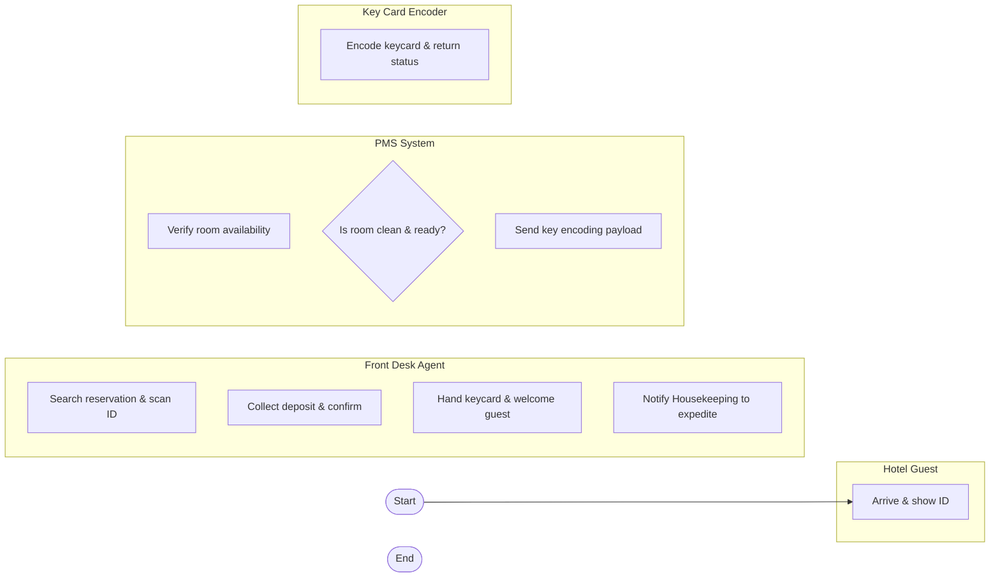

# Swimlane Diagram — Hotel Property Management System (PMS)

## Mermaid Code

## Flow Description | Mô tả luồng

| Lane | Actor | Role in Flow |
|------|-------|-------------|
| 1 | Hotel Guest | Yêu cầu làm thủ tục check-in |
| 2 | Front Desk Agent | Tiếp nhận thông tin và làm thủ tục |
| 3 | PMS System | Xử lý dữ liệu và kiểm tra phòng |
| 4 | Key Card Encoder | Mã hóa thẻ từ phòng |
