# Action Tree — Hotel Property Management System (PMS)

## Mermaid Code

```mermaid
graph TD
    Root["Hotel Property Management System (PMS)"]

    Root --> M1["Reservation & Front Desk"]
    M1 --> A1_1["Process Check-in"]
    M1 --> A1_2["Process Check-out"]
    M1 --> A1_3["Manage Reservations"]
    M1 --> A1_4["Assign Rooms"]
    M1 --> A1_5["Search Guest History"]
    Root --> M2["Housekeeping Management"]
    M2 --> A2_1["Update Cleaning Status"]
    M2 --> A2_2["Assign Attendants"]
    M2 --> A2_3["Inspect Room Quality"]
    M2 --> A2_4["Track Linen & Laundry"]
    Root --> M3["Billing & Folio Management"]
    M3 --> A3_1["Post Room Charges"]
    M3 --> A3_2["Process Credit Card Payment"]
    M3 --> A3_3["Split & Transfer Folios"]
    M3 --> A3_4["Issue Tax Invoices"]
    Root --> M4["Rate & Revenue Control"]
    M4 --> A4_1["Configure Rate Plans"]
    M4 --> A4_2["Set Seasonal Pricing"]
    M4 --> A4_3["Manage Allotments"]
    M4 --> A4_4["Set Minimum Stay Rules"]
    Root --> M5["Reports & Night Audit"]
    M5 --> A5_1["Run Night Audit"]
    M5 --> A5_2["Generate RevPAR Dashboard"]
    M5 --> A5_3["Export Occupancy Report"]
    M5 --> A5_4["Audit Transaction Logs"]
```

## Module Description | Mô tả Module

| # | Module | Description | Actions |
|---|--------|-------------|---------|
| 1 | Reservation & Front Desk | Quản lý đặt phòng và lễ tân | Process Check-in, Process Check-out, Manage Reservations, Assign Rooms, Search Guest History |
| 2 | Housekeeping Management | Quản lý dọn dẹp buồng phòng | Update Cleaning Status, Assign Attendants, Inspect Room Quality, Track Linen & Laundry |
| 3 | Billing & Folio Management | Quản lý tài khoản hóa đơn | Post Room Charges, Process Credit Card Payment, Split & Transfer Folios, Issue Tax Invoices |
| 4 | Rate & Revenue Control | Quản lý giá và chính sách | Configure Rate Plans, Set Seasonal Pricing, Manage Allotments, Set Minimum Stay Rules |
| 5 | Reports & Night Audit | Báo cáo và kiểm toán đêm | Run Night Audit, Generate RevPAR Dashboard, Export Occupancy Report, Audit Transaction Logs |
