# Action Tree — Mini-Bar & In-Room Service Management System

## Mermaid Code

```mermaid
graph TD
    Root["Mini-Bar & In-Room Service Management System"]

    Root --> M1["Request & Intake Management"]
    M1 --> A1_1["Create Room Service Ticket"]
    M1 --> A1_2["Search Active Tickets"]
    M1 --> A1_3["Assign Staff Member"]
    M1 --> A1_4["Prioritize Requests"]
    Root --> M2["Operational Service Execution"]
    M2 --> A2_1["Execute Service Steps"]
    M2 --> A2_2["Update Task Status"]
    M2 --> A2_3["Log Usage Materials"]
    M2 --> A2_4["Report Issue / Delay"]
    Root --> M3["Billing & Payment Processing"]
    M3 --> A3_1["Calculate Service Fee"]
    M3 --> A3_2["Apply Member Discount"]
    M3 --> A3_3["Transfer Fee to PMS Folio"]
    M3 --> A3_4["Process Online Payment"]
    Root --> M4["Quality & Audit Compliance"]
    M4 --> A4_1["Conduct Quality Inspection"]
    M4 --> A4_2["Collect Guest Feedback"]
    M4 --> A4_3["Review Audit Logs"]
    M4 --> A4_4["Track KPI SLA Score"]
    Root --> M5["Reporting & Strategy Analytics"]
    M5 --> A5_1["Export Daily Operation Summary"]
    M5 --> A5_2["Analyze Utilization Rate"]
    M5 --> A5_3["Forecast Resource Demand"]
    M5 --> A5_4["Generate Financial P&L Report"]
```

## Module Description | Mô tả Module

| # | Module | Description | Actions |
|---|--------|-------------|---------|
| 1 | Request & Intake Management | Tiếp nhận và quản lý yêu cầu đầu vào | Create Room Service Ticket, Search Active Tickets, Assign Staff Member, Prioritize Requests |
| 2 | Operational Service Execution | Thực thi công việc và điều phối vận hành | Execute Service Steps, Update Task Status, Log Usage Materials, Report Issue / Delay |
| 3 | Billing & Payment Processing | Hạch toán chi phí và quyết toán hóa đơn | Calculate Service Fee, Apply Member Discount, Transfer Fee to PMS Folio, Process Online Payment |
| 4 | Quality & Audit Compliance | Kiểm soát chất lượng và kiểm toán quy trình | Conduct Quality Inspection, Collect Guest Feedback, Review Audit Logs, Track KPI SLA Score |
| 5 | Reporting & Strategy Analytics | Báo cáo tổng hợp và phân tích xu hướng | Export Daily Operation Summary, Analyze Utilization Rate, Forecast Resource Demand, Generate Financial P&L Report |
