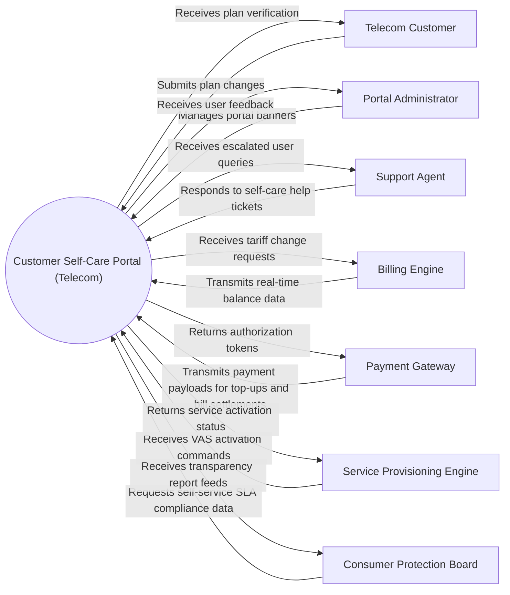

# Context Diagram — Customer Self-Care Portal (Telecom)

## Mermaid Code

## Actor & Interaction Table | Bảng Actor & Tương tác

| # | Actor | Actor Type | Data Sent TO System | Data Received FROM System | Notes |
|---|-------|------------|---------------------|---------------------------|-------|
| 1 | Telecom Customer | Primary | Submits plan changes, recharges balance, submits support tickets | Receives plan verification, usage charts, ticket resolution alerts | Mobile/Broadband user |
| 2 | Portal Administrator | Primary | Manages portal banners, updates FAQ items, configures feature toggles | Receives user feedback, access analytics, error logs | Telecom marketing/IT staff |
| 3 | Support Agent | Primary | Responds to self-care help tickets, triggers remote diagnostic resets | Receives escalated user queries, account status logs | Customer service agent |
| 4 | Billing Engine | Supporting | Transmits real-time balance data, unbilled charges, active tariff details | Receives tariff change requests, instant top-up commands | Core billing backend |
| 5 | Payment Gateway | Supporting | Transmits payment payloads for top-ups and bill settlements | Returns authorization tokens, transaction receipts | Payment processor |
| 6 | Service Provisioning Engine | Supporting | Receives VAS activation commands, SIM swap requests | Returns service activation status, network response logs | Network activation backend |
| 7 | Consumer Protection Board | Regulatory | Requests self-service SLA compliance data, fee transparency reports | Receives transparency report feeds, consumer complaint metrics | Consumer watchdog |

## System Boundary Description | Mô tả Phạm vi Hệ thống

The **Customer Self-Care Portal (Telecom)** handles core operational workflows including data ingestion, policy enforcement, transactional processing, and regulatory reporting within the telecommunications domain. Out of scope operations include direct physical hardware manufacturing and external banking ledger management.
