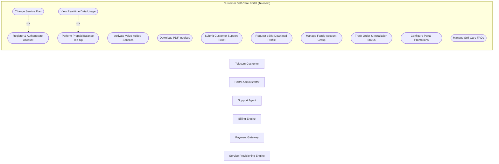

# Use Case Diagram — Customer Self-Care Portal (Telecom)

## Mermaid Code

## Actor Table | Bảng Actor

| # | Actor | Actor Type | Role Description | Related Use Cases |
|---|-------|------------|------------------|-------------------|
| 1 | Telecom Customer | Primary | Mobile/Broadband user | UC01, UC02 |
| 2 | Portal Administrator | Primary | Telecom marketing/IT staff | UC01, UC02 |
| 3 | Support Agent | Primary | Customer service agent | UC01, UC02 |
| 4 | Billing Engine | Supporting | Core billing backend | UC01, UC02 |
| 5 | Payment Gateway | Supporting | Payment processor | UC01, UC02 |
| 6 | Service Provisioning Engine | Supporting | Network activation backend | UC01, UC02 |
| 7 | Consumer Protection Board | Regulatory | Consumer watchdog | UC01, UC02 |

## Use Case Table | Bảng Use Case

| # | UC ID | Use Case Name | Primary Actor | Secondary Actor | Description | Priority |
|---|-------|---------------|---------------|-----------------|-------------|----------|
| 1 | UC01 | Register & Authenticate Account | TelecomCustomer | SMS Gateway | Register using phone number and log in via OTP or biometrics. | High |
| 2 | UC02 | View Real-time Data Usage | TelecomCustomer | TelecomBillingEngine | Display interactive breakdown of data, voice minutes, and SMS consumed. | High |
| 3 | UC03 | Perform Prepaid Balance Top-Up | TelecomCustomer | PaymentGateway | Recharge mobile balance using credit card, mobile banking, or voucher code. | High |
| 4 | UC04 | Change Service Plan | TelecomCustomer | TelecomBillingEngine | Upgrade or downgrade mobile or broadband subscription plans. | High |
| 5 | UC05 | Activate Value-Added Services | TelecomCustomer | ProvisioningSystem | Subscribe to streaming passes, roaming data packs, or caller tunes. | Medium |
| 6 | UC06 | Download PDF Invoices | TelecomCustomer | TelecomBillingEngine | View and download itemized monthly e-invoices for past billing cycles. | Medium |
| 7 | UC07 | Submit Customer Support Ticket | TelecomCustomer | CustomerSupportAgent | Log network issues or billing queries with image/file attachments. | High |
| 8 | UC08 | Request eSIM Download Profile | TelecomCustomer | ProvisioningSystem | Request QR code for eSIM installation on compatible mobile devices. | Medium |
| 9 | UC09 | Manage Family Account Group | TelecomCustomer | TelecomBillingEngine | Share data quotas and manage permissions for family linked SIMs. | Low |
| 10 | UC10 | Track Order & Installation Status | TelecomCustomer | ProvisioningSystem | Track home broadband installation technician arrival and status. | Medium |
| 11 | UC11 | Configure Portal Promotions | PortalAdmin | TelecomCustomer | Publish tailored banner ads and special top-up bonus promotions. | Medium |
| 12 | UC12 | Manage Self-Care FAQs | PortalAdmin | TelecomCustomer | Update self-help knowledge base articles and chatbot responses. | Low |

## Use Case Specification | Đặc tả Use Case

---

### UC01 — Register & Authenticate Account

| Field | Detail |
|-------|--------|
| **UC ID** | UC01 |
| **Use Case Name** | Register & Authenticate Account |
| **Actor(s)** | Primary: TelecomCustomer / Secondary: SMS Gateway |
| **Description** | Register using phone number and log in via OTP or biometrics. |
| **Precondition** | 1. User/Actor is authenticated in the system.   2. Required target element or account status is Active. |
| **Main Flow** | 1. TelecomCustomer initiates Register & Authenticate Account request.   2. System validates input parameters and security authorization tokens.   3. System checks operational rules against backend policies.   4. System processes requested operation and updates database state.   5. System logs transaction for audit compliance.   6. System returns success confirmation to TelecomCustomer. |
| **Alternative Flow** | **AF1** — Cached Batch Mode: If real-time queue is congested, system queues request for batch processing and returns pending token.   **AF2** — Secondary Notification: System dispatches copy of completion receipt to SMS Gateway. |
| **Exception Flow** | **EX1** — Validation Failure: If input format is invalid, system halts execution and displays error error message.   **EX2** — System Timeout: If backend fails to respond within 5000ms, system rolls back transaction and logs critical alert. |
| **Postcondition** | System record state is updated successfully, audit logs are saved, and downstream events are triggered. |
| **Business Rule** | **BR1**: All operations must comply with telecom security SLA and privacy regulations.   **BR2**: Financial and state modifications must generate immutable audit logs. |

---

### UC02 — View Real-time Data Usage

| Field | Detail |
|-------|--------|
| **UC ID** | UC02 |
| **Use Case Name** | View Real-time Data Usage |
| **Actor(s)** | Primary: TelecomCustomer / Secondary: TelecomBillingEngine |
| **Description** | Display interactive breakdown of data, voice minutes, and SMS consumed. |
| **Precondition** | 1. User/Actor is authenticated in the system.   2. Required target element or account status is Active. |
| **Main Flow** | 1. TelecomCustomer initiates View Real-time Data Usage request.   2. System validates input parameters and security authorization tokens.   3. System checks operational rules against backend policies.   4. System processes requested operation and updates database state.   5. System logs transaction for audit compliance.   6. System returns success confirmation to TelecomCustomer. |
| **Alternative Flow** | **AF1** — Cached Batch Mode: If real-time queue is congested, system queues request for batch processing and returns pending token.   **AF2** — Secondary Notification: System dispatches copy of completion receipt to TelecomBillingEngine. |
| **Exception Flow** | **EX1** — Validation Failure: If input format is invalid, system halts execution and displays error error message.   **EX2** — System Timeout: If backend fails to respond within 5000ms, system rolls back transaction and logs critical alert. |
| **Postcondition** | System record state is updated successfully, audit logs are saved, and downstream events are triggered. |
| **Business Rule** | **BR1**: All operations must comply with telecom security SLA and privacy regulations.   **BR2**: Financial and state modifications must generate immutable audit logs. |

---

### UC03 — Perform Prepaid Balance Top-Up

| Field | Detail |
|-------|--------|
| **UC ID** | UC03 |
| **Use Case Name** | Perform Prepaid Balance Top-Up |
| **Actor(s)** | Primary: TelecomCustomer / Secondary: PaymentGateway |
| **Description** | Recharge mobile balance using credit card, mobile banking, or voucher code. |
| **Precondition** | 1. User/Actor is authenticated in the system.   2. Required target element or account status is Active. |
| **Main Flow** | 1. TelecomCustomer initiates Perform Prepaid Balance Top-Up request.   2. System validates input parameters and security authorization tokens.   3. System checks operational rules against backend policies.   4. System processes requested operation and updates database state.   5. System logs transaction for audit compliance.   6. System returns success confirmation to TelecomCustomer. |
| **Alternative Flow** | **AF1** — Cached Batch Mode: If real-time queue is congested, system queues request for batch processing and returns pending token.   **AF2** — Secondary Notification: System dispatches copy of completion receipt to PaymentGateway. |
| **Exception Flow** | **EX1** — Validation Failure: If input format is invalid, system halts execution and displays error error message.   **EX2** — System Timeout: If backend fails to respond within 5000ms, system rolls back transaction and logs critical alert. |
| **Postcondition** | System record state is updated successfully, audit logs are saved, and downstream events are triggered. |
| **Business Rule** | **BR1**: All operations must comply with telecom security SLA and privacy regulations.   **BR2**: Financial and state modifications must generate immutable audit logs. |

---

### UC04 — Change Service Plan

| Field | Detail |
|-------|--------|
| **UC ID** | UC04 |
| **Use Case Name** | Change Service Plan |
| **Actor(s)** | Primary: TelecomCustomer / Secondary: TelecomBillingEngine |
| **Description** | Upgrade or downgrade mobile or broadband subscription plans. |
| **Precondition** | 1. User/Actor is authenticated in the system.   2. Required target element or account status is Active. |
| **Main Flow** | 1. TelecomCustomer initiates Change Service Plan request.   2. System validates input parameters and security authorization tokens.   3. System checks operational rules against backend policies.   4. System processes requested operation and updates database state.   5. System logs transaction for audit compliance.   6. System returns success confirmation to TelecomCustomer. |
| **Alternative Flow** | **AF1** — Cached Batch Mode: If real-time queue is congested, system queues request for batch processing and returns pending token.   **AF2** — Secondary Notification: System dispatches copy of completion receipt to TelecomBillingEngine. |
| **Exception Flow** | **EX1** — Validation Failure: If input format is invalid, system halts execution and displays error error message.   **EX2** — System Timeout: If backend fails to respond within 5000ms, system rolls back transaction and logs critical alert. |
| **Postcondition** | System record state is updated successfully, audit logs are saved, and downstream events are triggered. |
| **Business Rule** | **BR1**: All operations must comply with telecom security SLA and privacy regulations.   **BR2**: Financial and state modifications must generate immutable audit logs. |

---

### UC05 — Activate Value-Added Services

| Field | Detail |
|-------|--------|
| **UC ID** | UC05 |
| **Use Case Name** | Activate Value-Added Services |
| **Actor(s)** | Primary: TelecomCustomer / Secondary: ProvisioningSystem |
| **Description** | Subscribe to streaming passes, roaming data packs, or caller tunes. |
| **Precondition** | 1. User/Actor is authenticated in the system.   2. Required target element or account status is Active. |
| **Main Flow** | 1. TelecomCustomer initiates Activate Value-Added Services request.   2. System validates input parameters and security authorization tokens.   3. System checks operational rules against backend policies.   4. System processes requested operation and updates database state.   5. System logs transaction for audit compliance.   6. System returns success confirmation to TelecomCustomer. |
| **Alternative Flow** | **AF1** — Cached Batch Mode: If real-time queue is congested, system queues request for batch processing and returns pending token.   **AF2** — Secondary Notification: System dispatches copy of completion receipt to ProvisioningSystem. |
| **Exception Flow** | **EX1** — Validation Failure: If input format is invalid, system halts execution and displays error error message.   **EX2** — System Timeout: If backend fails to respond within 5000ms, system rolls back transaction and logs critical alert. |
| **Postcondition** | System record state is updated successfully, audit logs are saved, and downstream events are triggered. |
| **Business Rule** | **BR1**: All operations must comply with telecom security SLA and privacy regulations.   **BR2**: Financial and state modifications must generate immutable audit logs. |

